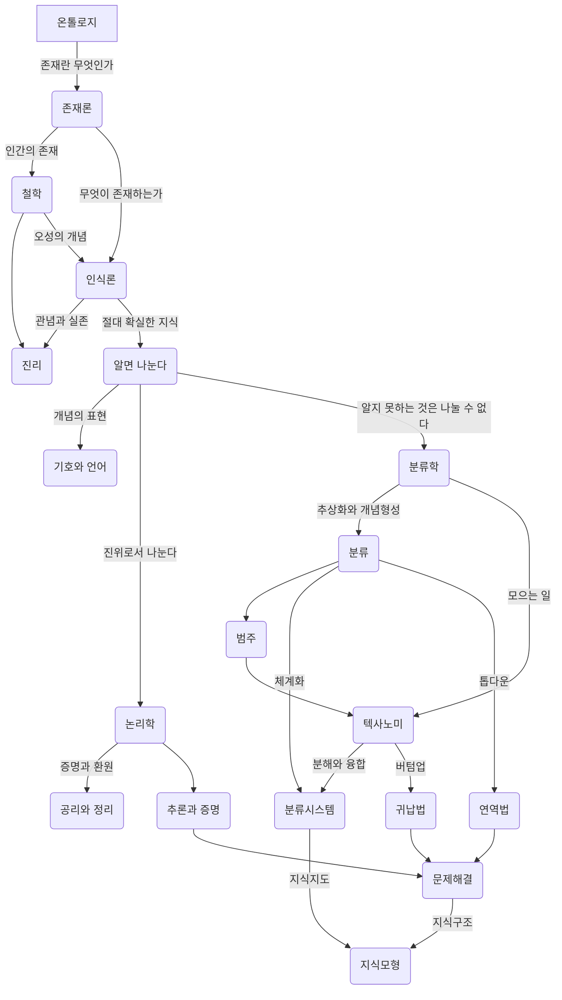

## 온톨로지 알고리즘 1: 기록 정보 지식의 세계 {#온톨로지-알고리즘-1-기록-정보-지식의-세계}

(타카시 사이토 2008)

-   타카시 사이토 최석두 and 한상길

폭소노미(folksonomy)


### 소개 {#소개}

기록정보학을 가로지르고, 필요불가결하며, 그것의 전통적 계승인 온톨로지 알고리즘을 재구축하는 데 목적을 두고 있는 책이다. 이 책은 온톨로지 알고리즘은 인간의 지성을 밝히는 지식 모형이며, 이것은 인간의 지적 과정의 원점이라고도 하는 "알기" 위해서 "나눈다"는 소박한 인식론에서 출발하여 역사학, 논리학, 수학, 언어학, 기호론, 분류학 등 리버럴 아츠에 의해 그 기초 원리가 확립되었다고 이야기하고 있다. 또한 컴퓨터의 출현에 따라 정보과학, 인지과학, 지식 공학, 소프트웨어 공학, 기록정보학 등 학제학의 지식 모형으로서 새롭게 연구되고 있는 온톨리지의 면면과 구조를 상세하게 밝혀내고 있다.


### 전체상 - 큰 그림을 보라! {#전체상-큰-그림을-보라}


#### IT 사회 &amp; 온톨로지 알고리즘 {#it-사회-and-온톨로지-알고리즘}


#### 기록 {#기록}


#### 정보 {#정보}


#### 관점 {#관점}


#### 온톨로지 알고리즘의 발전 사이클 {#온톨로지-알고리즘의-발전-사이클}

<!--list-separator-->

-  기록 사이클과 기록 알고리즘

<!--list-separator-->

-  정보 사이클과 정보 알고리즘

<!--list-separator-->

-  지식 사이클과 지식 알고리즘


#### 주제 {#주제}


#### 기록정보학 의 연구 초점 {#기록정보학-의-연구-초점}


#### 정보 시스템 {#정보-시스템}


#### 지식 연구 {#지식-연구}


#### 온톨로지 알고리즘 &gt; 영역 {#온톨로지-알고리즘-영역}


#### K-Map &amp; 재귀적 온톨로지 알고리즘 {#k-map-and-재귀적-온톨로지-알고리즘}


#### 온톨로지 알고리즘 &gt; 영역 {#온톨로지-알고리즘-영역}

기초 원리
: 역사학 논리학 수사학 언어학 기호론

분류학 정보과학, 인지과학, 지식 공학, 기록정보학


### 기록 : {#기록}


#### 편집 &amp; 온톨로지 알고리즘 {#편집-and-온톨로지-알고리즘}


#### 책 : 편집 {#책-편집}


#### 하이퍼텍스트 {#하이퍼텍스트}

<!--list-separator-->

-  참조형 링크와 계층형 링크

<!--list-separator-->

-  브라우징과 정보의 미아

<!--list-separator-->

-  네비게이션

<!--list-separator-->

-  World Brain

<!--list-separator-->

-  유사 하이퍼텍스트

<!--list-separator-->

-  하이퍼텍스트 시스템


#### 아이디어 생성 {#아이디어-생성}

<!--list-separator-->

-  오소링

    <!--list-separator-->

    -  구조화 편집

        <!--list-separator-->

        -  주크박스형 시뮬레이션형

        <!--list-separator-->

        -  노드와 링크의 규제

    <!--list-separator-->

    -  정보 매핑

        <!--list-separator-->

        -  인포메이션 블록의 종류

        <!--list-separator-->

        -  하이퍼트레일

<!--list-separator-->

-  라이팅 스페이스

<!--list-separator-->

-  편집공학


#### 편집 &amp; 온톨로지 알고리즘 {#편집-and-온톨로지-알고리즘}

고쳐 쓰다 -&gt; 편집 드라마 &gt; 무엇인가?


#### 책의 편집 {#책의-편집}

-   책의 구조 &gt; 목차 중심 =&gt; 정적 제한
-   도형
-   비선형 &gt; 참조형 관계 각주 / 주석 칼럼 기사 / 타 문서 참조)
-   문장 계층 구조
-


#### 하이퍼텍스트 {#하이퍼텍스트}

원래 인간의 사고 &gt; 비선형적인 구조 책을 만드려면 선형으로 바꿔야 함.


### 정보 {#h:ec917627-7757-4b0f-81f6-d602bb06a8b7}


#### 기록정보학 {#기록정보학}


#### 주제 분석 {#주제-분석}

<!--list-separator-->

-  색인화

<!--list-separator-->

-  &gt; 목적

<!--list-separator-->

-  &gt; 실례

<!--list-separator-->

-  &gt; 범주

<!--list-separator-->

-  &gt; 순서

<!--list-separator-->

-  주관적 온톨로지

<!--list-separator-->

-  속성 :and 속성값

<!--list-separator-->

-  주제 분석 &gt; 연구 과제

<!--list-separator-->

-  상호 간의 거리 계산

<!--list-separator-->

-  인용 색인


#### 내용 분석 {#내용-분석}

<!--list-separator-->

-  다변량 분석

<!--list-separator-->

-  의미공간 &gt; 분석


#### 정보 시스템 {#정보-시스템}

<!--list-separator-->

-  유니텀

<!--list-separator-->

-  검색 모형

<!--list-separator-->

-  데이터베이스 관리 시스템

<!--list-separator-->

-  정보검색 시스템


#### 디지털 도서관 {#디지털-도서관}

<!--list-separator-->

-  도서관 모형

<!--list-separator-->

-  메타 데이터

<!--list-separator-->

-  정보 푸시와 정보 풀

<!--list-separator-->

-  SDI 디지털 도서관

<!--list-separator-->

-  차분 정보 &gt; 배포


### 지식의 지식 {#지식의-지식}

지식의 뿌리 - 철학 철학 =&gt; 논리학 수학 언어학 철학의 원점 :: 온톨로지 =&gt; 사물의 속성을 나타내는 개념과 그 체계화 안다 나눈다 라는 말의 구분에서 시작.


#### 철학 {#철학}

```text
고양이 이며, 그 중에서 흰 고양이가 적어도 한 마리는 존재한다.
```

:exist x (cat (x) :and white (x))

:exist 존재기호 ~이 있다, ~가 존재한다. ~가 실존한다.

```text
:exist x (cat (x) :and white (x))
$\forall$ , $\exist$
```

-   [학문이 서로 돕는다는 것 : 현상학적 학문이론과 일반체계이론의 이중주]() 여기에 좋은 주제가 들어 있다.
-   적절한 활용 방법이?!

<!--list-separator-->

-  인식론

    -   인식하는 지성인 관념
    -   대응설
    -   정합설
    -   실용주의

    칸트 순수오성 개념 즉

<!--list-separator-->

-  형이상학

<!--list-separator-->

-  나눈다 &amp; 안다

<!--list-separator-->

-  분해와 종합


#### 개념 &amp; 범주 {#개념-and-범주}

<!--list-separator-->

-  개념

<!--list-separator-->

-  외연 &amp; 내포

<!--list-separator-->

-  범주

<!--list-separator-->

-  칸트 &gt; 범주

<!--list-separator-->

-  개념 분류

<!--list-separator-->

-  개념 정의


#### 논리학 {#논리학}

<!--list-separator-->

-  형식화

<!--list-separator-->

-  삼단논법

<!--list-separator-->

-  명제 논리

<!--list-separator-->

-  술어 논리

<!--list-separator-->

-  양화 기호 - 보편양화사

<!--list-separator-->

-  기호논리학

<!--list-separator-->

-  연역법 &amp; 귀납법

<!--list-separator-->

-  논리철학 - 비트겐슈타인


#### 수학 {#수학}

<!--list-separator-->

-  수학적 온톨로지

<!--list-separator-->

-  알고리즘


#### 기호론 &amp; 의미론 {#기호론-and-의미론}

<!--list-separator-->

-  커뮤니케이션 모형

<!--list-separator-->

-  기호 &amp; 그 역할

<!--list-separator-->

-  기호 표현 &amp; 기호 내용

<!--list-separator-->

-  기호론

<!--list-separator-->

-  개념 형성 &amp; 의미 작용

<!--list-separator-->

-  의미론

<!--list-separator-->

-  표시의 &amp; 공시의


#### 언어학 &amp; 자연언어 처리 {#언어학-and-자연언어-처리}

<!--list-separator-->

-  언어 모형의 작용

<!--list-separator-->

-  언어적 지식

<!--list-separator-->

-  말

<!--list-separator-->

-  언어학

<!--list-separator-->

-  생성 문법

<!--list-separator-->

-  격 문법

<!--list-separator-->

-  자연언어 처리 시스템

    <!--list-separator-->

    -  형태소 해석

    <!--list-separator-->

    -  통어 해석

    <!--list-separator-->

    -  의미 해석

    <!--list-separator-->

    -  담화 해석


### 분류학 :and 분류 시스템 {#분류학-and-분류-시스템}

분류학 &amp; 분류 시스템


#### 생물 분류 {#생물-분류}


#### 텍사노미 {#텍사노미}


#### 추상화 &amp; 개념 형성 {#추상화-and-개념-형성}


#### 분류 &gt; 관점 {#분류-관점}


#### 분류 시스템 &gt; 탄생 {#분류-시스템-탄생}


#### 도서 분류 시스템 {#도서-분류-시스템}

<!--list-separator-->

-  DDC

<!--list-separator-->

-  NDC

<!--list-separator-->

-  패싯 분류

<!--list-separator-->

-  UDC


#### 시소러스 {#시소러스}

<!--list-separator-->

-  시소러스 원리

<!--list-separator-->

-  유서

<!--list-separator-->

-  정보검색 시스템 &gt; 시소러스

<!--list-separator-->

-  롤 &amp; 링크

<!--list-separator-->

-  개념 사전

<!--list-separator-->

-  의미 표현 방식


### 지식 모형 {#지식-모형}

지식 모형


#### 다양한 지식 {#다양한-지식}


#### 해석학 모형 {#해석학-모형}


#### 정보 모형 {#정보-모형}


#### 인공지능 의 지식 모형 {#인공지능-의-지식-모형}


#### 지식 공학 &gt; 지식 모형 {#지식-공학-지식-모형}


#### 인지과학 &gt; 지식 모형 {#인지과학-지식-모형}


#### 소프트웨어 공학의 지식 모형 {#소프트웨어-공학의-지식-모형}


#### 지식 관리의 지식 모형 {#지식-관리의-지식-모형}


### 지식 지도 {#지식-지도}


#### 그림의 특성 {#그림의-특성}


#### 프레임 모형과 의미 네트워크 {#프레임-모형과-의미-네트워크}


#### 자연언어의 의미 도해 기법 {#자연언어의-의미-도해-기법}


#### 소프트웨어 공학의 지식 지도 {#소프트웨어-공학의-지식-지도}


#### 비지니스에서의 지식 지도 {#비지니스에서의-지식-지도}


#### 검색의 지식 지도 {#검색의-지식-지도}


### 온톨로지 알고리즘의 구현 {#온톨로지-알고리즘의-구현}


#### 시맨틱 웹 {#시맨틱-웹}


#### 케이 에이전트 {#케이-에이전트}


#### 케이 맵 {#케이-맵}


#### 실험 {#실험}


#### 서지 암묵지의 도구 {#서지-암묵지의-도구}


### 찾아보기 {#찾아보기}

-   1차정보


## #온톨로지알고리즘 지도 K-map {#h:3d1d3c32-bc17-4654-95b1-889fa2146383}

지식 모형

오성 -&gt; 지성






## #키워드 {#키워드}

-   [@김학래 #온톨로지 #지식그래프 #시맨틱웹]()
-   [@타카시사이토: #온톨로지 #알고리즘 기록 정보 지식의 세계]()
-   [#도서검색: #국가서지 #오픈데이터 #온톨로지 - #한국십진분류 #카테고리분류]()
-   [#LLM: 팔란티어 온톨로지]()


## Related-Notes {#related-notes}

## References

<style>.csl-entry{text-indent: -1.5em; margin-left: 1.5em;}</style><div class="csl-bib-body">
  <div class="csl-entry">타카시 사이토. 2008. <i>온톨로지 알고리즘 1: 기록 정보 지식의 세계</i>. Translated by 최석두 and 한상길. 한울. <a href="https://www.yes24.com/Product/Goods/87117232">https://www.yes24.com/Product/Goods/87117232</a>.</div>
</div>
