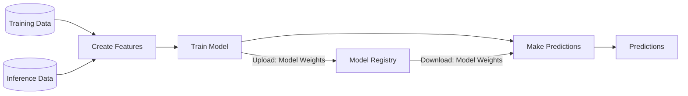

<div class="ox-hugo-toc toc">

<div class="heading">Table of Contents</div>

- [2025-06-30 Mon](#2025-06-30-mon)
- [2025-07-01 Tue](#2025-07-01-tue)
- [2025-07-02 Wed](#2025-07-02-wed)
- [2025-07-03 Thu](#2025-07-03-thu)
- [2025-07-04 Fri](#2025-07-04-fri)
- [NEWNOTES](#newnotes)
- [REFILED](#refiled)
- [SCREENSHOT](#screenshot)
- [CITATIONS](#citations)
- [PREVIOUS](#previous)

</div>
<!--endtoc-->

> [!quote] quote
> 
> (excellent_advice_for_living.t2t)<br />
> 
> Expand your mind by thinking with your feet on a walk or with your hand in a notebook. Think outside your brain.
> 
> 산책하면서 발로 생각하거나 노트에 손을 대고 생각하며 마음을 확장하세요. 뇌 밖에서 생각하세요.


## 2025-06-30 Mon {#2025-06-30-mon}

> [!quote] quote
> 
> (kevin-kelly-99.t2t)<br />
> 
> Compliment people behind their back. It’ll come back to you.
> 
> 사람들 뒤에서 칭찬하세요. 그것이 결국 당신에게 돌아올 것입니다.


### 05:42 굳모닝 - 업위크 {#05-42-굳모닝-업위크}

(마이클 싱어 2014) 책으로 열어내는 한 주


### 07:12 사무실 도착 {#07-12-사무실-도착}

(빅터 프랭클 2020) 프랭클의 책과 함께


### 08:31 브레이크 {#08-31-브레이크}


### 09:24 mermaid 설치 적극 활용 {#09-24-mermaid-설치-적극-활용}

-   [#다이어그램 #이맥스 #조직모드: ¤mermaid ¤platuml ¤d2]()


### 09:58 이제 온갖 다이어그램을 가져와서 그릴 수 있지 {#09-58-이제-온갖-다이어그램을-가져와서-그릴-수-있지}




### 14:01 식사 복귀 후 {#14-01-식사-복귀-후}


### 14:39 복잡한 다이어그램 {#14-39-복잡한-다이어그램}


### 21:03 바론 데려다주고 돌아옴 {#21-03-바론-데려다주고-돌아옴}

하루의 마무리 잠시만 메타라도 내보내자


### 21:45 메타 업데이트 자자 {#21-45-메타-업데이트-자자}


## 2025-07-01 Tue {#2025-07-01-tue}

> [!quote] quote
> 
> (kevin-kelly-99.t2t)<br />
> 
> The greatest breakthroughs are missed because they look like hard work.
> 
> 가장 위대한 돌파구는 힘든 일처럼 보여서 놓치게 된다.


### 03:53 `중도` 도덕경 {#03-53-중도-도덕경}


### 05:45 기상 준비 하고 나가자 {#05-45-기상-준비-하고-나가자}


### 07:15 출근 - 모닝 루틴 {#07-15-출근-모닝-루틴}

-   [X] 오디오북 (마이클 싱어 2023)
-   [X] 커피
-   [X] 손가락을 풀자
-   [X] 숨겨진 버그 : 이미지 링크, 한글 스펠링 사전 연결 고리


### <span class="org-todo todo TODO">TODO</span> 07:45 1장 칸트 철학과 현대 물리학 - jinx hunspell 수정 {#07-45-1장-칸트-철학과-현대-물리학-jinx-hunspell-수정}

<span class="timestamp-wrapper"><span class="timestamp">[2025-07-01 Tue 08:36] </span></span> 훈스펠 enchant 연결 안되어 있네


### <span class="org-todo done DONE">DONE</span> 08:35 첨부 파일 이미지 링크 수정 완료 {#08-35-첨부-파일-이미지-링크-수정-완료}


### 08:46 브레이크 업모닝 고우! {#08-46-브레이크-업모닝-고우}


### 14:18 그렇다면 코딩에 집중 {#14-18-그렇다면-코딩에-집중}


### <span class="org-todo todo TODO">TODO</span> 15:06 AMDGPU-TOP {#15-06-amdgpu-top}


#### Umio-Yasuno/Amdgpu\\_top {#umio-yasuno-amdgpu-top}

(Yasuno [2023] 2025) Yasuno, Umio 2025 Tool to display AMDGPU usage


### <span class="org-todo todo TODO">TODO</span> 17:00 #aider #openrouter {#17-00-aider-openrouter}

```text
# Change directory into your codebase
cd /to/your/project

# Or any other open router model
aider --model openrouter/<provider>/<model>

# List models available from OpenRouter
aider --list-models openrouter/
```

-   openrouter/deepseek/deepseek-coder
-   openrouter/deepseek/deepseek-r1


### <span class="org-todo done DONE">DONE</span> 17:31 thingsboard 대시보드 - 위젯 {#17-31-thingsboard-대시보드-위젯}

(thingsboard n.d.-c)

(thingsboard n.d.-d)

(thingsboard n.d.-a)


### 17:41 thingsboard - maven-install {#17-41-thingsboard-maven-install}

```shell
mvn spring-boot:run

```


### <span class="org-todo todo TODO">TODO</span> 18:05 씽스보드 프론트 백엔드 코드로 빌드 {#18-05-씽스보드-프론트-백엔드-코드로-빌드}

프론트 전체 코드를 기준으로 인공지능으로 커스텀 코드를 생성 이렇게 되면 인공지능으로 코드를 생성할 수 있다.


### 20:18 바론 데리고 가자 {#20-18-바론-데리고-가자}


## 2025-07-02 Wed {#2025-07-02-wed}

> [!quote] quote
> 
> (excellent_advice_for_living.t2t)<br />
> 
> Be more generous than necessary. No one on their deathbed has ever regretted giving too much away. There is no point to being the richest person in the cemetery.
> 
> 필요 이상으로 더 관대해지세요. 임종을 앞둔 사람이 너무 많이 나눠준 것을 후회한 적은 없습니다. 묘지에서 가장 부자가 되는 것은 아무 의미가 없습니다.


### 오늘의 목표 {#오늘의-목표}

<span class="timestamp-wrapper"><span class="timestamp">[2025-07-02 Wed 08:34]</span></span>

-   [ ] ThingsBoard UI 코드 - 대시보드 위젯 에이전트 코딩


### 01:16 지속 가능한 지식 학습 방법 {#01-16-지속-가능한-지식-학습-방법}

그럼에도 코드 에이전트 활용 집중


### 05:41 기상 - 증강형 코딩 - 켄트백 {#05-41-기상-증강형-코딩-켄트백}

인공지능 끌어낼 수 있는 방법을 훈련하라. 이것이 3개월 수습의 개인적 목표다. 자유를 얻기 위해서는 자유를 줘야 한다. 줘야 얻는다.

지식을 쌓고 융합하는 방법은? 노트를 남기는 것 이상으로 흔적을 정리하는 방법에 대한 연구는 아무래도 폴게제텔 아닐까? 시퀀스를 연결하는 것에 대한 기대.

메타다. 그 일을 어떻게 메타인지의 차원에서 바라 볼 수 있는가? 그 일을 어떻게 표준화할 수 있는가?

그 일은 그 일이 아니다. ABD다. 사르트르의 ABC다.

[@사르트르 1905 존재와무 현상학 실존주의]()


### 06:11 레버리지 마인드 {#06-11-레버리지-마인드}

샤워하면서 딱 왔다. 레버리지 책 서문에 나오는 영국 프로그래머 사례. 인도 아웃소싱. 회사 잘림. 그러나 저자는 높게 평가함 (롭 무어 2019)


### 06:16 업모닝 나가자 {#06-16-업모닝-나가자}


### 07:20 출근 - 레버리지 마인드 글 대기 {#07-20-출근-레버리지-마인드-글-대기}


### 08:49 모닝워시 {#08-49-모닝워시}


### 12:20 다음 질문 좀 해줘 {#12-20-다음-질문-좀-해줘}

[2=1=1=1 ¥: #AI #프론트엔드 #에이전틱 #프로토타이핑 #CICD #배치 #생성::|2025-07-02 Wed 11:21|]()


### 13:40 업런치 &lt;- 병원 이발 식사 복귀 {#13-40-업런치-병원-이발-식사-복귀}

레버리지 포인트 생각하라


### 18:07 퇴근 {#18-07-퇴근}


## 2025-07-03 Thu {#2025-07-03-thu}

> [!quote] quote
> 
> 우리가 반복적으로 행하는 것이 우리 자신이다. 그렇다면 탁월함은 행동이 아닌 습관인 것이다. — 아리스토텔레스


### 05:24 기상 - 고요함의 지혜 - 몽테뉴 - 법정 {#05-24-기상-고요함의-지혜-몽테뉴-법정}


### 05:33 에이전트 인 액션 {#05-33-에이전트-인-액션}

(마이클 래넘 2025) [#모음 #도서: #개발자 #페어 #프로그래밍 #코파일럿 #프롬프트 #에이전트]()


### 05:48 나가자 {#05-48-나가자}


### 07:20 출근 오래 걸렸다. K패스 {#07-20-출근-오래-걸렸다-dot-k패스}


### 08:42 구토 {#08-42-구토}

약 때문인가 구토가 올라온다. 얼마나 인간은 약한가. 구토가 올라오는데 무슨 일을 할 수 있는가? 갈 때까지 기다려야 한다. 진정이 될 때까지 기다려야 한다. 할 수 있는 것은 들숨 날숨 정도가 아니겠는가. 키보드 두드리는 것도 힘들다. 아니다. 이건. 기다리자.


### <span class="org-todo todo TODO">TODO</span> 08:49 디파이 설치 {#08-49-디파이-설치}

[©LangGenius ¤Dify.ai 에이전틱 AI 개발 플랫폼 - 지식베이스 클러스터]()


#### 도커 설치 모든 노드에 도커 설치 {#도커-설치-모든-노드에-도커-설치}

<span class="timestamp-wrapper"><span class="timestamp">[2025-07-03 Thu 08:55]</span></span>

[#리눅스 #도커 #설치]()


### 15:22 스토리지 서버 다시 설정 {#15-22-스토리지-서버-다시-설정}


### 18:21 네트워크 연결까지 확인 퇴근하자 {#18-21-네트워크-연결까지-확인-퇴근하자}


### 20:21 바론 집에 고고 {#20-21-바론-집에-고고}


## 2025-07-04 Fri {#2025-07-04-fri}


### 01:40 자각몽 꿈 현실 어딘가 아픈 삶의 이야기가 영화처럼 얽히다 {#01-40-자각몽-꿈-현실-어딘가-아픈-삶의-이야기가-영화처럼-얽히다}


### 01:49 내보내기 모두 {#01-49-내보내기-모두}

-   [#월간 #아카이브: 202506..T\*]() 특히 챙겨


### 02:27 오픈라우터 - 모델 정리 지피텔 {#02-27-오픈라우터-모델-정리-지피텔}

<span class="timestamp-wrapper"><span class="timestamp">[2025-07-04 Fri 02:29] </span></span> 지피텔 오픈라우터 모델을 몇개 지정 및 관련 정보 추가 [#이맥스: #지피텔 #활용법]()

```elisp
(defconst gptel--openrouter-models
  '(
     ;; May 28th update to the original DeepSeek R1 Performance on par with OpenAI o1, but open-sourced and with fully open reasoning tokens. It's 671B parameters in size, with 37B active in an inference pass.
    (deepsek/deepseek-r1-0528 ;; 2025-07-04
     :capabilities (tool reasoning)
     :context-window 128
     :input-cost 0.50
     :output-cost 2.15)

    ;; DeepSeek V3, a 685B-parameter, mixture-of-experts model, is the latest iteration of the flagship chat model family from the DeepSeek team.
    (deepseek/deepseek-chat-v3-0324
     :capabilities (tool)
     :context-window 163
     :input-cost 0.28
     :output-cost 0.88)

    ;; https://openrouter.ai/google/gemini-2.5-pro
    (google/gemini-2.5-pro
     :capabilities (media tool-use cache)
     :mime-types ("image/jpeg" "image/png" "image/gif" "image/webp" "application/pdf")
     :context-window 1048
     :input-cost 1.25
     :output-cost 10)

;; GPT-4o mini Search Preview is a specialized model for web search in Chat Completions. It is trained to understand and execute web search queries.
    (openai/gpt-4o-mini-search-preview
     :description "Cheap model for fast tasks; cheaper & more capable than GPT-3.5 Turbo"
     :capabilities (media tool-use json url)
     :mime-types ("image/jpeg" "image/png" "image/gif" "image/webp")
     :context-window 128
     :input-cost 0.15
     :output-cost 0.6
     )
    ;; https://openrouter.ai/anthropic/claude-sonnet-4
    (anthropic/claude-sonnet-4
     :description "Hybrid model capable of standard thinking and extended thinking modes"
     :capabilities (media tool-use cache)
     :mime-types ("image/jpeg" "image/png" "image/gif" "image/webp" "application/pdf")
     :context-window 200
     :input-cost 3
     :output-cost 15
     :cutoff-date "2025-05")

    (anthropic/claude-opus-4
     :description "Hybrid model capable of standard thinking and extended thinking modes"
     :capabilities (media tool-use cache)
     :mime-types ("image/jpeg" "image/png" "image/gif" "image/webp" "application/pdf")
     :context-window 200
     :input-cost 15
     :output-cost 75
     :cutoff-date "2025-05"))
```


## NEWNOTES {#newnotes}

-   [#최근노트 #모음]()

-   [#LLM: 임베디드 DDOS 보안성 시뮬레이션 홈카메라 (2025-07-03)]()
-   [#업무 #AI활용 #플랫폼 (2025-07-01)]()
-   [#업무 #AI활용 #임베디드 (2025-07-01)]()
-   [#업무 #AI활용 #프론트엔드 (2025-07-01)]()
-   [#AI활용 (2025-07-01)]()
-   [#업무 (2025-07-01)]()
-   [¥: #오픈API: Tuya 제공 및 보안 정책 - 국내 협력사 (2025-07-01)]()
-   [#클러스터: #캐시 ¤bcache #RAID #스토리지 ¤gpustack ¤dify (2025-07-03)]()
-   [#분산처리프레임워크: ¤Ray (2025-07-03)]()
-   [¤GPUStack AI 클러스터 GPU 관리자 오픈소스 (2025-07-03)]()
-   [#네트워크: 10GbE 100GbE #이더넷 #인피니밴드 - 클러스터 리눅스 (2025-07-02)]()
-   [†#이맥스#통합개발환경#크로스플랫폼: ¤다트 ¤플러터 (2025-07-02)]()
-   [#모음: 인공지능 스타트업 회사 (2025-06-30)]()
-   [#플랫폼: IoT 아이오티 #개념 #키워드 #확장 (2025-06-30)]()
-   [#시스템 #플랫폼 #생태계 관계 확장 개념 (2025-06-30)]()
-   [#재현성 #파이썬 #생태계 #도구 ¤pyenv ¤poetry ¤poethepoet (2025-06-30)]()
-   [#조직모드 #마우스 #입문자 #인터페이스 (2025-06-30)]()
-   [†#스토리지#저장장치#RAID #캐시 (2025-07-03)]()
-   [†#크로스플랫폼 (2025-07-02)]()
-   [#LLM: pytorch 파이썬 (2025-07-03)]()
-   [#LLM: NVIDIA 리눅스 드라이버 설치 관련 (2025-07-03)]()
-   [#LLM: #프론트엔드 #컴포넌트 #라이브러리 ¤thingsboard ¤react ¤angular (2025-07-02)]()
-   [#LLM: 날짜 요일 대소문자 Downcase customid (2025-07-02)]()
-   [#LLM: Thingsboard 백엔드 프론트엔드 ui-ngx 빌드 로그인 테스트 (2025-07-01)]()
-   [#LLM: 깃허브 프로 플러스 고급 요금제 비교 Pro Plus (2025-07-01)]()
-   [#LLM: thingsboard ui widget dashboard build (2025-07-01)]()
-   [#LLM: AMD 라이젠 노트북 리눅스 #ROCm (2025-07-01)]()
-   [#LLM: ¤Ollama 라이젠 노트북 모델 (2025-07-01)]()
-   [@OKFN: 오픈 열린 지식 재단 (2025-07-01)]()
-   [#LLM: git £index.lock 문제 (2025-06-30)]()
-   [#LLM: embark-file-map with consult-org-heading (2025-06-30)]()
-   [@롭무어 레버리지 자본주의 속에 숨겨진 부의 비밀 (2025-07-02)]()
-   [@사르트르 1905 존재와무 현상학 실존주의 (2025-07-02)]()
-   [#IoT #플랫폼: ¤Thingsboard 대시보드 풀스택 오픈소스 (2025-07-01)]()
-   [©Ollama ¤ollama ¤localai #로컬LLM #실행도구 (2025-07-01)]()
-   [@OpenHomeFoundation 지속 가능한 스마트홈 오픈소스 생태계 (2025-07-01)]()
-   [@알폰소링기스 아무것도 공유하지 않은 자들의 공동체 (2025-06-30)]()


## REFILED {#refiled}


## SCREENSHOT {#screenshot}


### Screenshots for 20250701 {#screenshots-for-20250701}


#### <span class="org-todo todo TODO">TODO</span> 20250701T150515-amdgpu-top {#20250701t150515-amdgpu-top}

![[../images/20250701T150515-amdgpu-top.png|320]]


#### Screenshot_20250701_070945_aTimeLogger {#screenshot-20250701-070945-atimelogger}

![[../images/Screenshot_20250701_070945_aTimeLogger.jpg|320]]


## CITATIONS {#citations}


### [검색어: urldate = {2025-06-30}] {#검색어-urldate-2025-06-30}

-   Pyenv/Pyenv (Slipbox) (“Pyenv/Pyenv” [2012] 2025)
-   증강형 코딩: 바이브를 넘어서 (Slipbox) (spilist2 2025)

<!--listend-->

-   Mlabonne/Blog: <https://mlabonne.github.io/blog/> (Slipbox) (“Mlabonne/Blog: https://mlabonne.github.io/blog/” n.d.)
-   Mlabonne - Overview (Slipbox) (“Mlabonne - Overview” n.d.)
-   Poe the Poet Documentation (Slipbox) (“Poe the Poet Documentation” n.d.)


### [검색어: urldate = {2025-07-01}] {#검색어-urldate-2025-07-01}

-   S-Kostyaev/Ellama (Slipbox) (Kostyaev [2023] 2025)
-   Snowy-0wl/Piper-Mode (Slipbox) (snowy- 0wl [2025] 2025)
-   Umio-Yasuno (Slipbox) (Yasuno [2023] 2025)
-   AI Assistance Widget (Slipbox) (thingsboard n.d.-a)
-   Angular: Web Development Framework (Slipbox) (“Angular: Web Development Framework” n.d.)
-   Building from Sources (Slipbox) (thingsboard n.d.-b)
-   🏡 Home (Slipbox) (“🏡 Home Open WebUI” n.d.)
-   Ollama (Slipbox) (“Ollama” n.d.)
-   Open Home Foundation (Slipbox) (“Open Home Foundation” n.d.)
-   Quick Start Installation Guide --- ROCm (Slipbox) (“Quick Start Installation Guide –- ROCm Installation (Linux)” n.d.)
-   ReadmeX (Slipbox) (“ReadmeX - Thingsboard/Thingsboard” n.d.)
-   Ubuntu Native Installation --- ROCm (Slipbox) (“Ubuntu Native Installation –- ROCm Installation (Linux)” n.d.)
-   Widgets Development Guide (Slipbox) (thingsboard n.d.-c)
-   Working with IoT (Slipbox) (thingsboard n.d.-d)


### [검색어: urldate = {2025-07-02}] {#검색어-urldate-2025-07-02}

-   피그마를 HTML (Slipbox) (bamchi n.d.)
-   Claude Code로 (Slipbox) (bamchi 2025)
-   Vibecoding은 개발자의 전문성을 없애는 것이 아니라, 전문성이 필요한 영역을 바꾼다 (Slipbox) (ashbyash 2025)


## PREVIOUS {#previous}

-   [2025-06-23]()

## BIBLIOGRAPHY

<style>.csl-entry{text-indent: -1.5em; margin-left: 1.5em;}</style><div class="csl-bib-body">
  <div class="csl-entry">마이클 싱어. 2014. <i>상처받지 않는 영혼: 내면의 자유를 위한 놓아보내기 연습</i>. Translated by 이균형. 서울: 라이팅하우스. <a href="https://www.yes24.com/Product/Goods/12981014">https://www.yes24.com/Product/Goods/12981014</a>.</div>
  <div class="csl-entry">———. 2023. <i>삶이 당신보다 더 잘 안다: 숲속 현자의 내맡김 수업</i>. Translated by 이균형. 고양: 라이팅하우스. <a href="https://www.yes24.com/Product/Goods/123146766">https://www.yes24.com/Product/Goods/123146766</a>.</div>
  <div class="csl-entry">마이클 래넘. 2025. <i>AI 에이전트 인 액션</i>. Translated by 류광. <a href="https://m.yes24.com/goods/detail/148412805">https://m.yes24.com/goods/detail/148412805</a>.</div>
  <div class="csl-entry">빅터 프랭클. 2020. <i>죽음의 수용소에서: 죽음조차 희망으로 승화시킨 인간 존엄성의 승리</i>. Translated by 이시형. 개정보급판. 파주: 청아출판사. <a href="https://www.yes24.com/product/goods/90384709">https://www.yes24.com/product/goods/90384709</a>.</div>
  <div class="csl-entry">롭 무어. 2019. <i>레버리지 자본주의 속에 숨겨진 부의 비밀</i>. <a href="http://www.yes24.com/Product/Goods/74208134">http://www.yes24.com/Product/Goods/74208134</a>.</div>
  <div class="csl-entry">0wl, snowy-. (2025) 2025. “Snowy-0wl/Piper-Mode.” <a href="https://github.com/snowy-0wl/piper-mode">https://github.com/snowy-0wl/piper-mode</a>.</div>
  <div class="csl-entry">“Angular: Web Development Framework.” n.d. Accessed July 1, 2025. <a href="https://angular.dev/">https://angular.dev/</a>.</div>
  <div class="csl-entry">ashbyash. 2025. “Vibecoding은 개발자의 전문성을 없애는 것이 아니라, 전문성이 필요한 영역을 바꾼다.” June 30, 2025. <a href="https://news.hada.io/topic?id=21746">https://news.hada.io/topic?id=21746</a>.</div>
  <div class="csl-entry">bamchi. 2025. “Claude Code로 17시간만에 Acticrawl.Com 완성: AI 협업의 새로운 가능성.” June 29, 2025. <a href="https://news.hada.io/topic?id=21721">https://news.hada.io/topic?id=21721</a>.</div>
  <div class="csl-entry">———, ed. n.d. <i>피그마를 HTML, CSS로 1분만에 코딩하기! Figma-Context-MCP</i>. Directed by bamchi. Accessed July 2, 2025. <a href="https://www.youtube.com/watch?v=bR69IWIxCAk">https://www.youtube.com/watch?v=bR69IWIxCAk</a>.</div>
  <div class="csl-entry">“🏡 Home Open WebUI.” n.d. Accessed July 1, 2025. <a href="https://openwebui.com/">https://openwebui.com/</a>.</div>
  <div class="csl-entry">Kostyaev, Sergey. (2023) 2025. “S-Kostyaev/Ellama.” <a href="https://github.com/s-kostyaev/ellama">https://github.com/s-kostyaev/ellama</a>.</div>
  <div class="csl-entry">“Mlabonne/Blog: https://mlabonne.github.io/blog/.” n.d. Accessed June 30, 2025. <a href="https://github.com/mlabonne/blog/tree/master">https://github.com/mlabonne/blog/tree/master</a>.</div>
  <div class="csl-entry">“Mlabonne - Overview.” n.d. GitHub. Accessed June 30, 2025. <a href="https://github.com/mlabonne">https://github.com/mlabonne</a>.</div>
  <div class="csl-entry">“Ollama.” n.d. Accessed July 1, 2025. <a href="https://ollama.com">https://ollama.com</a>.</div>
  <div class="csl-entry">“Open Home Foundation.” n.d. Accessed July 1, 2025. <a href="https://www.openhomefoundation.org/">https://www.openhomefoundation.org/</a>.</div>
  <div class="csl-entry">“Poe the Poet Documentation.” n.d. Poe the Poet. Accessed June 30, 2025. <a href="https://poethepoet.natn.io/index.html">https://poethepoet.natn.io/index.html</a>.</div>
  <div class="csl-entry">“Pyenv/Pyenv.” (2012) 2025. pyenv. <a href="https://github.com/pyenv/pyenv">https://github.com/pyenv/pyenv</a>.</div>
  <div class="csl-entry">“Quick Start Installation Guide –- ROCm Installation (Linux).” n.d. Accessed July 1, 2025. <a href="https://rocm.docs.amd.com/projects/install-on-linux/en/latest/install/quick-start.html">https://rocm.docs.amd.com/projects/install-on-linux/en/latest/install/quick-start.html</a>.</div>
  <div class="csl-entry">“ReadmeX - Thingsboard/Thingsboard.” n.d. Accessed July 1, 2025. <a href="https://readmex.com/en-US/thingsboard/thingsboard/page-10e52843e8-0106-459b-9811-d6d4edacbec8?utm_source=perplexity">https://readmex.com/en-US/thingsboard/thingsboard/page-10e52843e8-0106-459b-9811-d6d4edacbec8?utm_source=perplexity</a>.</div>
  <div class="csl-entry">spilist2. 2025. “증강형 코딩: 바이브를 넘어서.” June 30, 2025. <a href="https://news.hada.io/topic?id=21733">https://news.hada.io/topic?id=21733</a>.</div>
  <div class="csl-entry">thingsboard. n.d.-a. “AI Assistance Widget.” ThingsBoard. Accessed July 1, 2025. <a href="https://thingsboard.io/docs/trendz/ai-assistance-widget/">https://thingsboard.io/docs/trendz/ai-assistance-widget/</a>.</div>
  <div class="csl-entry">———. n.d.-b. “Building from Sources.” ThingsBoard. Accessed July 1, 2025. <a href="https://thingsboard.io/docs/user-guide/install/building-from-source/">https://thingsboard.io/docs/user-guide/install/building-from-source/</a>.</div>
  <div class="csl-entry">———. n.d.-c. “Widgets Development Guide.” ThingsBoard. Accessed July 1, 2025. <a href="https://thingsboard.io/docs/pe/user-guide/contribution/widgets-development/">https://thingsboard.io/docs/pe/user-guide/contribution/widgets-development/</a>.</div>
  <div class="csl-entry">———. n.d.-d. “Working with IoT Dashboards.” ThingsBoard. Accessed July 1, 2025. <a href="https://thingsboard.io/docs/pe/user-guide/dashboards/">https://thingsboard.io/docs/pe/user-guide/dashboards/</a>.</div>
  <div class="csl-entry">“Ubuntu Native Installation –- ROCm Installation (Linux).” n.d. Accessed July 1, 2025. <a href="https://rocmdocs.amd.com/projects/install-on-linux/en/latest/install/install-methods/package-manager/package-manager-ubuntu.html">https://rocmdocs.amd.com/projects/install-on-linux/en/latest/install/install-methods/package-manager/package-manager-ubuntu.html</a>.</div>
  <div class="csl-entry">Yasuno, Umio. (2023) 2025. “Umio-Yasuno/Amdgpu\_Top.” <a href="https://github.com/Umio-Yasuno/amdgpu_top">https://github.com/Umio-Yasuno/amdgpu_top</a>.</div>
</div>

