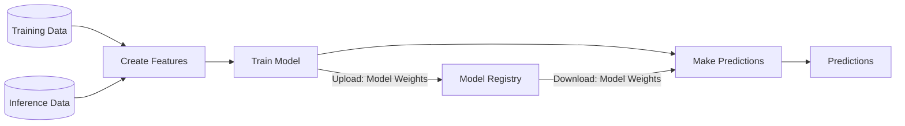

Table of Contents

- [2025-06-30 Mon](#2025-06-30-mon)
- [2025-07-01 Tue](#2025-07-01-tue)
- [NEWNOTES](#newnotes)
- [REFILED](#refiled)
- [SCREENSHOT](#screenshot)
- [CITATIONS](#citations)
- [PREVIOUS](#previous)

<!--endtoc-->

> [!quote] quote
> 
> (excellent_advice_for_living.t2t) 
> 
> Expand your mind by thinking with your feet on a walk or with your hand in a notebook. Think outside your brain.
> 
> 산책하면서 발로 생각하거나 노트에 손을 대고 생각하며 마음을 확장하세요. 뇌 밖에서 생각하세요.

## 2025-06-30 Mon {#2025-06-30-mon}

> [!quote] quote
> 
> (kevin-kelly-99.t2t) 
> 
> Compliment people behind their back. It’ll come back to you.
> 
> 사람들 뒤에서 칭찬하세요. 그것이 결국 당신에게 돌아올 것입니다.

### 05:42 굳모닝 - 업위크 {#05-42-굳모닝-업위크}

(마이클 싱어 2014) 책으로 열어내는 한 주

### 07:12 사무실 도착 {#07-12-사무실-도착}

(빅터 프랭클 2020) 프랭클의 책과 함께

### 08:31 브레이크 {#08-31-브레이크}

### 09:24 mermaid 설치 적극 활용 {#09-24-mermaid-설치-적극-활용}

-   [#다이어그램 #이맥스 #조직모드: ¤mermaid ¤platuml ¤d2]()

### 09:58 이제 온갖 다이어그램을 가져와서 그릴 수 있지 {#09-58-이제-온갖-다이어그램을-가져와서-그릴-수-있지}

### 14:01 식사 복귀 후 {#14-01-식사-복귀-후}

### 14:39 복잡한 다이어그램 {#14-39-복잡한-다이어그램}

### 21:03 바론 데려다주고 돌아옴 {#21-03-바론-데려다주고-돌아옴}

하루의 마무리 잠시만 메타라도 내보내자

### 21:45 메타 업데이트 자자 {#21-45-메타-업데이트-자자}

## 2025-07-01 Tue {#2025-07-01-tue}

> [!quote] quote
> 
> (kevin-kelly-99.t2t) 
> 
> The greatest breakthroughs are missed because they look like hard work.
> 
> 가장 위대한 돌파구는 힘든 일처럼 보여서 놓치게 된다.

### 03:53 `중도` 도덕경 {#03-53-중도-도덕경}

### 05:45 기상 준비 하고 나가자 {#05-45-기상-준비-하고-나가자}

### 07:15 출근 - 모닝 루틴 {#07-15-출근-모닝-루틴}

-   [X] 오디오북 (마이클 싱어 2023)
-   [X] 커피
-   [X] 손가락을 풀자
-   [X] 숨겨진 버그 : 이미지 링크, 한글 스펠링 사전 연결 고리

### TODO 07:45 1장 칸트 철학과 현대 물리학 - jinx hunspell 수정 {#07-45-1장-칸트-철학과-현대-물리학-jinx-hunspell-수정}

[2025-07-01 Tue 08:36]  훈스펠 enchant 연결 안되어 있네

### DONE 08:35 첨부 파일 이미지 링크 수정 완료 {#08-35-첨부-파일-이미지-링크-수정-완료}

### 08:46 브레이크 업모닝 고우! {#08-46-브레이크-업모닝-고우}

## NEWNOTES {#newnotes}

-   [#최근노트 #모음]()

-   [#모음: 인공지능 스타트업 회사 (2025-06-30)]()
-   [#플랫폼: IoT 아이오티 #개념 #키워드 #확장 (2025-06-30)]()
-   [#시스템 #플랫폼 #생태계 관계 확장 개념 (2025-06-30)]()
-   [#재현성 #파이썬 #생태계 #도구 ¤pyenv ¤poetry ¤poethepoet (2025-06-30)]()
-   [#조직모드 #마우스 #입문자 #인터페이스 (2025-06-30)]()
-   [#LLM: git £index.lock 문제 (2025-06-30)]()
-   [#LLM: embark-file-map with consult-org-heading (2025-06-30)]()
-   [@알폰소링기스 아무것도 공유하지 않은 자들의 공동체 (2025-06-30)]()

## REFILED {#refiled}

## SCREENSHOT {#screenshot}

## CITATIONS {#citations}

### [검색어: urldate = {2025-05-26}] {#검색어-urldate-2025-05-26}

## PREVIOUS {#previous}

-   [2025-06-23]()

## BIBLIOGRAPHY

  
마이클 싱어. 2014. <i>상처받지 않는 영혼: 내면의 자유를 위한 놓아보내기 연습</i>. Translated by 이균형. 서울: 라이팅하우스. <a href="https://www.yes24.com/Product/Goods/12981014">https://www.yes24.com/Product/Goods/12981014</a>.

  
———. 2023. <i>삶이 당신보다 더 잘 안다: 숲속 현자의 내맡김 수업</i>. Translated by 이균형. 고양: 라이팅하우스. <a href="https://www.yes24.com/Product/Goods/123146766">https://www.yes24.com/Product/Goods/123146766</a>.

  
빅터 프랭클. 2020. <i>죽음의 수용소에서: 죽음조차 희망으로 승화시킨 인간 존엄성의 승리</i>. Translated by 이시형. 개정보급판. 파주: 청아출판사. <a href="https://www.yes24.com/product/goods/90384709">https://www.yes24.com/product/goods/90384709</a>.

