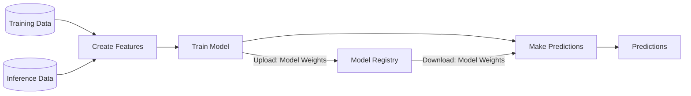

<div class="ox-hugo-toc toc">

<div class="heading">Table of Contents</div>

- [2025-06-30 Mon](#2025-06-30-mon)
- [2025-07-01 Tue](#2025-07-01-tue)
- [2025-07-02 Wed](#2025-07-02-wed)
- [NEWNOTES](#newnotes)
- [REFILED](#refiled)
- [SCREENSHOT](#screenshot)
- [CITATIONS](#citations)
- [PREVIOUS](#previous)

</div>
<!--endtoc-->

> [!quote] quote
> 
> (excellent_advice_for_living.t2t)<br />
> 
> Expand your mind by thinking with your feet on a walk or with your hand in a notebook. Think outside your brain.
> 
> 산책하면서 발로 생각하거나 노트에 손을 대고 생각하며 마음을 확장하세요. 뇌 밖에서 생각하세요.


## 2025-06-30 Mon {#2025-06-30-mon}

> [!quote] quote
> 
> (kevin-kelly-99.t2t)<br />
> 
> Compliment people behind their back. It’ll come back to you.
> 
> 사람들 뒤에서 칭찬하세요. 그것이 결국 당신에게 돌아올 것입니다.


### 05:42 굳모닝 - 업위크 {#05-42-굳모닝-업위크}

(마이클 싱어 2014) 책으로 열어내는 한 주


### 07:12 사무실 도착 {#07-12-사무실-도착}

(빅터 프랭클 2020) 프랭클의 책과 함께


### 08:31 브레이크 {#08-31-브레이크}


### 09:24 mermaid 설치 적극 활용 {#09-24-mermaid-설치-적극-활용}

-   [#다이어그램 #이맥스 #조직모드: ¤mermaid ¤platuml ¤d2]()


### 09:58 이제 온갖 다이어그램을 가져와서 그릴 수 있지 {#09-58-이제-온갖-다이어그램을-가져와서-그릴-수-있지}




### 14:01 식사 복귀 후 {#14-01-식사-복귀-후}


### 14:39 복잡한 다이어그램 {#14-39-복잡한-다이어그램}


### 21:03 바론 데려다주고 돌아옴 {#21-03-바론-데려다주고-돌아옴}

하루의 마무리 잠시만 메타라도 내보내자


### 21:45 메타 업데이트 자자 {#21-45-메타-업데이트-자자}


## 2025-07-01 Tue {#2025-07-01-tue}

> [!quote] quote
> 
> (kevin-kelly-99.t2t)<br />
> 
> The greatest breakthroughs are missed because they look like hard work.
> 
> 가장 위대한 돌파구는 힘든 일처럼 보여서 놓치게 된다.


### 03:53 `중도` 도덕경 {#03-53-중도-도덕경}


### 05:45 기상 준비 하고 나가자 {#05-45-기상-준비-하고-나가자}


### 07:15 출근 - 모닝 루틴 {#07-15-출근-모닝-루틴}

-   [X] 오디오북 (마이클 싱어 2023)
-   [X] 커피
-   [X] 손가락을 풀자
-   [X] 숨겨진 버그 : 이미지 링크, 한글 스펠링 사전 연결 고리


### <span class="org-todo todo TODO">TODO</span> 07:45 1장 칸트 철학과 현대 물리학 - jinx hunspell 수정 {#07-45-1장-칸트-철학과-현대-물리학-jinx-hunspell-수정}

<span class="timestamp-wrapper"><span class="timestamp">[2025-07-01 Tue 08:36] </span></span> 훈스펠 enchant 연결 안되어 있네


### <span class="org-todo done DONE">DONE</span> 08:35 첨부 파일 이미지 링크 수정 완료 {#08-35-첨부-파일-이미지-링크-수정-완료}


### 08:46 브레이크 업모닝 고우! {#08-46-브레이크-업모닝-고우}


### 14:18 그렇다면 코딩에 집중 {#14-18-그렇다면-코딩에-집중}


### <span class="org-todo todo TODO">TODO</span> 15:06 AMDGPU-TOP {#15-06-amdgpu-top}


#### Umio-Yasuno/Amdgpu\\_top {#umio-yasuno-amdgpu-top}

(Yasuno [2023] 2025) Yasuno, Umio 2025 Tool to display AMDGPU usage


### <span class="org-todo todo TODO">TODO</span> 17:00 #aider #openrouter {#17-00-aider-openrouter}

```text
# Change directory into your codebase
cd /to/your/project

# Or any other open router model
aider --model openrouter/<provider>/<model>

# List models available from OpenRouter
aider --list-models openrouter/
```

-   openrouter/deepseek/deepseek-coder
-   openrouter/deepseek/deepseek-r1

<!--listend-->

```text
aider --list-models openrouter/
──────────────────────────────────────────────────────────────────────────────────────You should probably run aider in your project's directory, not your home dir.
Models which match "openrouter/":
- openrouter/anthropic/claude-2
- openrouter/anthropic/claude-3-5-haiku
- openrouter/anthropic/claude-3-5-haiku-20241022
- openrouter/anthropic/claude-3-haiku
- openrouter/anthropic/claude-3-haiku-20240307
- openrouter/anthropic/claude-3-opus
- openrouter/anthropic/claude-3-sonnet
- openrouter/anthropic/claude-3.5-sonnet
- openrouter/anthropic/claude-3.5-sonnet:beta
- openrouter/anthropic/claude-3.7-sonnet
- openrouter/anthropic/claude-3.7-sonnet:beta
- openrouter/anthropic/claude-instant-v1
- openrouter/anthropic/claude-sonnet-4
- openrouter/cognitivecomputations/dolphin-mixtral-8x7b
- openrouter/cohere/command-r-plus
- openrouter/databricks/dbrx-instruct
- openrouter/deepseek/deepseek-chat
- openrouter/deepseek/deepseek-chat-v3-0324
- openrouter/deepseek/deepseek-chat-v3-0324:free
- openrouter/deepseek/deepseek-chat:free
- openrouter/deepseek/deepseek-coder
- openrouter/deepseek/deepseek-r1
- openrouter/deepseek/deepseek-r1-0528
- openrouter/deepseek/deepseek-r1:free
- openrouter/fireworks/firellava-13b
- openrouter/google/gemini-2.0-flash-001
- openrouter/google/gemini-2.0-flash-exp:free
- openrouter/google/gemini-2.5
- openrouter/google/gemini-2.5-flash
- openrouter/google/gemini-2.5-pro
- openrouter/google/gemini-2.5-pro-exp-03-25
- openrouter/google/gemini-2.5-pro-preview-03-25
- openrouter/google/gemini-pro-1.5
- openrouter/google/gemini-pro-vision
- openrouter/google/palm-2-chat-bison
- openrouter/google/palm-2-codechat-bison
- openrouter/gryphe/mythomax-l2-13b
- openrouter/jondurbin/airoboros-l2-70b-2.1
- openrouter/mancer/weaver
- openrouter/meta-llama/codellama-34b-instruct
- openrouter/meta-llama/llama-2-13b-chat
- openrouter/meta-llama/llama-2-70b-chat
- openrouter/meta-llama/llama-3-70b-instruct
- openrouter/meta-llama/llama-3-70b-instruct:nitro
- openrouter/meta-llama/llama-3-8b-instruct:extended
- openrouter/meta-llama/llama-3-8b-instruct:free
- openrouter/microsoft/wizardlm-2-8x22b:nitro
- openrouter/mistralai/mistral-7b-instruct
- openrouter/mistralai/mistral-7b-instruct:free
- openrouter/mistralai/mistral-large
- openrouter/mistralai/mistral-small-3.1-24b-instruct
- openrouter/mistralai/mistral-small-3.2-24b-instruct
- openrouter/mistralai/mixtral-8x22b-instruct
- openrouter/nousresearch/nous-hermes-llama2-13b
- openrouter/openai/gpt-3.5-turbo
- openrouter/openai/gpt-3.5-turbo-16k
- openrouter/openai/gpt-4
- openrouter/openai/gpt-4-vision-preview
- openrouter/openai/gpt-4o
- openrouter/openai/gpt-4o-2024-05-13
- openrouter/openai/gpt-4o-mini
- openrouter/openai/o1
- openrouter/openai/o1-mini
- openrouter/openai/o1-mini-2024-09-12
- openrouter/openai/o1-preview
- openrouter/openai/o1-preview-2024-09-12
- openrouter/openai/o3-mini
- openrouter/openai/o3-mini-high
- openrouter/openrouter/optimus-alpha
- openrouter/openrouter/quasar-alpha
- openrouter/pygmalionai/mythalion-13b
- openrouter/qwen/qwen-2.5-coder-32b-instruct
- openrouter/undi95/remm-slerp-l2-13b
- openrouter/x-ai/grok-3-beta
- openrouter/x-ai/grok-3-fast-beta
- openrouter/x-ai/grok-3-mini-beta
- openrouter/x-ai/grok-3-mini-fast-beta
- vertex_ai-language-models/openrouter/google/gemini-2.5-pro-preview-03-25
```


### <span class="org-todo done DONE">DONE</span> 17:31 thingsboard 대시보드 - 위젯 {#17-31-thingsboard-대시보드-위젯}

(thingsboard n.d.-b)

(thingsboard n.d.-c)

(thingsboard n.d.-a)


### 17:41 thingsboard - maven-install {#17-41-thingsboard-maven-install}

```shell
mvn spring-boot:run

```


### <span class="org-todo todo TODO">TODO</span> 18:05 씽스보드 프론트 백엔드 코드로 빌드 {#18-05-씽스보드-프론트-백엔드-코드로-빌드}

프론트 전체 코드를 기준으로 인공지능으로 커스텀 코드를 생성 이렇게 되면 인공지능으로 코드를 생성할 수 있다.


### 20:18 바론 데리고 가자 {#20-18-바론-데리고-가자}


## 2025-07-02 Wed {#2025-07-02-wed}

> [!quote] quote
> 
> (excellent_advice_for_living.t2t)<br />
> 
> Be more generous than necessary. No one on their deathbed has ever regretted giving too much away. There is no point to being the richest person in the cemetery.
> 
> 필요 이상으로 더 관대해지세요. 임종을 앞둔 사람이 너무 많이 나눠준 것을 후회한 적은 없습니다. 묘지에서 가장 부자가 되는 것은 아무 의미가 없습니다.


### 01:16 지속 가능한 지식 학습 방법 {#01-16-지속-가능한-지식-학습-방법}

그럼에도 코드 에이전트 활용 집중


### 05:41 기상 - 증강형 코딩 - 켄트백 {#05-41-기상-증강형-코딩-켄트백}

인공지능 끌어낼 수 있는 방법을 훈련하라. 이것이 3개월 수습의 개인적 목표다. 자유를 얻기 위해서는 자유를 줘야 한다. 줘야 얻는다.

지식을 쌓고 융합하는 방법은? 노트를 남기는 것 이상으로 흔적을 정리하는 방법에 대한 연구는 아무래도 폴게제텔 아닐까? 시퀀스를 연결하는 것에 대한 기대.

메타다. 그 일을 어떻게 메타인지의 차원에서 바라 볼 수 있는가? 그 일을 어떻게 표준화할 수 있는가?

그 일은 그 일이 아니다. ABD다. 사르트르의 ABC다.

[@사르트르 1905 존재와무 현상학 실존주의]()


### 06:11 레버리지 마인드 {#06-11-레버리지-마인드}

샤워하면서 딱 왔다. 레버리지 책 서문에 나오는 영국 프로그래머 사례. 인도 아웃소싱. 회사 잘림. 그러나 저자는 높게 평가함 (롭 무어 2019)

[@롭무어 레버리지 자본주의 속에 숨겨진 부의 비밀]()


### 06:16 업모닝 나가자 {#06-16-업모닝-나가자}


## NEWNOTES {#newnotes}

-   [#최근노트 #모음]()

-   [#업무 #AI활용 #플랫폼 (2025-07-01)]()
-   [#Thingsboard (2025-07-01)]()
-   [#업무 #AI활용 #임베디드 (2025-07-01)]()
-   [#업무 #AI활용 #프론트엔드 (2025-07-01)]()
-   [#AI활용 (2025-07-01)]()
-   [#업무 (2025-07-01)]()
-   [¥: #오픈API: Tuya 제공 및 보안 정책 - 국내 협력사 (2025-07-01)]()
-   [#모음: 인공지능 스타트업 회사 (2025-06-30)]()
-   [#플랫폼: IoT 아이오티 #개념 #키워드 #확장 (2025-06-30)]()
-   [#시스템 #플랫폼 #생태계 관계 확장 개념 (2025-06-30)]()
-   [#재현성 #파이썬 #생태계 #도구 ¤pyenv ¤poetry ¤poethepoet (2025-06-30)]()
-   [#조직모드 #마우스 #입문자 #인터페이스 (2025-06-30)]()
-   [#LLM: Thingsboard 백엔드 프론트엔드 ui-ngx 빌드 로그인 테스트 (2025-07-01)]()
-   [#LLM: 깃허브 프로 플러스 고급 요금제 비교 Pro Plus (2025-07-01)]()
-   [#LLM: thingsboard ui widget dashboard build (2025-07-01)]()
-   [#LLM: AMD 라이젠 노트북 리눅스 #ROCm (2025-07-01)]()
-   [#LLM: ¤Ollama 라이젠 노트북 모델 (2025-07-01)]()
-   [@OKFN: 오픈 열린 지식 재단 (2025-07-01)]()
-   [#LLM: git £index.lock 문제 (2025-06-30)]()
-   [#LLM: embark-file-map with consult-org-heading (2025-06-30)]()
-   [@사르트르 1905 존재와무 현상학 실존주의 (2025-07-02)]()
-   [#로컬LLM #실행도구 ¤ollama ¤localai (2025-07-01)]()
-   [@OpenHomeFoundation 지속 가능한 스마트홈 오픈소스 생태계 (2025-07-01)]()
-   [@알폰소링기스 아무것도 공유하지 않은 자들의 공동체 (2025-06-30)]()


## REFILED {#refiled}


## SCREENSHOT {#screenshot}


## CITATIONS {#citations}


### [검색어: urldate = {2025-05-26}] {#검색어-urldate-2025-05-26}


## PREVIOUS {#previous}

-   [2025-06-23]()

## BIBLIOGRAPHY

<style>.csl-entry{text-indent: -1.5em; margin-left: 1.5em;}</style><div class="csl-bib-body">
  <div class="csl-entry">마이클 싱어. 2014. <i>상처받지 않는 영혼: 내면의 자유를 위한 놓아보내기 연습</i>. Translated by 이균형. 서울: 라이팅하우스. <a href="https://www.yes24.com/Product/Goods/12981014">https://www.yes24.com/Product/Goods/12981014</a>.</div>
  <div class="csl-entry">———. 2023. <i>삶이 당신보다 더 잘 안다: 숲속 현자의 내맡김 수업</i>. Translated by 이균형. 고양: 라이팅하우스. <a href="https://www.yes24.com/Product/Goods/123146766">https://www.yes24.com/Product/Goods/123146766</a>.</div>
  <div class="csl-entry">빅터 프랭클. 2020. <i>죽음의 수용소에서: 죽음조차 희망으로 승화시킨 인간 존엄성의 승리</i>. Translated by 이시형. 개정보급판. 파주: 청아출판사. <a href="https://www.yes24.com/product/goods/90384709">https://www.yes24.com/product/goods/90384709</a>.</div>
  <div class="csl-entry">롭 무어. 2019. <i>레버리지 자본주의 속에 숨겨진 부의 비밀</i>. <a href="http://www.yes24.com/Product/Goods/74208134">http://www.yes24.com/Product/Goods/74208134</a>.</div>
  <div class="csl-entry">thingsboard. n.d.-a. “AI Assistance Widget.” ThingsBoard. Accessed July 1, 2025. <a href="https://thingsboard.io/docs/trendz/ai-assistance-widget/">https://thingsboard.io/docs/trendz/ai-assistance-widget/</a>.</div>
  <div class="csl-entry">———. n.d.-b. “Widgets Development Guide.” ThingsBoard. Accessed July 1, 2025. <a href="https://thingsboard.io/docs/pe/user-guide/contribution/widgets-development/">https://thingsboard.io/docs/pe/user-guide/contribution/widgets-development/</a>.</div>
  <div class="csl-entry">———. n.d.-c. “Working with IoT Dashboards.” ThingsBoard. Accessed July 1, 2025. <a href="https://thingsboard.io/docs/pe/user-guide/dashboards/">https://thingsboard.io/docs/pe/user-guide/dashboards/</a>.</div>
  <div class="csl-entry">Yasuno, Umio. (2023) 2025. “Umio-Yasuno/Amdgpu\_Top.” <a href="https://github.com/Umio-Yasuno/amdgpu_top">https://github.com/Umio-Yasuno/amdgpu_top</a>.</div>
</div>

