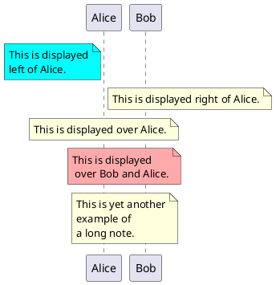

## 관련메타 {#관련메타}

-   [†#마인드맵#다이어그램#시각화#사고법]()
-   [†#데이터시각화#도표#그래프#동적#대시보드#비주얼]()


## 히스토리 {#히스토리}

-   <span class="timestamp-wrapper"><span class="timestamp">[2025-06-30 Mon 09:35] </span></span> 대부분의 다이어그램은 텍스트로 만들어야 합니다. [†#온보딩]()


## ¤mermaid {#mermaid}

-   <span class="timestamp-wrapper"><span class="timestamp">[2024-04-12 Fri 14:16] </span></span> 이맥스에서 안전한 선택


### ob-mermaid {#ob-mermaid}

<span class="timestamp-wrapper"><span class="timestamp">[2023-03-23 Thu 09:31]</span></span>

-   스페이스맥스에 restclient 레이어에 이미 있다.

Mermaid is a tool for drawing systems diagrams. **NOTE**: The variable `ob-mermaid-cli-path` needs to be set in the config (because it will change from system to system).

```shell

npm install -g @mermaid-js/mermaid-cli
mmdc -i input.mmd -o output.svg
```


#### ob-mermaid {#ob-mermaid}


### Mermaid | Diagramming and charting tool {#mermaid-diagramming-and-charting-tool}

(“Mermaid | Diagramming and Charting Tool” n.d.)


### abrochard/mermaid-mode {#abrochard-mermaid-mode}

(Adrien Brochard [2019] 2024)

Adrien Brochard 2024

Emacs major mode for working with mermaid graphs <https://mermaidjs.github.io/>


## ¤d2 {#d2}

d2 가 좋다. 쉽게 사용할 수 있으니까. 다이어그램은 하나 선택해서 해야 하는데 예쁜게 좋다. 이왕이면.

-   [#문법: #영문법 - 문장 성분 품사 관계 - #다이어그램]()


### 설치 방법 {#설치-방법}

<a id="code-snippet--install-d2"></a>
```bash

# Basics
curl -fsSL https://d2lang.com/install.sh | sh -s --
```


### FIXME ob-d2 exmaples {#fixme-ob-d2-exmaples}

<span class="timestamp-wrapper"><span class="timestamp">[2023-06-16 Fri 12:54]</span></span>

<span class="timestamp-wrapper"><span class="timestamp">[2024-01-16 Tue 14:34] </span></span> 문제는 여백?! 상관 없이 블로그 엔진에서 로딩해주면 된다.

babel 검증 부터 한다. 이미지로 넣으면 되니까 Hugo 는 옵션이다.

테스트

```d2
x -> y: hello world
```

flags 옵션으로 테마 줄 수 있다. 이게 장점이기도 하다.

```d2
High Mem Instance -> EC2 <- High CPU Instance: Hosted By
```

다른 예제

```d2
clouds: {
  aws: {
    load_balancer -> api
    api -> db
  }
  gcloud: {
    auth -> db
  }

  gcloud -> aws
}
```


### ob-d2 {#ob-d2}

<span class="timestamp-wrapper"><span class="timestamp">[2023-06-16 Fri 12:47]</span></span> <https://github.com/xcapaldi/ob-d2>

```elisp
;;;;; ob-d2

(defun jh-org/init-ob-d2 ()
  (use-package ob-d2
    :defer 15
    :config
    (setq ob-d2-command "~/.local/bin/d2")
    )
  )
```


## ¤plantuml {#plantuml}



