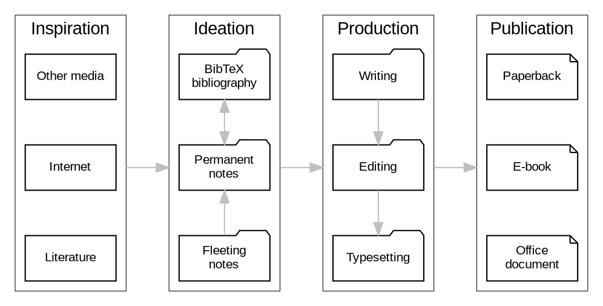
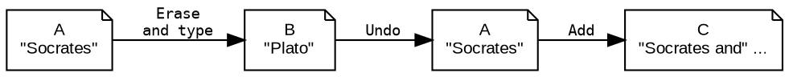
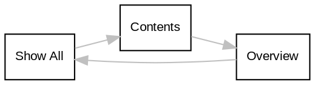

## References

<style>.csl-entry{text-indent: -1.5em; margin-left: 1.5em;}</style><div class="csl-bib-body">
  <div class="csl-entry">Berry, R.E. 1988. “Common User Access. A Consistent and Usable Human-Computer Interface for the SAA Environments.” <i>Ibm Systems Journal</i> 27 (3): 281–300. <a href="https://doi.org/10.1147/sj.273.0281">https://doi.org/10.1147/sj.273.0281</a>.</div>
  <div class="csl-entry">“Emacs Writing Studio.” 2021. <a href="https://lucidmanager.org/tags/emacs/">https://lucidmanager.org/tags/emacs/</a>.</div>
  <div class="csl-entry">Johnson, Timothy. 2022. “Emacs as a Tool for Modern Science: The Use of Open Source Tools to Improve Scientific Workflows.” <i>Johnson Matthey Technology Review</i> 66 (2): 122–29. <a href="https://doi.org/10.1595/205651322x16316969040478">https://doi.org/10.1595/205651322x16316969040478</a>.</div>
  <div class="csl-entry">Khalili, Ali, and Sören Auer. 2015. “WYSIWYM –- Integrated Visualization, Exploration and Authoring of Semantically Enriched Un-Structured Content.” <i>Semantic Web</i> 6 (3): 259–75. <a href="https://doi.org/10.3233/sw-140157">https://doi.org/10.3233/sw-140157</a>.</div>
  <div class="csl-entry">Kim, Kangsoo, Austin Erickson, Alexis Lambert, Gerd Bruder, and Greg Welch. 2019. “Effects of Dark Mode on Visual Fatigue and Acuity in Optical See-through Head-Mounted Displays.” In <i>Symposium on Spatial User Interaction</i>. Sui ’19. ACM. <a href="https://doi.org/10.1145/3357251.3357584">https://doi.org/10.1145/3357251.3357584</a>.</div>
  <div class="csl-entry">Monnier, Stefan, and Michael Sperber. 2020. “Evolution of Emacs Lisp.” <i>Proceedings of the ACM on Programming Languages</i> 4 (HOPL): 1–55. <a href="https://doi.org/10.1145/3386324">https://doi.org/10.1145/3386324</a>.</div>
  <div class="csl-entry">Omanson, Richard, Craig S. Miller, Elizabeth Young, and David Schwantes. 2010. “Comparison of Mouse and Keyboard Efficiency,” 600–404.</div>
  <div class="csl-entry">Stallman, Richard M. 1981a. <i>Emacs Manual for Its Users</i>. AIM-554. <a href="http://hdl.handle.net/1721.1/6329">http://hdl.handle.net/1721.1/6329</a>.</div>
  <div class="csl-entry">———. 1981b. “EMACS the Extensible, Customizable Self-Documenting Display Editor.” <i>Acm Sigoa Newsletter</i> 2 (1-2): 147–56. <a href="https://doi.org/10.1145/1159890.806466">https://doi.org/10.1145/1159890.806466</a>.</div>
  <div class="csl-entry">Stickgold, Robert, April Malia, Denise Maguire, David Roddenberry, and Margaret O’Connor. 2000. “Replaying the Game: Hypnagogic Images in Normals and Amnesics.” <i>Science</i> 290 (5490): 350–53. <a href="https://doi.org/10.1126/science.290.5490.350">https://doi.org/10.1126/science.290.5490.350</a>.</div>
  <div class="csl-entry">Tognazzini, Bruce. 1992. <i>Tog on Interface</i>. Reading, Mass: Addison-Wesley.</div>
  <div class="csl-entry">———. 1993. “Principles, Techniques, and Ethics of Stage Magic and Their Application to Human Interface Design.” In <i>Proceedings of the Interact ’93 and CHI ’93 Conference on Human Factors in Computing Systems</i>, 355–62. Amsterdam. <a href="https://doi.org/10.1145/169059.169284">https://doi.org/10.1145/169059.169284</a>.</div>
</div>


## Emacs Writing Studio {#emacs-writing-studio}

(“Emacs Writing Studio” 2021)

-   Emacs Writing Studio is a configuration and description of how to write and publish articles, books and websites with Emacs.


## History {#history}

-   <span class="timestamp-wrapper"><span class="timestamp">[2024-12-18 Wed 10:41] </span></span> 그냥 하던거 복붙해서 쭉 만들어 버리자. 그게 편하겠다. 오래걸려.


## 00 Desc {#00-desc}

Unlock the full potential of your writing process with Emacs Writing Studio, an indispensable guide for writers looking to break free from the constraints of conventional writing tools. Whether you're a novelist crafting intricate tales, a researcher assembling a technical report, or a multitasking author managing various projects, this book is your comprehensive resource for transforming your workflow, ensuring all your writing needs are met.

Written by Peter Prevos, a seasoned author and Emacs enthusiast, Emacs Writing Studio demystifies the world of Emacs, a powerful and highly configurable text editor. This book is not just a manual; it's a carefully curated journey through Emacs' capabilities tailored specifically for writers. From ideation to publication, this guide walks you through every stage of the writing process, ensuring that you can focus on what truly matters—your content.

With Emacs Writing Studio, you'll learn how to:

-   Organise and Manage Ideas: Use Emacs' robust note-taking features to capture fleeting thoughts, develop them into substantial notes, and weave them into your manuscript.
-   Streamline Writing Workflow: Write distraction-free in a plain text environment, reducing the clutter of modern word processors while enjoying the flexibility to customise your workspace.
-   Export with Ease: Seamlessly publish your work in multiple formats, including PDF, HTML, and ePub, with the powerful export capabilities of Emacs' Org mode.
-   Stay on Track: Manage your writing projects and deadlines effectively, leveraging Emacs' task management tools to keep everything in order.

This guide is more than technical instructions—it's an invitation to rethink how you write. Emacs, known for its steep learning curve, becomes accessible with Prevos' guidance. It helps you master the essentials and gradually explore more advanced features as your confidence grows.

Whether new to Emacs or looking to refine your existing setup, Emacs Writing Studio will be your go-to reference. It includes practical tips, real-world examples, and a fully annotated configuration that you can tailor to your specific needs, ensuring you're always prepared and ready to tackle your writing projects.

Embrace a new way of writing. Equip yourself with the tools to write more efficiently, manage your work precisely, and publish effortlessly. Let Emacs Writing Studio be the companion that empowers your writing journey, giving you the confidence and control you need to succeed.


## 00 Foreword {#00-foreword}

<span class="timestamp-wrapper"><span class="timestamp">[2024-12-18 Wed 10:59]</span></span>

With _Emacs Writing Studio_ you have what you need to get started with writing. The book and the concomitant configuration for Emacs provide a solid foundation for you to organise your ideas, capture information, and elucidate your thoughts.

This book provides an overview of Emacs' capabilities for writers. It does it in a way that is approachable. You get the essentials and are then guided through the various facets of the workflow.

Consider _Emacs Writing Studio_ a companion on a long journey. It helps you get started with Emacs and will be there for you as a valuable reference when you need to do something a little bit more advanced but forgot how to proceed.

What you get at the outset is a curated experience. This is exactly what you need to get on with the task of writing: it minimises distractions. Though do not think of it as a constraint: you are still using Emacs --- a powerful tool that can be reprogrammed or extended to do more with text and related patterns of interaction. The _Emacs Writing Studio_ setup consists of sensible defaults. You will not be locked in to a bespoke system. This is the standard Emacs experience and you are free to modify it to your liking.

You can always find more resources to address whatever issue you may have. Beside the official manual of Emacs, you will discover a rich corpus of knowledge produced by the community. There are blog posts, drawings, and video demonstrations. They will all apply to what you have here.

No configuration can be a replacement for the work you put in. This is true for your time using Emacs but also for writing in general. Do not come with the expectation that _Emacs Writing Studio_ will do miracles for you: it will not make you an Emacs expert overnight and it will not boost your creativity without you doing anything.

This is a tool that has been tested and proven to work well. Like every tool, it must be used properly by someone who has the requisite skills or is willing to acquire them through continuous practice. As a beginner, you will not know much: the book is here to ensure that you find the information you need to keep going.

The expectation you can have is that _Emacs Writing Studio_ will deliver on its promise of giving you a set of tools for authoring your next works. It will do it in a reliable way. The rest is up to you: conduct the research and start creating.

Beside the technicalities, this book will make you think about matters of method. It does it indirectly through the functions it describes. You then have to consider how each of those will fit in to your workflow.

Piecing together a set of tools or procedures is part of the process of discovery that authors must go through. Through trial and error, you figure out what works for you. You may then stick with it and strongly prefer it over alternative approaches. Whether your methods are appropriate for others does not really matter: you know that one size does not fit all.

Emacs is the perfect tool for those who want to be particular with their writing. It is highly configurable and will grow with you as a user to always match your current level. If you do ever get the chance to learn some Emacs Lisp, you will realise that there is so much you can do to tweak every little thing exactly how you want it to be.

The key to learning your way around Emacs is to be patient and methodical. Try one thing at a time, learn how to use it, and then move on to the next one. This is why _Emacs Writing Studio_ is helpful: it lets you experiment at your own pace while giving you something that works well out-of-the-box.

Remember that you are just getting started and you will be here long-term. Good luck!

Protesilaos "Prot" Stavrou


## 00 Preface {#00-preface}

<span class="timestamp-wrapper"><span class="timestamp">[2024-12-18 Wed 11:00]</span></span>

My writing journey started in the early 1990s with paper diaries to record my random thoughts and as a travel diary. Paper notebooks are great, and I still use them today as the primary place to gather thoughts. The only disadvantage of paper notebooks is finding old information and linking bits and pieces together takes a lot of work. Besides my notebooks, I also amassed a paper archive, a library and a collection of photographs. Being a computing enthusiast, I have ever since searched for the ultimate digital tool to combine all these pieces of information into the ultimate personal knowledge management system.

Over the years, I have tried a multitude of computer applications to achieve this ideal state. I wanted something that stores information in an enduring format that does not rely on a brand of software. Ideally, it had to be searchable and a single application to undertake different tasks.

I used to hop from application to application, jump from the action list to my schedule, and move on to the word processor, spreadsheet, PDF reader, etc. I managed a complex web of software tools to deliver a single project. Wouldn't it be nice if there was one program that could help you with all your tasks?

My online research always pointed towards Emacs. I tried to use it in the early 2000s but quickly gave up due to the steep learning curve. About ten years ago, I tried again, and this time, I was helped by a steady flow of websites and instructional videos to get me started. Over the following years, I studied Emacs and configured it to write and publish articles and books.

Emacs is to me like being in Willy Wonka's Chocolate Factory where almost everything is possible. I crafted EWS to meet my specific needs for writing this book and other projects, which I am are also useful for other authors.

My commitment to crafting the Emacs Writing Studio (EWS) configuration was driven by a desire to share the benefits of my journey with others. EWS is not just a tool, but a culmination of years of learning and experimentation. My aim was to write the book that I would have loved to read when I first came in contact with Emacs.

This book, which is both a guide to EWS and a product of its capabilities, has been rigorously tested and refined to ensure it meets the needs of large writing projects.


### Acknowledgements {#acknowledgements}

The development and maintenance of a complex system like Emacs is a testament to the power of community. I am deeply grateful to the countless volunteers who have contributed to its core system's code and the abundance of packages. Their collective effort is what makes Emacs a thriving ecosystem.

My motivation for writing this book came from the inspiring work of people like Protesilaos (Prot) Stavrou, David Wilson from _System Crafters_ and many others who helped me flatten the learning curve of my Emacs journey through their blogs and YouTube videos.

Mastodon and Emacs users Harold Kirsch, Thomas Montfort, Ben Finney, Antonio Simón (Quijote Libre), Bob Irving, Frédéric Vachon, and Erin Stearns have reviewed early versions of the book. Their feedback has helped to make this book both easier to read and more comprehensive, which is a fine balance to achieve.

Thanks to Stefan Kangas and Fredrik Salomonsson for picking up some typos in the text.

&nbsp;
<p style="text-align:right">Peter Prevos</p>


## 01 소개 Introduction {#01-소개-introduction}

<span class="timestamp-wrapper"><span class="timestamp">[2024-12-18 Wed 10:44]</span></span>

지난 5천 년 동안 글쓰기는 점토판과 돌을 깎아 쓰는 것에서 종이, 컴퓨터, 그리고 가장 최근에는 인공 지능으로 발전해 왔습니다. 전자 글쓰기가 등장하기 전에는 작가에게 필요한 것은 공책과 펜, 타자기뿐이었습니다. 디지털 시대에 작가가 된다는 것은 여러 가지 면에서 점토, 돌, 종이 시대보다 더 복잡합니다.

현대의 작가들은 각각 특정 기능을 수행하는 수많은 전자 도구에 압도당하는 경우가 많습니다. 정보는 다양한 플랫폼에 흩어져 있고 호환되지 않는 형식으로 저장되어 있어 글쓰기 과정이 복잡하고 시간이 많이 소요됩니다. 이러한 복잡성을 덜어주는 것이 바로 Emacs의 주요 장점 중 하나입니다.

안타깝게도 이전 단락에서는 많은 학생, 저자, 연구원 및 기타 작가들이 워크플로우를 관리하는 방법에 대해 설명했습니다. 이 과정을 다르게 하고 동일한 프로그램을 사용하여 아이디어 구상부터 출판까지 저작물을 만들 수 있다면 어떨까요? 이 책에서는 초기 아이디어를 떠올리는 것부터 완성된 기사, 책 또는 웹사이트를 게시하는 것까지 모든 작업을 지원하는 강력한 도구인 Emacs를 소개합니다. Emacs를 사용하면 소프트웨어 저글링을 그만두고 글쓰기에 집중할 수 있습니다.

이 책은 기존 글쓰기 도구의 제약에서 벗어나 보다 유연하고 강력하며 사용자 지정 가능한 환경을 수용하고자 하는 작가를 위한 책입니다. 복잡한 소설 이야기를 엮어가는 소설가든, 치밀한 논픽션을 만드는 연구자든, _Emacs Writing Studio_ (EWS)는 글쓰기 프로세스를 혁신할 수 있는 종합적인 가이드를 제공합니다.


### Fiction writers {#fiction-writers}

소설 작가에게 상상력은 가장 소중한 자산입니다. 아이디어의 유동성을 따라잡을 수 있는 도구가 있어야 방해받지 않고 풍부한 캐릭터, 복잡한 플롯, 생생한 세계를 만드는 데 집중할 수 있습니다. Emacs를 사용하면 단일 환경 내에서 메모, 초안, 캐릭터 스케치를 체계적으로 관리할 수 있습니다.

강력한 검색 및 바꾸기 기능과 사용자 지정 가능한 템플릿이 결합되어 있어 원고 전체에서 캐릭터 이름, 위치, 기타 중요한 세부 사항의 일관성을 쉽게 관리할 수 있습니다. 영감이 떠오르면 불필요한 그래픽 요소의 방해 없이 바로 글쓰기에 몰입할 수 있는 Emacs의 미니멀한 인터페이스를 사용하세요.

추리 소설로 유명한 미국 작가 닐 타운 스티븐슨은 글을 불덩어리로 파괴하는 방식이 아니라 기존 글쓰기 도구와 비교했을 때 엄청난 힘을 발휘한다는 의미에서 Emacs를 열핵 워드 프로세서라고 표현했습니다.


### Non-fiction writers {#non-fiction-writers}

논픽션 글쓰기에는 정확성, 체계성, 세심한 조사가 필요합니다. 논문, 기술 보고서, 역사 전기 등 어떤 작업을 하든, Emacs는 방대한 양의 데이터를 효과적으로 관리할 수 있는 도구를 제공합니다. 연구 노트를 효율적으로 구성하고, 참고 문헌을 관리하고, 작업의 개요를 작성할 수 있습니다.

Emacs를 사용하면 이러한 요소를 글쓰기에 매끄럽게 통합할 수 있어, 초안을 작성할 때 모든 조사 내용을 손끝으로 확인할 수 있습니다. 원고를 PDF나 HTML과 같은 다양한 포맷으로 내보낼 수 있는 기능을 사용하면 번거로운 포맷 변환 없이도 작업을 출판하거나 동료들과 공유할 수 있습니다.


### Multitasking writers {#multitasking-writers}

오늘날처럼 빠르게 변화하는 세상에서는 많은 작가들이 여러 프로젝트를 동시에 관리합니다. Emacs는 다양한 글쓰기 포트폴리오를 관리하기에 완벽한 도구입니다.

단편 소설, 연구 논문, 일기 등 다양한 프로젝트 사이를 손쉽게 전환할 수 있습니다. Emacs의 강력한 작업 관리 기능을 사용하면 마감일과 작업을 추적하고 모든 글쓰기 작업의 진행 상황을 파악할 수 있습니다.


### Distracted writers {#distracted-writers}

최신 글쓰기 소프트웨어의 기능에 쉽게 산만해진다면 Emacs가 신선한 변화를 선사합니다. 일반 텍스트와 키보드 기반 명령에 중점을 둔 Emacs는 방해받지 않고 글에만 집중할 수 있는 진정으로 방해받지 않는 환경을 제공하여 방해받지 않고 글쓰기에 집중할 수 있게 해줍니다.

Emacs로 글을 쓰면 타자기가 글과 글 사이에 서 있던 시절로 돌아갑니다. 하지만 Emacs에는 강력한 편집 기능도 있으므로 수정액이 필요 없습니다.


### Curious writers {#curious-writers}

마지막으로 이 책은 단순한 도구가 아니라 기술 사용자로서 배우고 성장할 수 있는 기회를 찾는 분들을 위한 책입니다. Emacs는 단순한 소프트웨어가 아니라 삶의 방식입니다. 강력한 기능을 사용하는 방법을 배우면서 글쓰기 과정과 전반적인 생산성을 향상시키는 새로운 기술을 개발하여 글쓰기 여정에서 새로운 가능성을 탐색하도록 영감을 줍니다.

처음에는 소프트웨어 개발자를 위해 고안되었지만, 컴퓨터 전문가가 아니어도 저자로 활용할 수 있습니다. 이 책은 가파른 학습 곡선을 평평하게 만들어 최고의 글쓰기 동반자로서 Emacs의 잠재력을 최대한 발휘할 수 있도록 도와줍니다.


## 02 이맥스를 사용하는 이유 Why Use Emacs {#02-이맥스를-사용하는-이유-why-use-emacs}

<span class="timestamp-wrapper"><span class="timestamp">[2024-12-18 Wed 10:45]</span></span>

Emacs의 공식 태그 라인은 "확장 가능한 자체 문서화 텍스트 편집기"라는 것입니다. 이 단어는 소프트웨어 개발 도구라는 원래의 목적에 초점을 맞추고 있기 때문에 Emacs를 제대로 표현하지 못합니다. Emacs는 정보 관리, 프로젝트 추적, 기사, 책, 웹사이트 및 기타 텍스트 기반 활동을 작성하고 게시하는 데 도움이 되는 다목적 컴퓨팅 환경입니다. Emacs는 생산성 해킹이 아니라 생산성 해킹 시스템입니다. Emacs는 생산성 도구의 스위스 군용 전기톱입니다.

리차드 스톨먼은 40여 년 전에 Emacs의 첫 번째 버전을 출시했습니다 (Stallman 1981b). 이렇게 오래된 소프트웨어는 구식으로 보일 수 있지만 활발한 개발자 커뮤니티가 지속적으로 시스템을 개선하고 있습니다. 확장성이 있다는 것은 사용자가 자신의 필요에 맞게 구성할 수 있다는 뜻입니다. Emacs 구성은 키보드 단축키와 추가 기능 등 사용자가 원하는 방식으로 시스템이 작동하도록 지시합니다. 또한 Emacs는 무료로 제공되는 수천 개의 패키지를 통해 확장할 수 있습니다. Emacs 패키지는 시스템에 새로운 기능을 추가하거나 휴대폰의 앱처럼 기존 기능을 향상시키는 플러그인입니다.

수십 년 동안 많은 버전의 Emacs가 존재해 왔습니다. 현재 가장 널리 사용되는 버전은 1984년 Richard Stallman이 처음 발표한 GNU Emacs입니다 (Johnson 2022). GNU Emacs(Emacs라고도 함)는 자유 소프트웨어 재단에서 배포하는 무료 소프트웨어입니다. 재단은 자유 소프트웨어를 다음과 같이 느슨하게 정의합니다:

> “Free software” means software that respects users' freedom and community. Roughly, it means that the users have the freedom to run, copy, distribute, study, change and improve the software. Thus, "free software" is a matter of liberty, not price. To understand the concept, you should think of "free" as in "free speech", not as in "free beer".

무료 소프트웨어는 금전적 가치보다 자유라는 측면을 강조하기 위해 '리브레 소프트웨어'라고도 불립니다.

Emacs는 텍스트 편집기이지만 작성자에게는 의미가 없습니다. 저자의 관점에서 보면 편집은 글쓰기 과정의 한 단계에 불과하기 때문에 Emacs는 텍스트 /프로세서/입니다. 텍스트 편집기는 소프트웨어 개발자가 코드를 작성하기 위한 도구이고 텍스트 프로세서는 저자가 산문을 작성하기 위한 도구입니다. EWS는 소프트웨어 편집기를 텍스트 프로세서로 변환하여 Emac을 저자를 위한 도구로 변환하는 맞춤형 구성입니다.


### Why use Emacs? 이맥스를 사용하는 이유? {#why-use-emacs-이맥스를-사용하는-이유}

글쓰기 프로젝트에서 작업할 때 저자는 작업을 완료하기 위한 도구 모음이 필요합니다. 리서치 도구에 메모를 적고 데이터베이스에 꼼꼼하게 참고 문헌을 구축합니다. 그런 다음 익숙한 워드 프로세서로 글을 씁니다. 마감일을 지키기 위해 프로젝트 관리를 위한 생산성 도구도 활용합니다. 마지막으로 몇 시간 동안 집중해서 일한 후에는 테트리스 게임으로 긴장을 풀고 애플리케이션 서커스에서 충분한 휴식을 취하기도 합니다.

이 익숙한 장면의 문제점은 각 프로그램마다 새로운 기술을 배우고, 다른 내부 로직을 탐색하고, 미리 정해진 워크플로우에 맞춰야 한다는 것입니다. 대부분의 소프트웨어는 유연성이 떨어져서 체크박스로 제공되는 몇 가지 구성 옵션 외에는 개발자의 작업 방식에 적응해야 합니다.

Emacs는 혁신적인 접근 방식을 제공합니다. 하나의 통합된 환경에서 연구 노트를 작성하고, 참고 문헌을 관리하고, 심지어 테트리스 게임까지 즐길 수 있습니다. 여러 프로그램을 번갈아 사용하는 대신 명령어 하나만 익히면 얼마나 편리할지 상상해 보세요. Emacs는 사용자가 원하는 대로 구성하고 사용자 지정할 수 있어 단순한 글쓰기 도구에서 개인 워크플로우의 확장으로 탈바꿈합니다. 소프트웨어 저글링을 그만두고 진정으로 중요한 글쓰기에 집중하세요.

이 설명은 약간 오해의 소지가 있을 수 있습니다. Emacs가 글쓰기 스튜디오가 되려면 다른 소프트웨어의 도움이 필요하기 때문입니다. Emacs는 다른 무료 소프트웨어에 대한 인터페이스이기도 합니다. 따라서 Emacs가 PDF, 오디오 또는 비디오 파일과 같은 바이너리 파일 형식을 읽고 내보낼 수 있도록 추가 소프트웨어를 설치해야 합니다. 또한 맞춤법 검사, 고급 검색 및 다이어그램 생성을 위해 외부 소프트웨어를 사용해야 합니다.

Emacs는 최신 그래픽 소프트웨어의 눈요깃거리와는 다르게 보이지만, 겉으로 보기에 세련되지 않은 데에는 이유가 있습니다. 딱딱한 외관에 속지 마세요. 표면 아래에는 강력하고 세심하게 제작된 최신 컴퓨팅 환경이 숨어 있으며, 이를 방해받지 않는 글쓰기 도구로 활용할 수 있습니다.

또 다른 장점은 이 도구의 수명이 길다는 점입니다. 지금 사용하는 방식이 앞으로 수십 년 후에도 Emacs를 사용하는 방식이 될 것입니다. 기본 기본 기능은 약간만 변경되었기 때문에 1981년판 Emacs 매뉴얼을 읽는 것은 최신 버전을 읽는 것과 거의 같습니다 (Stallman 1981a).

많은 작가들이 대용량 문서를 다룰 때 상용 워드 프로세서의 제약을 한탄해 왔습니다. 이 소프트웨어로 작업하는 것은 실망스러운 경험이 될 수 있습니다. 이러한 프로그램은 종이 메모와 보고서가 세상을 지배하던 시절에 처음 개발되었으며, 그 이후에도 거의 변하지 않았습니다. 대부분의 사람들이 전자 매체를 위해 글을 쓰지만 그래픽 소프트웨어는 인쇄된 종이 조각을 에뮬레이션합니다. Emacs는 콘텐츠와 디자인을 분리함으로써 이러한 패러다임에서 벗어났습니다. 이러한 자유로운 접근 방식 덕분에 최종 제품의 디자인에 얽매이지 않고 아이디어를 만드는 데 집중할 수 있습니다. 또 다른 장점으로 Emacs는 동일한 텍스트 파일을 인쇄 가능한 PDF, 웹사이트 또는 전자책으로 손쉽게 변환할 수 있습니다.


### Malleable software 유연한 소프트웨어 {#malleable-software-유연한-소프트웨어}

Emacs는 '유연한 소프트웨어' 플랫폼으로, 작동 방식을 자유롭게 변경하고 개선할 수 있습니다. 가변 소프트웨어의 첫 번째 원칙은 변경이 쉽다는 것입니다. 고급 Emacs 사용자는 Elisp(Monnier and Sperber 2020)라고도 불리는 LISP 언어의 Emacs 버전을 사용하여 맞춤형 애플리케이션을 구축할 수 있습니다. 이 작업은 어렵게 들릴 수 있지만 가능성에 관한 것입니다. 초보 Emacs 사용자는 Elisp에 대한 지식 없이도 시스템의 거의 모든 것을 구성할 수 있습니다.

이 책은 코드가 없는 버전의 Emacs 사용법을 소개합니다. 마지막 장과 부록에서는 Elisp 사용을 시작하는 방법에 대한 지침을 제공하지만, 코드를 작성하지 않고도 작성자로서 Emacs를 사용할 수 있습니다.

고급 애플리케이션을 사용하려면 Emacs Lisp를 배워야 합니다. 이 지식 요구 사항은 장애물처럼 보일 수 있지만 사용 방법을 배우면 컴퓨터 사용 방식에 거의 무한한 힘을 부여할 수 있습니다. 소프트웨어는 사용자에 맞춰 조정되어야지 그 반대가 되어서는 안 됩니다. 대부분의 Emacs 사용자는 자신이 개발한 작업을 공유하므로 자유롭게 복사할 수 있습니다. 또한 무료로 제공되는 수천 개의 패키지를 사용하여 Emac을 확장하고 구성할 수도 있습니다. EWS는 이러한 패키지를 엄선하여 작성자의 요구를 충족하는 컬렉션입니다.

이 접근 방식의 장점은 이 소프트웨어를 사용할 때 완전한 자유를 누릴 수 있다는 것입니다. 텍스트로만 할 수 있다면 원하는 거의 모든 작업을 수행하도록 지시하고 특정 요구 사항에 맞게 구성할 수 있습니다. 단점은 최신 소프트웨어와는 다른 접근 방식이 필요하다는 것입니다. Emacs를 사용하면 컴퓨터 사용의 원래 의도와 진정한 사용자 친화성으로 돌아갈 수 있습니다. 컴퓨터 사용 방식을 바꿀 준비가 되셨나요? 영화 매트릭스의 유명한 장면을 인용하자면:

> If you take the blue Microsoft pill, the story ends, and everything stays the same. If you take the purple Emacs pill, you stay in Wonderland, and I show you how deep the rabbit hole goes.
>
> 파란색 Microsoft 알약을 먹으면 이야기가 끝나고 모든 것이 그대로 유지됩니다. 보라색 이맥스 알약을 먹으면 원더랜드에 머물게 되고, 토끼굴이 얼마나 깊은지 보여드릴게요.


### Redefining user-friendliness 사용자 친화성 재정의 {#redefining-user-friendliness-사용자-친화성-재정의}

Emac의 매끄러운 그래픽 인터페이스가 부족하면 신규 사용자가 실망할 수 있습니다. 안타깝게도 대부분의 사람들은 사용자 친화성을 매끄러운 디자인과 마우스 사용과 혼동합니다. 그러나 그래픽 방식은 사용자가 자유를 잃기 때문에 전혀 사용자 친화적이지 않습니다. 그래픽 기반 소프트웨어는 금박을 입힌 새장과 같습니다. 작업하기는 편할지 모르지만 여전히 새장입니다.

Emacs는 페이지나 화면에서 최종적으로 어떻게 보이는지 대신 화면에 표시되는 문자의 의미론적 의미에 초점을 맞춘 일반 텍스트 처리기입니다. 일반 텍스트는 정보가 저장되는 방식과 관련된 것으로, 일반 영어와는 다릅니다. 일반 텍스트는 글꼴 크기, 색상 및 기타 속성에 대한 정의를 숨기는 서식 있는 텍스트와 반대되는 개념입니다.

일반 텍스트는 일반적으로 `.txt` 확장자를 가지며 굵은 텍스트와 같은 서식이 없습니다. Windows 사용자라면 오래된 메모장 소프트웨어에 익숙할 것입니다. 하지만 일반 텍스트를 예술 작품으로 바꿀 수 있는 광범위한 기능을 포함하는 HTML, Markdown, LaTeX 및 Org와 같은 다른 일반 텍스트 형식도 있습니다.

일반 텍스트는 모든 컴퓨터 시스템에서 읽을 수 있으므로 특정 소프트웨어 패키지를 사용하거나 특정 형식의 글쓰기에 갇힐 염려가 없습니다. Emacs에서 작성한 모든 내용은 메모장, 텍스트 편집기 또는 기타 소프트웨어로 읽을 수 있습니다. 유일한 차이점은 다른 프로그램에는 Emacs의 다재다능함이 없다는 것입니다. 일반 텍스트는 틈새 애플리케이션이 아닙니다. 이 형식은 기본적으로 수십 년 동안 변하지 않았으며 앞으로도 사라질 것 같지 않습니다.

텍스트 모드는 '그래픽'을 표시할 수 있습니다. 제가 1970년대에 초등학교에 다닐 때 선생님이 컴퓨터 아트를 보여주셨어요. 이 작품은 이 고양이와 같은 이미지와 유사한 인쇄된 문자로 구성되어 있었습니다(출처: [asciiart.eu](https://www.asciiart.eu/)). 그러나 Emacs에서도 이미지를 표시할 수 있으므로 이러한 고대 기술에 의존할 필요는 없습니다.

```text
 /\_/\
( o o )
==_Y_==
  `-'
```

그래픽 인터페이스는 화면의 물체를 책상 위의 종이와 폴더처럼 보이게 하여 실제 세계를 시뮬레이션합니다. 문서를 가리키고 클릭하고 폴더로 드래그하면 문서가 종이 위에 있는 것처럼 나타나고 작업이 끝나면 휴지통으로 이동합니다. 그래픽 인터페이스는 마치 물리적인 작업을 하고 있다고 믿게 만드는 마술과도 같습니다(Tognazzini 1993). 이 방식은 편리할 수 있지만 컴퓨터가 어떻게 작동하는지 이해하지 못하게 합니다. 워드 프로세서에서는 화면이 인쇄된 페이지처럼 보입니다. 이는 미적으로 보기에는 좋을지 모르지만, 작성자가 콘텐츠를 만드는 데 방해가 되고 대신 서식을 만지작거리게 만듭니다.

그래픽 소프트웨어는 화면이 인쇄된 문서처럼 보이도록 하는 _What You See is What You Get_ (WYSWYG 위지위그)를 따릅니다. 이는 인쇄된 문서를 작성할 때만 해당됩니다. 그러나 전자 텍스트의 극히 일부만 인쇄용으로 작성되므로 디지털 시대에는 WYSIWYG 방식이 큰 의미가 없습니다.

그래픽 접근 방식은 콘텐츠에서 정신을 분산시키고 사용자가 텍스트를 작성하는 대신 스타일을 편집하도록 유도합니다. WYSIWYG 소프트웨어의 텍스트는 콘텐츠와 디자인을 포함하므로 리치 텍스트라고 합니다. 서식 있는 텍스트 내부의 서식 지정 지침은 사용자에게 보이지 않기 때문에 최종 결과물이 원하는 대로 보이지 않는 문제가 발생할 수 있습니다. 전 세계의 직장인들은 그래픽 환경에서 문서 서식을 지정하고 조판하는 데 많은 시간을 낭비하고 있습니다.

일반 텍스트는 /What You See is What You Mean/(WYSIWYM) 방식을 사용합니다. 문서 디자인에 초점을 맞추는 대신 WYSIWYM 편집기는 각 요소의 의도된 의미를 보존합니다. 섹션, 단락, 일러스트레이션 및 기타 문서 요소는 다양한 규칙을 사용하여 레이블이 지정됩니다(Khalili and Auer 2015). 일반 텍스트에서는 콘텐츠와 의미를 사용자가 직접 볼 수 있고 변경할 수 있습니다.

일반 일반 텍스트 파일은 가장 기본적인 형식이며 어떤 의미도 포함하지 않습니다. HTML, LaTeX, Markdown 및 Org와 같은 다른 일반 텍스트 형식에는 최종 결과(마크업)를 정의하는 명령 집합이 포함되어 있습니다. 표 [Table 1](#table--tab-plaint-text)는 네 가지 인기 있는 일반 텍스트 형식에서 /이탤릭체 텍스트/를 표시하는 방법을 보여줍니다.

<a id="table--tab-plaint-text"></a>
<div class="table-caption">
  <span class="table-number"><a href="#table--tab-plaint-text">Table 1</a>:</span>
  Italic text in common plain text formats.
</div>

| Format   | Italic semantics     |
|----------|----------------------|
| HTML     | `<i>Italic Text</i>` |
| LaTeX    | `\emph{Italic Text}` |
| Markdown | `_Italic Text_`      |
| Org mode | `/Italic Text/`      |

일반 텍스트를 사용하면 콘텐츠를 완성할 때까지 문서 디자인에 대해 걱정할 필요가 없어 생산성을 높일 수 있습니다. 서식 있는 텍스트보다 일반 텍스트를 사용할 때의 가장 큰 장점은 산만하지 않은 글쓰기 환경을 제공한다는 점입니다. 이 책을 쓰면서 최신 워드 프로세서를 사용할 때처럼 인쇄된 형태가 어떻게 보일지 알 수 없었습니다. Emacs에서는 텍스트, 이미지, 그리고 최종 결과물이 어떻게 보일지에 대한 컴퓨터 지침만 볼 수 있습니다. 이 문서를 웹 페이지나 다른 형식으로 내보낼 때 템플릿은 레이아웃과 타이포그래피와 같은 최종 결과물의 디자인을 정의합니다. 이 방식을 사용하면 텍스트를 여러 형식으로 쉽게 내보낼 수 있습니다.

그림 [Figure 1](#figure--fig-wysiwym)의 이미지는 실제로 Emacs에서 글을 쓰는 모습을 보여줍니다. 왼쪽은 이 장의 일부에 대한 Emacs 화면을 보여줍니다. 오른쪽은 콘텐츠를 PDF로 컴파일한 후의 결과를 보여줍니다.

<a id="figure--fig-wysiwym"></a>



요약하면, 그래픽 소프트웨어를 사용하는 것보다 일반 텍스트로 작성할 때 얻을 수 있는 이점은 다음과 같습니다:

1.  사용하는 소프트웨어의 독립성.
2.  텍스트, 메타데이터 및 마크업이 표시됩니다.
3.  화면에 방해 요소가 없습니다.
4.  모든 형식으로 내보낼 수 있습니다.


### The learning curve : 학습 곡선 {#the-learning-curve-학습-곡선}

-   [-] Learning curve graphic

Emacs는 다양한 구성이 가능하기 때문에 학습 곡선이 가파릅니다. Emacs를 제대로 사용하려면 기본 원리와 일부 관련 애드온 패키지를 익혀야 합니다. Emacs는 다른 일반 텍스트 프로세서보다 복잡하지만 다른 어떤 도구보다 훨씬 강력합니다. 하지만 이 강력한 기능에는 큰 책임이 따르기 때문에 기본 글쓰기 도구로 사용하려면 몇 가지 새로운 기술을 배워야 합니다.

EWS의 목적은 학습 곡선을 평평하게 만들어 수많은 가능성에 압도되지 않고 당면한 작업에 필요한 기능만 익힐 수 있도록 하는 것입니다. 아무런 설정 없이도 Emac은 많은 일을 할 수 있습니다.

Emacs의 방법과 어휘는 다른 현대 소프트웨어에 비해 낯설게 느껴집니다. 이러한 차이의 주된 이유는 1970년대에 개발이 시작되었는데, 이 시기는 컴퓨팅이 현재의 경험과는 현저히 달랐던 시기였기 때문입니다. Emacs 어휘는 컴퓨팅 발전의 초기 시대의 흔적이 남아 있습니다. 예를 들어, 파일을 여는 것은 '파일 방문'입니다. 텍스트를 붙여넣는 것은 '잡아당기기'이고, 잘라내는 것은 '죽이기'와 같습니다. 파일을 마치 종이 조각처럼 자르고, 붙여넣고, 폴더 간에 이동하는 등의 수공예 용어보다 Emacs 용어가 더 시적입니다. 이러한 차이점은 Emacs의 매력의 일부일 뿐만 아니라 그 힘의 일부이기도 합니다. 이렇게 익숙한 작업에 해당하는 Emacs의 기능은 최신 소프트웨어에서 흔히 볼 수 있는 것보다 더 강력하다는 것을 알게 될 것입니다. 하지만 이 가파른 학습 곡선은 그만한 가치가 있다는 것이 제 개인적인 생각입니다:

> The steeper the learning curve, the bigger the reward.


### Advantages and limitations of Emacs {#advantages-and-limitations-of-emacs}

요약하면, Emacs를 사용하여 콘텐츠를 작성할 때 얻을 수 있는 몇 가지 중요한 이점이 있습니다:

1.  하나의 소프트웨어로 대부분의 컴퓨팅 활동을 수행하면 하나의 시스템만 마스터하면 되므로 생산성이 향상됩니다.
2.  모든 정보를 일반 텍스트 파일에 저장합니다. 난해한 파일 형식에 대한 문제가 전혀 없습니다.
3.  워크플로우에 맞게 소프트웨어의 거의 모든 기능을 수정할 수 있습니다.
4.  Emacs는 모든 주요 운영 체제에서 실행됩니다: GNU/Linux, Windows, Chrome, MacOS.
5.  Emacs는 기꺼이 도움을 주는 대규모 커뮤니티에서 지원하는 무료(리브레) 소프트웨어입니다.

이 다기능 편집기에 대해 찬사를 보내고 나면, 이맥스가 소프트웨어의 전지전능한 신이라고 생각할 수도 있습니다. 어떤 사람들은 이 지극히 유연한 소프트웨어 환경에 대한 찬사를 표현하기 위해 모의 종교로 /이맥스 교회/를 설립하기도 했습니다. 이러한 찬사에도 불구하고 이맥스는 몇 가지 한계가 있습니다.

Emacs는 이미지를 표시하고 텍스트와 통합할 수 있지만 그래픽 파일을 만들거나 수정하는 데는 기능이 제한되어 있습니다. 사진을 만들거나 편집해야 하는 경우 김프(GNU 이미지 조작 프로그램)를 사용하는 것이 좋습니다. 동영상 콘텐츠는 파일 또는 웹사이트에 대한 하이퍼링크 외에는 지원되지 않습니다. 하지만 이러한 제한은 Emacs의 핵심 기능이 텍스트 처리라는 점을 감안하면 용납할 수 있습니다.

두 번째 단점은 Emacs에 완전히 작동하는 웹 브라우저가 포함되어 있지 않다는 것입니다. Emacs 내에서 웹 서핑을 할 수 있지만 일반 텍스트 인터페이스의 한계 내에서만 가능합니다. 하지만 일반 텍스트로 웹사이트를 읽는 것도 방해받지 않고 안전한 브라우징 환경을 제공하는 몇 가지 장점이 있습니다.

마지막으로, Emacs는 생산성 저하를 초래할 위험이 있습니다. 모든 것을 구성할 수 있다고 해서 반드시 구성해야 한다는 의미는 아닙니다. 워크플로우에 너무 많은 시간을 소비하지 마세요. 이 시간을 워크플로우에 _내_ 투자하고 글을 쓰세요. 대부분의 생산성 핵은 키보드가 아닌 마음으로 글을 쓰기 때문에 결과물에 큰 영향을 미치지 않습니다.


### The _Emacs Writing Studio_ workflow 워크플로우 {#sec-workflow}

이 책은 연구자와 저자가 원고를 준비하고, 쓰고, 출판할 때 사용하는 일반적인 워크플로우를 따릅니다. 실제 글쓰기 과정은 연속적인 반복 주기를 포함하기 때문에 복잡하고 혼란스러운 경우가 많습니다. 하지만 일상의 세부 사항에서 한 발 물러서면 질서 정연한 패턴이 나타납니다. 우리는 문학을 읽고 영감을 얻고, 새로운 아이디어를 개발하고, 새로운 작품을 제작하고, 그 결과를 발표합니다. 현실은 이 목록에서 제시하는 것처럼 결코 선형적이지 않지만, 이 책의 내용을 정리하는 데 유용한 가이드가 됩니다([Figure 2](#figure--fig-workflow)).



<a id="figure--fig-workflow"></a>



이 워크플로우의 기본 원칙은 저자가 문학, 웹, 영화, 기타 출처(_영감_)에서 정보를 수집해 노트 필기 시스템에서 처리하는 것입니다. 이러한 노트는 정보와 영감의 중심 저장소이며 참고 문헌(_아이디어_)으로 연결될 수 있습니다. 이러한 아이디어와 메모는 글쓰기 과정(_프로덕션_)의 기초를 형성합니다. 원고가 완성되면 저자는 원고를 최종 형식으로 출판합니다(_출판_). 하지만 다섯 번째 단계가 있습니다. 긴 하루의 글쓰기와 편집이 끝나면 시스템을 좋은 상태로 유지하기 위해 /관리/도 해야 합니다.


#### Inspiration 영감 {#inspiration-영감}

아이디어는 갑자기 떠오르는 것이 아닙니다. 우리의 생각, 계획, 영감은 우리가 살아온 경험과 읽고, 듣고, 보는 것에서 비롯됩니다. Emacs는 상상할 수 있는 모든 일반 텍스트 형식을 읽고 PDF 파일, 전자책, 이미지를 표시하는 광범위한 기능을 갖추고 있습니다. 팟캐스트를 듣거나 동영상을 시청하는 것은 Emacs에서는 불가능하지만 멀티미디어 애플리케이션과 통합할 수 있는 인터페이스를 제공할 수 있습니다. 또한 참고 문헌을 관리하여 전자 문헌 컬렉션을 정리하고 액세스할 수 있습니다. Emacs는 일반 텍스트로 인터넷을 검색할 수도 있습니다. 챕터 에서는 Emacs로 전자책을 읽고, 인터넷을 서핑하고, 멀티미디어 파일을 사용하는 방법에 대해 설명합니다.


#### Ideation 아이디어 {#ideation-아이디어}

새롭게 떠오른 아이디어를 기록으로 남겨야만 그 가치를 인정받을 수 있습니다. 따라서 아이디어 프로세스를 원활하게 진행하려면 노트를 작성하는 것이 필수적입니다. 메모는 찰나의 아이디어일 수도 있고 보관할 가치가 있는 영구적인 생각일 수도 있습니다.

Emacs는 일반 텍스트로 노트를 저장하는 데 이상적인 도구입니다. 디지털 두뇌를 관리할 수 있는 여러 패키지를 사용할 수 있습니다. EWS 워크플로우의 이 단계는 Protesilaos (Prot) Stavrou의 Denote 패키지를 중심으로 진행됩니다.

_제텔카스텐_ 또는 /불렛 저널/과 같은 특정 노트 필기 방법을 따를 필요는 없습니다. 제 개인 노트 모음은 유기적으로 성장한 태그를 사용해 분류하고 파일을 적절히 연결해 아이디어의 원초적인 수프입니다. 디지털 생각 외에도 PDF나 사진 같은 바이너리 파일을 포함해 보관할 만한 가치가 있는 자료라면 무엇이든 Denote에 추가할 수 있습니다. 챕터에서는 개인 지식 관리 시스템을 개발하기 위해 Org와 Denote 패키지를 사용하는 방법에 대해 설명합니다.


#### Production 창작 {#production-창작}

생각을 정리했다면 이제 글쓰기를 시작할 차례입니다. Org는 기사나 책을 쓰거나 웹사이트를 개발하는 데 이상적입니다. Emacs 개발자들은 완성, 문법 검사, 사전, 시소러스 및 기타 필수 도구와 같이 글쓰기 과정을 지원하는 많은 추가 유틸리티도 공개했습니다. 제작 과정에서 다른 작성자와 공동 작업을 하고 싶을 수도 있는데, 이를 위해서는 서로 다른 버전을 어느 정도 제어할 수 있어야 합니다. 챕터 에서는 Org를 사용하여 기사, 웹사이트, 책을 작성하고 대규모 프로젝트를 관리하는 방법을 설명합니다.


#### Publication 출판 {#publication-출판}

노력의 결실을 출판할 수 있는 영광스러운 순간이 찾아왔습니다. Org는 텍스트를 다양한 형식으로 내보낼 수 있는 강력한 기능을 갖추고 있으며, 가장 중요한 것은 공유를 위한 워드 프로세서 문서, 실제 책용 PDF 파일, 전자책용 ePub, 웹사이트용 HTML, 기업 문서용 ODT입니다. Org는 기술 저자 및 출판사에서 널리 사용되는 LaTeX 문서 준비 시스템을 통해 인쇄 가능한 PDF 파일로 파일을 내보내지만, 모든 유형의 실제 책에 사용할 수 있습니다. 챕터 에서는 Org를 사용하여 일반 텍스트 문서를 전자 또는 실제 출판물로 변환하여 전 세계와 공유하는 방법에 대해 설명합니다.


#### Administration 관리 {#administration-관리}

글쓰기 프로젝트를 진행하는 것은 창의적인 표현의 환상적인 여정이지만, 프로젝트를 관리하는 데에는 약간의 오버헤드도 있습니다. Emacs는 다른 GNU 소프트웨어와 인터페이스하여 강력한 디렉토리 편집기(Dired)를 사용해 파일을 관리할 수 있도록 도와줍니다. 또한 내장된 Image-Dired 패키지를 사용하여 사진과 이미지를 관리할 때도 Emacs를 사용할 수 있습니다. 마지막으로, 큰 프로젝트를 진행한다는 것은 많은 작업을 추적해야 한다는 뜻입니다. Org에는 프로젝트를 추적하는 데 도움이 되는 완벽한 기능의 작업 관리 시스템이 있습니다. 개인 워크플로우를 구현하거나 GTD(Getting Things Done) 방식을 사용할 수 있습니다. 챕터 에서는 글쓰기 프로젝트를 추적할 수 있도록 파일과 프로젝트를 관리하는 방법에 대해 설명합니다.


### How to read this book 이 책을 읽는 방법 {#how-to-read-this-book-이-책을-읽는-방법}

이 책은 기술적인 Emacs 매뉴얼이 아니라 저자를 위한 가이드 투어입니다. 이 책에서는 연구, 글쓰기, 출판을 위한 일반적인 사용 사례와 이를 구현하는 방법을 Emacs를 사용하여 설명합니다. 각 장에는 대담한 독자가 내용을 더 자세히 살펴볼 수 있도록 포괄적인 내장 도움말 시스템에 대한 참조가 포함되어 있습니다. 이 책의 지식만으로도 글쓰기 프로젝트를 시작할 수 있으며, 키보드 닌자가 되기 위해 필요한 모든 문서가 Emacs 자체에 포함되어 있습니다.

다음 장에서는 구성되지 않은 바닐라 GNU Emacs 시스템을 사용하여 학습 곡선을 시작하는 원리에 대해 설명합니다. 그러나 구성되지 않은 상태에서 소프트웨어를 사용하는 Emacs 사용자는 없습니다. EWS 구성은 Emacs의 모양과 느낌을 바꾸고 필요한 정보를 찾는 데 도움이 되는 향상된 기능을 추가합니다. 또한 EWS는 참고 문헌에 접근하기 위한 Citar와 메모를 위한 Denote와 같은 일련의 Emacs 패키지(플러그인)를 사용하여 작성자를 도와줍니다. 챕터 에서는 EWS 구성의 원리를 설명합니다.

5장부터 8장까지는 리서치에서 글쓰기, 출판에 이르는 글쓰기 프로젝트의 일반적인 워크플로우를 설명합니다. 이 장에서는 기사, 책, 웹사이트를 읽는 방법( 장)과 Emac을 개인 지식 관리 시스템으로 전환하는 방법( 장)을 보여 줍니다. 또한 이 장에서는 출판을 위해 원고를 준비하고( 장) 다양한 형식으로 내보내는 방법( 장)을 설명합니다.

챕터 에서는 프로젝트 및 파일 관리와 같은 관리 작업을 다룹니다. 조직 모드 패키지는 캘린더와 작업 목록을 관리하여 생산성을 유지하는 데 도움이 되는 강력한 기능을 제공합니다. 이 장의 마지막 부분에서는 Emacs를 사용해 파일을 관리하는 방법을 보여드립니다. 대규모 프로젝트를 진행하다 보면 당연히 컴퓨터 파일을 복사하고, 붙여넣고, 이름을 바꾸고, 다른 작업을 해야 할 때가 있을 것입니다. Dired(디렉토리 편집기) 패키지는 이 작업을 수행하는 데 필요한 모든 것을 제공합니다.

마지막 장 에서는 에맥스 Lisp에 대한 짧은 소개를 포함하여 지식을 심화할 수 있는 몇 가지 팁을 제공하여 에맥스 닌자가 되는 방법에 대한 조언을 제공합니다. 이 책의 부록에는 주석이 달린 EWS 구성과 함께 이를 읽고 변경하는 방법에 대한 지침이 포함되어 있습니다.

이 책을 읽는 가장 좋은 방법은 컴퓨터 앞에 앉아 책을 읽으면서 직접 시도해 보는 것입니다. 다양한 옵션을 실험해보고 파일을 만들어서 사용해 보세요.


## 03 이맥스 시작하기 {#03-이맥스-시작하기}

<span class="timestamp-wrapper"><span class="timestamp">[2024-12-18 Wed 10:46]</span></span>

Getting Started With Vanilla GNU Emacs 이맥스 시작하기

이제 Emacs를 설치하고 사용할 차례입니다. 이 장에서는 아무런 설정 없이 Emacs를 사용하는 방법을 처음으로 소개합니다(바닐라 Emacs라고도 함). 이러한 기본 기술은 이 책의 나머지 부분에서 고급 기능을 소개할 때 유용합니다.

Emacs의 설치 과정은 운영 체제에 따라 다릅니다. GNU Emacs 웹사이트(`emacs.org`)에는 가장 일반적인 운영 체제에서 Emacs를 설치하는 방법에 대한 지침이 나와 있습니다. 이 글을 쓰는 시점에서 최신 버전의 Emacs가 필요합니다(현재 버전은 29). Windows에서는 Emacs 및 필요한 모든 소프트웨어를 설치하는 것이 Linux나 Mac OS에 비해 조금 더 복잡합니다. 이 운영 체제에 추가 소프트웨어를 설치하는 방법에 대한 지침은 Emacs Writing Studio 웹 사이트에서 확인할 수 있습니다.

소프트웨어를 설치했으면 이제 Emacs를 열고 둘러볼 차례입니다. 가장 먼저 나타나는 것은 도움말 파일 및 기타 정보에 대한 링크가 있는 시작 화면입니다(그림 [Figure 3](#figure--fig-splash)). 링크를 클릭하여 튜토리얼을 읽거나 `q` 버튼을 눌러 화면을 닫습니다(Emacs에서는 '종료'를 의미). `q` 를 누르는 것이 읽기 전용 화면을 종료하는 표준 방법입니다.

스플래시화면이 닫히면 임시 노트에 사용할 수 있는 '스크래치 버퍼'로 들어갑니다. Emacs 용어로, 버퍼는 파일에 연결할 수 있는 콘텐츠를 보관하는 컴퓨터 메모리 영역입니다. 따라서 버퍼는 문서의 동적 버전이며, 버퍼를 연결된 파일에 저장할 때까지 파일은 변경되지 않습니다. 프로그램을 종료할 때 스크래치 버퍼의 내용은 저장되지 않으므로 아직 글쓰기를 시작하지 마세요.

<a id="figure--fig-splash"></a>




### STRT Emacs quickstart guide 이맥스 퀵스타트 가이드 {#sec-quickstart}

Emacs에 대해 많이 알 필요 없이 바로 사용할 수 있습니다. 다른 사람들이 생각하는 것보다 훨씬 직관적으로 작동합니다. 먼저 조직 문서를 작성하고 웹 페이지로 내보내서 시작해 보겠습니다.

메뉴바에서 _File_ &gt; _Visit New File_ 을 선택하고 디렉터리를 선택한 다음 `.org` 확장자를 가진 파일 이름을 입력합니다(예: `test.org`). 파일 방문은 파일을 버퍼로 읽어들이기 위한 Emacs 용어입니다. 이 파일은 특수한 유형의 일반 텍스트 파일인 조직모드가 됩니다. 이제 다른 텍스트 소프트웨어에서 일반적으로 하는 것처럼 입력을 시작합니다.

Org 구문을 사용하여 문서에 구조와 메타데이터를 추가할 수도 있습니다. 예를 들어, 문서 제목을 정의하는 첫 줄에 `#+title: Hello World` 를 추가합니다. 제목을 삽입하려면 `* Chapter` 과 같이 별표 하나로 한 줄을 시작하세요. 별표를 두 개 이상 사용하면 부제목이 만들어집니다.

```text
#+title: Hello World

* Chapter
Dolor sit amet, consectetur adipiscing elit. Nulla varius imperdiet malesuada.

** Section
Nullam ut consequat lacus. Praesent porttitor urna eget semper vestibulum.
```

이 두 줄이 일반 텍스트와 다른 색으로 표시되어 있는 것을 볼 수 있습니다. 이 색상은 텍스트의 실제 색상이 아니라 일반 단락이 아님을 나타내는 의미적 힌트입니다. 이러한 색상은 문서를 빠르게 스캔하는 데 도움이 됩니다. 이제 제목 아래에 일반 텍스트를 추가합니다. 마지막으로 _File_ &gt; _Save_ 으로 결과를 저장합니다. 이제 Emacs에서 첫 번째 문서를 작성했습니다. 이제 파일은 다음과 같이 보일 것입니다:

Emacs가 화면 경계에서 긴 문장을 줄 바꿈하지 않는다고 해도 걱정하지 마세요. 기본 설정일 뿐이니까요. 메뉴 막대로 이동하여 _Options_ &gt; _Line Wrapping in This Buffer_ &gt; _Word Wrap (Visual Line Mode)_ 을 선택하면 쉽게 변경할 수 있습니다. 이제 Emacs는 익숙한 글쓰기 소프트웨어처럼 작동합니다.

다음으로 이 간단한 예제를 웹 페이지로 내보냅니다. 조직모드:는 _What You See is What You Mean_ 시스템이므로 화면에서 텍스트가 표시되는 방식이 최종 게시된 결과물에 표시되는 방식과 반드시 일치하지는 않습니다. 조직모드:는 문서를 내보낼 때 일종의 템플릿을 사용하여 구문:을 원하는 타이포그래피 디자인으로 변환 합니다. 이러한 템플릿은 웹페이지의 경우 CSS(Cascading Style Sheet)를 사용합니다.

따라서 `#+title:` 줄에 있는 텍스트는 문서의 제목이 되고, 별표로 하나 이상 시작하는 줄은 제목이 됩니다. 내보내기 모듈은 이러한 키워드를 관련 출력으로 변환합니다. 이후 장에서는 이미지, 표 수식 및 기타 아티팩트를 추가하는 다른 구문들을 소개합니다.

가장 간단한 방법은 웹페이지를 만드는 것입니다. _Org_ 메뉴에서 _Export/Publish_ 를 선택하고 `h` 및 `o` 키를 입력합니다. Org는 문서를 HTML 파일로 변환하고 기본 브라우저를 열어 결과를 표시합니다.

여기까지가 Emacs 조직 모드에서 문서를 작성하고 게시하는 기본적인 워크플로우입니다. 이 외에도 훨씬 더 많은 기능이 있으며, Emacs에는 원하는 대로 문서를 만들 수 있는 수많은 플러그인과 미세-조정 옵션이 있습니다.


### Working with the keyboard 키보드로 일하기 {#working-with-the-keyboard-키보드로-일하기}

Emacs는 대체로 키보드 중심의 응용 프로그램입니다. 이전 섹션에서 설명한 것처럼 가끔씩 마우스와 메뉴 막대를 사용할 수는 있지만, 이러한 주변기기를 사용할 필요는 없습니다. 키보드와 마우스 중 어느 것을 사용하는 것이 가장 효율적인지에 대한 공식적인 합의는 없지만(Tognazzini 1992; Omanson et al. 2010), 대부분의 Emac 사용자는 키보드를 사용하는 것을 선호합니다.

메뉴 표시줄에서 아이콘을 클릭하는 것이 일련의 키 입력을 기억하는 것보다 뇌의 용량을 덜 필요로 하는 것처럼 보일 수 있습니다. 하지만 아이콘 표시줄의 실질적인 문제는 사용 가능한 모든 기능을 담을 공간이 부족하다는 것입니다. 키보드 단축키는 근육 기억의 일부가 되기 때문에 기억하기 쉽습니다.

마우스 대신 키보드 단축키를 사용하면 두 입력 장치 사이에서 주기적으로 손을 움직일 수 없습니다. 예를 들어, 일반적인 워드 프로세서에서 단어의 철자가 틀린 경우 키보드에서 마우스로 손을 이동하고 커서를 틀린 단어로 이동한 다음 마우스를 클릭하고 원하는 철자를 선택합니다. Emacs에서는 한 번의 키 입력으로 오타를 수정하고 계속 글을 쓸 수 있습니다.

키보드와 마우스 논쟁에서 기억해야 할 가장 중요한 점은 글쓰기는 분당 단어를 내리치는 것보다 사고하는 것이 더 중요하므로 마우스를 사용하는 것이 죄가 아니라는 것입니다. 텍스트 선택이나 커서 이동과 같은 일부 작업에는 Emacs에서 마우스를 사용할 수 있습니다. 메뉴 시스템의 가장 큰 장점은 Emacs에서 기능을 찾는 데 도움이 된다는 점이지만 메뉴에 액세스하는 데 마우스가 필요하지 않습니다. `F10`:을 누르고 화살표 키를 사용하여 드롭다운 메뉴를 탐색하여 Emacs의 기능을 찾습니다.

As Emacs was developed before standardisation of computer interfaces so the way it interacts with the keyboard is slightly different to what you are perhaps used to. Lets start at the basics. A standard computer keyboard has five types of keys:

1.  Alphanumeric: Letters, numbers and punctuation.
2.  Editing: such as arrow keys and backspace
3.  Function and multimedia
4.  Escape
5.  Modifier keys: Shift, Control, Alt, Windows/Command

Pressing an alphanumeric key adds the character to the computer’s memory and displays it on the screen. This is a complex way of saying that they are used in typing. Editing keys, such as arrow keys, page up and down, delete, and backspace do what it says on their labels. Function and multimedia keys perform more complex tasks. For example, pressing `F3` in Emacs records a macro. Multimedia keys are usually defined by the operating system and activate tasks such as increasing the screen brightness or playing music. The escape key is the most potent member of the keyboard. Like Dorothy’s Ruby Slippers in the _Wizard of Oz_, pressing it three times gets you out of trouble when you are stuck.

In principle, these are the only keys you ever need to write prose, but we want to do more than just insert and edit text. Computer keyboards also have modifier keys, which are special keys that temporarily modify the standard action of another key when pressed together.

The modifier keys on modern PC or Apple keyboards are Shift, Control, Alt / Option, and Windows / Command. Chromebook computers have the same modifier keys but there is no equivalent to the Windows / Command key. Some smaller keyboards also have additional modifier keys, such as `Fn`, to expand the available options. Modifier keys have no effect when pressed by themselves. As the name suggests, these keys modify other keys when pressed simultaneously.

Some of the Emacs terminology for these keys stems from a time when the current standard keyboard layout did not yet exist. What we now call the Alt key used to be the _Meta_ key. The Windows key on PC keyboards or Command on Apple systems maps to the old _Super_ key. Your operating system uses the Windows or Command key for various tasks, so Emacs does not use it by default. Older keyboards also featured a Hyper key, which Emacs can still recognise but is no longer available on modern computers.

Emacs documentation abbreviates key sequences. When you use the menu bar as in the previous section you might notice that some functionality adds an abbreviated keyboard shortcut in the description. For example, `C-a` stands for pressing the Control and `a` key at the same time. The dash indicates that the first key modifies the second key, while a space between keys indicates that they are typed consecutively. The space bar and other names keys are indicated between angled brackets like this `<spc>` or `<tab>`. Without angled brackets means you type 'spc' or 'tab'.

Each modifier key has an abbreviation, as shown in table [Table 2](#table--tab-modifier-keys). You can combine modifier keys, occasionally leading to awkward combinations, such as `C-M-S-a` (Control, Alt and Shift `a`), which requires the nimble fingers of a sleight-of-hand artist to execute smoothly. The shift modifier is usually not indicated because `C-M-A` is the same as `C-M-S-a`. The escape key can also act as a modifier key. Pressing escape once is the same as holding the meta key. So typing `<esc>-x` is the same as `M-x`.

<a id="table--tab-modifier-keys"></a>
<div class="table-caption">
  <span class="table-number"><a href="#table--tab-modifier-keys">Table 2</a>:</span>
  Emacs modifier keys.
</div>

| Modifier          | Example | Function                     |
|-------------------|---------|------------------------------|
| Shift             | `S-8`   | `*` sign on US keyboard      |
| Control           | `C-e`   | End of line                  |
| Alt / Option      | `M-d`   | Delete (kill) word           |
| Windows / Command | `s`     | Used by the operating system |
| Hyper             | `H`     | Not mapped to regular keys   |

The most critical keyboard shortcut to know about is `C-g`, which cancels a partially typed command. Unlike the triple escape key, this command can also quit running functions.

All keystrokes in Emacs execute a function, which means they perform a task. The `c-g` key mentioned above executes the `keyboard-quit` command. Functions that are visible to the user are called commands. All commands are functions but not all functions are commands and this book uses these words interchangeably. Most technical books display the names of functions in `typewriter-font` to distinguish them from normal text. Emacs functions are always written with dashes instead of spaces between words, which hackers refer to as kebab-case. Not all functions have a keyboard shortcut, but when a shortcut is available, it is also shown in typewriter text. Knowing the names of functions and the keyboard shortcut helps to better understand how Emacs works. You also need to know the function name because keyboard shortcuts can change as they are fully configurable.

But wait, there is more. Emacs also uses prefix keys. When you press these, the system will wait for further input. For example, `C-x C-f` means that you first press Control and `x` and then Control and `f`, the default sequence for finding (opening or creating) a file with the `find-file` command.

After pressing a prefix key, Emacs displays it at the bottom of the screen (the echo area), awaiting further input. The length of key sequences is theoretically unlimited, but they are usually nor more than three or four keys in practice. The standard prefix keys are:

-   `C-x`: Used for built-in Emacs commands
-   `C-c`: Used by Emacs packages
-   `C-h`: Help functions
-   `M-x`: Execute commands

If you like to know what shortcuts are available after a prefix key then use `C-h` after the prefix. For example, `C-c C-h` opens a new buffer with a list of all available shortcuts that start with `C-c`. The names of the commands can be a bit cryptic. Click on the function name to view it's help file. In Emacs help is always around the corner.

Due to Emacs's ancient roots, it does not comply with the Common User Access (CUA) standard for user interfaces (Berry 1988). This standard defines the familiar keyboard shortcuts such as `C-c` and `C-x` to copy or cut something to the clipboard. Emacs uses these keys as prefixes. Emacs uses other standard keys, such as `C-z`, for different functionality. You can configure Emacs to recognise these common keyboard shortcuts, but EWS sticks to the default.

One more prefix key needs mentioning. Some commands have alternative states, meaning the same function can have different outcomes. You activate an alternative state by adding `C-u` (the universal argument) before the regular key sequence. Emacs repeats the action four times when a function does not have an alternative state for the universal argument. So, using `C-u <up>` moves the cursor four lines up. Using a double universal argument makes it sixteen, and so on. Typing `C-u C-u C-u #` Emacs inserts sixty-four hashtag symbols. You can also repeat keystrokes by adding a number after Control or Alt repeats the next keystroke. For example, `M-80 *` adds eighty asterisks to your text.

This detailed description of how Emacs uses the keyboard might dazzle you. The cover of the 1981 version of the Emacs manual even suggested that Emacs is best used by aliens with unearthly nimble fingers (Figure [Figure 4](#figure--fig-emacs1981)). Don’t worry, by the time you complete this book, you will play your keyboard like a virtuoso.

<a id="figure--fig-emacs1981"></a>




### Issuing commands {#sec-commands}

The modifier and prefix keys provide an abundance of shortcuts to issue commands to Emacs, but the number of keys is not unlimited so some commands don't have a shortcut. When a command is without keybinding then you can provide your own, just be careful not to create conflict between existing shortcuts, explained in the Appendix. This book always displays both the default or EWS keyboard shortcut and the command name.

Functions without a keybinding need to be called by name. The standard way to execute commands is to use `M-x` and then type the command name and the Return / Enter key (`<ret>`). When you type `M-x`, the bottom of the screen (the minibuffer) shows `M-x`, waiting for further instructions. The minibuffer is where you enter input and instructions. For example, type `M-x tetris <ret>` to play Tetris. Don't get too distracted; just press `q` a few times to exit the game and get back to your work. Experimental research shows that playing Tetris too long can impact your dreams (Stickgold et al. 2000).

Typing the full function name every time is too much work for those who seek ultimate efficiency. The minibuffer completion system helps you find the commands you seek. When typing a partial function or file name, you can hit the tab (`<tab>`) key. Emacs will display completion candidates in the minibuffer. For example, to execute the `visual-line-mode` function and change how Emacs wraps paragraphs, you type `M-x visu <tab>`.

To see how this completion works, enter Tab after each letter you type into the minibuffer. You will notice that Emacs narrows the completion candidates as you get closer to your desired selection, until there is only one option. This principle also works with variable names and filenames. The Tab key is your secret weapon to help you remember and discover functions, variables, file names, buffer names and other selection candidates. You can access the menu and tool bars with the mouse, but they only contain a small selection of the available functionality as the screen is simply not large enough to hold them all.

The remainder of this book only mentions the names of commands without adding the `M-x` and `<ret>` parts. When the text suggest to use a function or command called `example-command`, you do so with `M-x example-command <ret>`. Any available keyboard shortcuts are also indicated, in which case you can use the short way to access the function.


### Major and minor modes {#major-and-minor-modes}

Emacs is a versatile tool that accomplishes specialised tasks through editing modes that alter the basic behaviour. An editing mode can be a major or minor mode. A major mode is like opening an app within the Emacs environment, just like you open an app on your phone. The most popular major mode is Org mode, which provides a writing a and publication system. Org is the major mode discussed throughout this book.

A more quirky Emacs mode is Artist mode. This tool lets you to create plain text drawings with the mouse and keyboard. Go ahead and try, issue the `artist-mode` command, and start drawing with the mouse. You can find out more about how to use the Artist package through the built-in help system with `C-h P artist`.

All major modes share the same underlying Emacs functionality, such as copying and pasting (killing and yanking) and opening files, but they add specialised tasks, for example exporting to a webpage. A major mode determines the core functionality for an open buffer. A buffer is the part of the memory that holds the text you are working on, or other content. Each buffer has one major mode, and each major mode has its own functionality with specific key bindings and drop-down menus.

Minor modes provide further functionality, such as spell-checking, text completion or displaying line numbers. A minor mode is an auxiliary program that enhances the functionality of a major mode. While each buffer has only one major mode, a buffer can have many active minor modes. A minor mode can also apply to the whole Emacs session.

In many cases Emacs recognises the major made based on the file extension. All org mode files end in `.org`, so Emacs automatically enables Org mode when opening such a file. The name of the major mode is displayed in the line below the window. Minor modes have to be explicitly enabled, either for a specific buffer, globally for all buffers or hooked to a specific major mode.

As an exercise to understand these principles, open the `test.org` file created in the first section of this chapter using `C-x C-f`. You will note that the title and headings are marked in a different colour and that a new option is available in the menu bar. Now save this file under a new name (`test.txt`) with `C-x C-w` (`write-file`). The buffer is no longer an Org file but a plain text file. The buffer changes as the title and headings are no longer coloured. Also the Org option in the menu bar is unavailable and the line below the open buffer now shows 'text' instead of 'Org'. To go back to org mode, you can issue the `org-mode` command.

The available keyboard shortcuts (the keymaps) and drop-down menus depend on the major and minor modes that are active at the time. Some keymaps are global and apply to the whole of Emacs. Other maps are specific to a mode. Unless a mode overrides it, some shortcuts remain the same for all modes. Packages can change or add shortcuts, depending on the required functionality. So, a shortcut like `C-c C-c` is used by different modes for different actions, depending on the context in which it is used.


### Opening and saving files {#opening-and-saving-files}

Opening files in Emacs is called 'visiting a file' and uses the `find-file` function (`C-x C-f`). So effectively, finding, opening and visiting a file have the same effect. Emacs opens the file and displays its contents in the buffer, ready for writing and editing. When you type a name that does not yet exist, Emacs creates a new file. If you open a directory, Emacs shows the contents of that folder in the Emacs file manager (The Directory Editor or 'Dired', see chapter ). Alternatively, you can open a file with the toolbar icon or through the menu bar.

Emacs asks you to select a file or folder in the minibuffer. Typing the complete path to the file you seek would be tedious, so Emacs assists with auto completion, explained in section [Issuing commands](#sec-commands). Please note that a file path in Emacs is separated by forward slashes and not by backslashes, as is the case in Windows (`C:/Users/Freud/` and not `C:\Users\Freud\`).

When finding a file, Emacs starts in the folder of the currently active buffer. You can remove the text before the cursor to move to higher levels in the directory tree. You don't have to remove all subdirectories. To find a file in your home directory, ignore the current text in the minibuffer and type a tilde followed by forward slash (`~/`) and Tab. To start searching in the root folder of your drive, type two forward slashes (`//`). On a Windows computer the best method is to type the drive letter, followed by a colon and a slash (`c:/`). When you hit the =Tab button twice, all the available files and folders appear in the minibuffer.

Create a new file (`C-x C-f`) to get some practice and start writing into the buffer. After you have added some text, you might wat the save your work to the file. The contents of the file stays the same until you save the buffer. After you complete your edits, `C-x C-s` saves the buffer to its associated file. To save a buffer under a new name, you can use `C-x C-w` (table [Table 3](#table--tab-files)). You can see whether a buffer is different from the associated file in the mode line. If it contains two asterisks at the start, then your file needs saving. Two dashes means that the content of the file is the same as the buffer.

<a id="table--tab-files"></a>
<div class="table-caption">
  <span class="table-number"><a href="#table--tab-files">Table 3</a>:</span>
  Most commonly used file functions.
</div>

| Keystroke | Function      | Description                              |
|-----------|---------------|------------------------------------------|
| `C-x C-f` | `find-file`   | Find (open) a file                       |
| `C-x C-s` | `save-buffer` | Save the current buffer to its file      |
| `C-x C-w` | `write-file`  | Write current buffer to a file (Save as) |


### Buffers, frames and windows {#sec-windows}

When you open Emacs, the software runs within a frame (figure [Figure 5](#figure--fig-frame)). This might sound confusing because a frame is called a window in most operating systems. To confuse matters further, you can divide an Emacs frame into windows. You can also open multiple frames on a desktop, for example, one on each monitor.

The default Emacs screen has a menu bar on top and toolbar with icons just below it. The windows start below the toolbar. Each window contains a buffer, which contains text, a user interface or output from functions. The mode line below each window displays the name of the buffer or its associated file and other metadata. Each frame has an echo area at the bottom, where Emacs displays feedback. Echo is a computer science term for displaying information, such as error messages and other feedback. The bottom of the page also contains the minibuffer, an expandable part of the bottom of the screen where Emacs seeks your input when, for example, selecting a buffer or a file.

<a id="figure--fig-frame"></a>



Like any office software, you are working on the version in memory (the buffer), and the previous version is on disk (the file). You can have multiple buffers open at the same time so that you can easily switch between them. The active buffer is the one you are currently working on. The names of special buffers, such as `*Messages*`, are surrounded by asterisks. Most buffers, except those surrounded by an asterisk, are linked to a file.

Emacs is highly stable, and some users have hundreds of open buffers because they rarely need to restart the program. The `C-x b` shortcut (`switch-to-buffer`) selects another buffer as the active one. With the `C-x left` and `C-x right` key sequences (`previous-buffer` and `next-buffer`), you can move between buffers in chronological activation order.

By default, a frame has one window. You can split the current window horizontally or vertically by pressing `C-x 2` or `C-x 3` (`split-window-below` and `split-window-right`). The `C-x 0` shortcut (`delete-window`) removes your current window, but the buffer stays in memory, and `C-x 1` removes all other windows (`delete-other-windows`), so the current buffer encompasses the full frame. To move between windows, use the `C-x o` shortcut (`other-window`). This function cycles through the available windows.

When splitting a window vertically, the same buffer appears twice. Each window can have its own cursor position so you can easily refer to other parts of your writing without jumping around and losing focus. Activating `follow-mode` flows the text of the buffer so windows that hold this buffer become columns of the same document. When the cursor moves below the bottom of the left window, it appears again in the right window, so all windows share one cursor. To deactivate follow mode, run the same function again.

<a id="table--tab-buffers-windows"></a>
<div class="table-caption">
  <span class="table-number"><a href="#table--tab-buffers-windows">Table 4</a>:</span>
  Buffer and window functions.
</div>

| Keystroke     | Function               | Description                              |
|---------------|------------------------|------------------------------------------|
| `C-x b`       | `switch-to-buffer`     | Select another buffer                    |
| `C-x <left>`  | `previous-buffer`      | Move to the previous active buffer       |
| `C-x <right>` | `next-buffer`          | Move to the next active buffer           |
| `C-x 0`       | `delete-window`        | Delete the current window                |
| `C-x 1`       | `delete-other-windows` | Delete all windows except the active one |
| `C-x 2`       | `split-window-below`   | Split the current window horizontally    |
| `C-x 3`       | `split-window-right`   | Split the current window vertically      |
| `C-x o`       | `other-window`         | Move to the next window                  |
|               | `follow-mode`          | Show buffer over two or more windows     |


### Finding help {#finding-help}

Emacs has an extensive built-in help system with different ways to access information, accessible with the `C-h` prefix key. The complete Emacs manual is available with `C-h r` (`info-emacs-manual`). This manual opens in Info mode, which is a specialised mode for manuals. The full Emacs manual is not bedtime reading but more a pool of knowledge to dip your toe into when the need arises. The `g` key lets you jump to a chapter or section of the text (`Info-goto-node`), using minibuffer completion discussed earlier. For example, `C-h r g help <ret>` takes you to the part of the manual about the help system.

When reading a manual in the info system, the space bar scrolls the screen up so you can walk through the manual and read it page by page (`Info-scroll-up`). The backspace button or `S-<spc>` returns you to the previous screen (`Info-scroll-down`). The manual contains hyperlinks in the table of contents and sprinkled throughout the text. You can click these with the mouse or hit the enter key when the cursor is on the link. To jump to the previous or the next chapter, you can use `Info-up` and `Info-down` functions bound to `u` and `d`. If you are looking for something specific, then `Info-search` (`s`) lets you find specific terms. As always, `q` quits the screen.

Some packages in Emacs have their own manuals. You can view a list of the available manuals with `C-h R <tab>` (`info-display-manual`). Also here you can use minibuffer completion to find a manual. You can read these manuals the same way as described in the previous paragraph.

Not all Emacs packages have an extensive manual. Another method to find out information about a package is the `describe-package` function (`C-h P`). This function extracts information from the source code that describes the package and a link to the home page.

The help system also has other commands to find more specific descriptions. If you want to find out which command binds a specific shortcut, use `C-h k` and enter the key sequence. Emacs displays a message at the bottom of the screen when you enter a key sequence that has no associated function, e.g., "`C-c k` is undefined". To find out more about a variable, use `C-h v` (`describe-variable`) and type its name. And to learn more about a command use `C-h x` (`describe-command`). A popup window describes the relevant variable or command, which you can close with `q`.

The remainder of the book provides regular references to the relevant parts of the Emacs help system for readers who like to know more details about the system. You don't need to read the manuals end-to-end because this book contains everything you need to know to get started as an Emacs author. The references to Emacs documentation are for people interested in knowing more details about how the software works.


### Writing in Emacs {#sec-text-mode}

You now know enough to start writing more complex documents. Either visit an existing plain text file or create a new one and start typing. To be fully productive, you need to understand some of the basic principles of Text mode, the foundational major mode for writing prose. The Emacs documentation describes text mode as the mode for writing text for humans, in contrast to Prog mode, which is for writing code that computers read. Text mode forms the foundation for all other prose formats, such as Org. This means that all major modes for authors use the same basic functionality for writing. When you enable Org, text mode is automatically enabled as well.

This section summarises the most common commands for writing text. The Emacs manual provides a detailed description of all functionality relevant for writing human languages, which you can read with `C-h r g basic` and `C-h r g text`.


#### Moving around in a buffer {#moving-around-in-a-buffer}

You might think that all you need to know is using the arrow and page up and down keys, but Emacs has a lot more to offer to let you hop around the manuscript.

Emacs documentation sometimes refers to the cursor as 'point'. The cursor is the character displayed on the screen (a line or a box), and the point indicates where the next typed character will appear. Point is more critical when you write Emacs functions, so this book focuses on the cursor, as that is where the writing action happens.

In addition to the standard methods for moving around a buffer, Emacs provides additional functionality to help you navigate your manuscript. For example, `C-p` (`previous-line`) does the same as the `<up>` key (table [Table 5](#table--tab-moving)). Some people prefer these keys so their hands stay in the default position for fast touch-typing.

<a id="table--tab-moving"></a>
<div class="table-caption">
  <span class="table-number"><a href="#table--tab-moving">Table 5</a>:</span>
  Moving around a buffer in Emacs.
</div>

| Keystroke          | Function                 | Direction       |
|--------------------|--------------------------|-----------------|
| `C-b`, `<left>`    | `left-char`              | Left            |
| `C-f`, `<right>`   | `right-char`             | Right           |
| `C-p`, `<up>`      | `previous-line`          | Up              |
| `C-n`, `<down>`    | `next-line`              | Down            |
| `M-b`, `C-<left>`  | `backward-word`          | Previous word   |
| `M-f`, `C-<right>` | `forward-word`           | Next word       |
| `C-v`, `<pagedown` | `scroll-down-command`    | Scroll down     |
| `M-v`, `<pageup>`  | `scroll-up-command`      | Scroll up       |
| `C-a`, `<home>`    | `move-beginning-of-line` | Start of line   |
| `C-e`, `<end>`     | `move-end-of-line`       | End of line     |
| `M-<`, `C-<home>`  | `beginning-of-buffer`    | Start of buffer |
| `M->`, `C-<end>`   | `end-of-buffer`          | End of buffer   |

Getting lost in a sea of words on your screen is easy. Some simple keystrokes can help you focus your eyes quickly. Keying `C-l` (`recenter-top-bottom`) moves the line that your cursor is on to the centre of the screen. If you repeat this keystroke, the cursor will move to the top of the screen. If you do this three times in a row, the cursor will move to the bottom of the screen.

You will undoubtedly will occasionally move from one part of a document to another and then like to jump back where you came from but lost your place. You can do this more efficiently by setting a mark.

A mark is a bookmark for a position (point) within your text. Setting a mark is like dropping a pin on a map. You can set a mark to remember a place you want to jump to, which is incredibly handy when editing large files. You set a mark with `C-<spc> C-<spc>` (`set-mark-command`), which stores the cursor's current location in the mark ring. The mark ring is the sequence of marks for the current buffer. You can now move to another part of your document and edit or read what you need. You jump back to the previous mark with `C-u C-<spc>`. While `C-<spc>` (`set-mark`) stores the current location in the mark ring, adding a universal argument extracts that position and jumps to it. Repeatedly pressing `C-u C-<spc>` moves through all the marks stored in the ring. If you get to the first stored value, you return to the last one, hence the name mark ring.


#### Search and replace {#sec-search}

While jumping around the text with arrow keys and other functionality is great, sometimes you know exactly what you need. The search and replace functionality in Emacs is extremely powerful and this section only reveals the tip of the iceberg.

Emacs' most common search method is incremental search (`isearch-forward`). An incremental search (`C-s`) begins as soon as you type the first character of the search term. As you type the search query, Emacs shows you where it finds this sequence of characters. Repeatedly pressing `C-s` steps through the matches in the buffer. When you identify the place you want, you can terminate the search with `C-g` and the cursor jumps back to the original location. The Enter key or arrow keys stops the cursor at the current location so you can edit the text.

The `C-s` shortcut searches incrementally from the cursor. You cycle through the search results by repeatedly pressing `C-s`. Using `C-r` (`isearch-backward`) searches the text before the cursor. Emacs saves search terms in the search ring. Typing `C-s C-s` recycles the previous search term. Using `M-p` and `M-n` lets you scroll through previous search terms in the ring.

To search and replace text in a buffer, use `M-%` (`query-replace`). This function highlights all instances of the text to be replaced and provides a range of options at each instance. Type space or `y` to replace the marked match and `delete` or `n` to skip to the next one. The exclamation mark replaces all instances without further confirmation. If something goes wrong, use `u` to undo the most recent change or `U` to undo all changes made in this search. The enter key or `q` quits the replacement process. More options are available, which you can glean by hitting the question mark.


#### Copy and paste text {#copy-and-paste-text}

Writing is fun, but sometimes it is more efficient to copy something you wrote previously or copy text from somebody else (referenced of course), or perhaps even text generated with a language model. The system for copying and pasting text works a bit different from modern systems but with a lot more power.

To select (mark in Emacs speak) a piece of text, you first set a mark with `C-<spc>` and then move the cursor to highlight the desired section. To select a complete paragraph, use the `M-h` key. In a plain text context, a paragraph is a line of text separated by blank lines. Repeatedly pressing `M-h` selects subsequent sections. Using `C-x h` selects all text in a buffer, and `C-g` nullifies any selection. Once the text is marked, you can act on it by deleting, copying, or moving it. In some modes you can select with shift and arrow keys, but it is disabled in Org because these keys activate other functionality.

In modern computing language, copying and pasting are handicraft analogues for moving text from one place to another. Emacs terminology is more prosaic. Copying a text is the same as saving it to the 'kill-ring' and yanking a text retrieves it from that seemingly bleak location. While the clipboard in most systems only retains the last entry, the kill ring provides access to your 'killing spree'. In other words, Emacs stores a history of all text you copy and cut from a buffer to the kill ring. The length of this history is sixty entries by default. Once the kill ring is full, the oldest item vanishes.

The kill commands copy or move text to the kill ring. The yank commands copies an entry from the kill ring to the current buffer. The `yank-pop` (`M-y`) command cycles through the contents of the kill ring so you can access the history. Table [Table 6](#table--tab-kill-yank) lists the keyboard shortcuts to copy and move text from and to the kill ring.

<a id="table--tab-kill-yank"></a>
<div class="table-caption">
  <span class="table-number"><a href="#table--tab-kill-yank">Table 6</a>:</span>
  Copying and pasting in Emacs.
</div>

| Keystroke | Function         | Description                                                  |
|-----------|------------------|--------------------------------------------------------------|
| `M-w`     | `kill-ring-save` | Copy a selection to the kill ring                            |
| `C-w`     | `kill-region`    | Move a selection to the kill ring                            |
| `C-y`     | `yank`           | Insert the most recent kill ring entry to the buffer         |
| `M-y`     | `yank-pop`       | Replace previously yanked text with the next kill ring entry |


#### Correcting mistakes {#sec-mistakes}

An ancient Roman proverb tells us that it is human to make mistakes, but to keep making them is diabolical (_Errare humanum est_). Emacs does not care about these sensibilities and provides ample options to let you correct your digressions. The most convenient aspect of electronic writing is that it is easy to change your mind or correct a mistake without resorting to correction fluids or other archaic methods. A series of editing commands are available to modify text and fix your typos (table [Table 7](#table--tab-deletion)). Commands that start with `kill-` store the deleted text on the kill ring so you can yank the deleted text back into the buffer if needed.

<a id="table--tab-deletion"></a>
<div class="table-caption">
  <span class="table-number"><a href="#table--tab-deletion">Table 7</a>:</span>
  Emacs deletion commands.
</div>

| Keystroke           | Function               | Action                              |
|---------------------|------------------------|-------------------------------------|
| `C-d`, `<delete>`   | `delete-char`          | Delete character after point        |
| `<backspace>`       | `delete-backward-char` | Delete character before point       |
| `C-x C-o`           | `delete-blank-lines`   | Remove blank lines below the cursor |
| `M-d`, `C-<delete>` | `kill-word`            | Delete the next word                |
| `C-k`               | `kill-line`            | Delete to the end of the line       |

Besides removing unwanted characters and words, you can also swap their positions. When you accidentally reverse two letters in a word, you can switch their order with the `transpose-char` command with the cursor between them (`C-t`). Swapping words is quickly done with the `transpose-words` (`M-t`) command.

Emacs can assist you if you make a mistake when capitalising a word. The three commands below change the word under the cursor from its position. If you are in the middle of a word, move first to the start. Adding a negative argument (`M--`, Alt / Option and the minus key) before these commands modifies the letters before the cursor. This addition is valuable when you have just finished typing a word and realise it needs to start with a capital letter. Typing `M-- M-c` fixes it for you without jumping around the text or grabbing a mouse.

-   `M-l`: Convert following word to lower case (`downcase-word`).
-   `M-u`: Convert following word to upper case (`upcase-word`).
-   `M-c`: Capitalise the following word (`capitalize-word`).

When you mark a region and like to change the letter type, then use `C-x C-l` to convert the selected text to lower case (`downcase-region`) and `C-x C-u` for upper case (`upcase-region`). When using these commands for the first time Emacs warns you because apparently they are confusing to new users. Just confirm and save this for future sessions.

The Emacs `undo` command is mapped to `C-/`. If you need to undo the step, use `C-?` (`undo-redo`). Emacs behaves differently from other software concerning undoing and redoing edits, which requires some explanation. In standard word processors, the text you undid is lost if you undo something and make some changes but then change your mind.

For example, type "Socrates", erase it with `M-d`, change it to "Plato", and then undo this edit to revert back to Socrates and add some more text. In standard word processors, you cannot return to the state where the text mentioned Plato (State B in Figure [Figure 6](#figure--fig-emacs-undo)). In Emacs, all previous states are available. You can return to any prior state with consecutive undo commands in Emacs. Subsequent undo and redo commands follow the chain in figure [Figure 6](#figure--fig-emacs-undo), never losing anything you typed. This behaviour can be confusing, but you will learn to love it after a while because you never loose any edits.



<a id="figure--fig-emacs-undo"></a>



Another feature of the Emacs undo system is that it can apply only to a selected region. Lets say that you have just completed the first chapter and have started writing the next one. You then realise that you need to undo some of the edits in the chapter one. If you use the undo function, it will first undo all your work on chapter two before changing the first chapter. You can solve this problem by selecting the relevant region of text in chapter one and then issue the `undo` command over just that region.


#### Languages other than English {#languages-other-than-english}

For the majority of the world, English is not the first language. When you set the keyboard settings in your operating system to another language, Emacs can get confused when using modifier keys. Typing `M-x` on a Ukrainian computer results in the Cyrillic letter Che instead of an x, which Emacs cannot compute.

Emacs supports a large range of input methods to type the rich variety of languages of the world. To see an overview of the various languages that Emacs supports run `view-hello-file` (`C-h h`). An input method either converts keyboard characters directly or it converts a sequence of letters into one character. For example, using one of the methods to type Chinese, you start keying and a menu appears in the minibuffer, from where you can select the desired character.

To choose an input method for the current buffer use `C-x <ret> C-\` (`set-input-method`), which lets you select the preferred method in the minibuffer. The start of the mode line indicates the current input method. You can temporarily disable the chosen method with `C-\`. Using this key again takes you back to the selected input method.

For more specific information on how to use your keyboard to write another language, use `C-h I` which runs the `describe-input-method` function. To view a list of all available input methods run the `list-input-methods` command and a new buffer pops up with a long list of the languages of the world. The Emacs manual provides detailed information on the various input methods with `C-h r g input`.


#### Modifying the display {#sec-display}

The way the buffer looks on the screen depends on the major mode, the theme, the configuration and active packages. You do have some interactive control over the size of the text. To temporarily increase the height of the text in the current buffer, type `C-x C-+`. To decrease the size, type `C-x C--` (`text-scale-adjust`). To restore the default (global) font height, type `C-x C-0`.

The default Text mode in Emacs does not truncate lines like a regular word processor but keeps going until you hit enter. In Emacs, a logical line is a sequence of characters that finishes with a return. A visual line relates to how it is displayed in Emacs. The default setting is that logical lines continue beyond the screen boundary. While this is perhaps useful for writing code, it is confusing when writing prose.

Emacs has several line-wrapping functions, of which Visual Line Mode is the most useful for writing long-form text. To activate this mode, execute `visual-line-mode` in the minibuffer. Doing this every time when working on a buffer is a bit tedious and this is where configuration comes in. We need to configure the system to enable line wrapping for all text modes by default.


### Configuring Emacs {#configuring-emacs}

-   [X] Principles of configuration
-   [X] Basics of Emacs Writing Studio
    -   [X] External software requirements
    -   [X] Customisation
-   [-] Minibuffer completion

The previous sections explained how to use Emacs in its naked, unconfigured state, more commonly called vanilla Emacs. The software can do anything you need to be an author without any configuration, but that is not an ideal state. As a malleable system, Emacs is almost infinitely configurable, so you can make it behave how you see fit. Emacs users have shared their configurations and published thousands of packages to add functionality. This chapter discusses the principles of configuring Emacs.

While using commercial software is like renting a furnished house, using Emacs is more like owning a house. However, your digital home needs some paint, new carpets, and furniture to make it your home.

Some Emacs users deploy pre-configured systems, such as Doom Emacs, Spacemacs, SciMax or other starter kits. While these configurations are helpful, they sometimes provide everything but the proverbial kitchen sink. On the other side of the spectrum, you can configure your system from scratch, which can become a productivity sink wading through a myriad of options. The EWS configuration is a minimal starter kit for authors. The basic idea is to use this configuration as building blocks that you can modify to your preferences. But before installing the EWS configuration, let's first introduce the principles of configuring Emacs.


#### The initialisation file {#the-initialisation-file}

When you start Emacs, it loads the initialisation file, or init file in short. This file contains Lisp code that loads additional packages and configurations when Emacs starts. You can run Emacs without an init file, but you will undoubtedly want to modify the defaults.

The first time you start Emacs, it will create the configuration folder which is where the init file lives. This folder also contains the packages you need to personalise your system. Emacs looks for a file called `.emacs`, `.emacs.el` or `init.el`. The dot in front of the file means that it is hidden from view to prevent clutter in your directories.


#### Emacs packages {#sec-packages}

The Emacs base system provides extensive functionality, but you can enhance its capability with any of the thousands of packages. Many people develop and share software in Emacs Lisp to improve or extend what the system can do. Developers of these packages mostly distribute them through a public package repository, which are websites that let you easily download and install packages. The two most important ones are:

-   ELPA: GNU Emacs Lisp Package Archive --- the official package archive, enabled by default (`elpa.gnu.org`).
-   MELPA: Milkypostman’s Emacs Lisp Package Archive --- Unofficial archive (`melpa.org`).

The main difference between these two repositories relates to who holds the copyright. The Free Software Foundation holds the copyright for all packages in ELPA. For MELPA packages, the copyright remains with the author. The end result for the user is the same as all packages are licensed as free software. You can explore the list of packages with the `list-packages` command.

Packages are constantly updated by their developers. To ensure you get the latest version, use the `package-upgrade-all` function. This naming convention might seem back to front, as using `upgrade-all-packages` is linguistically clearer. However, the convention for naming Emacs Lisp functions is that the first word is the package name, which in this case is `package`. This naming convention makes it easy to group functions by package.


#### Customising Emacs {#sec-custom}

Besides crafting your personal configuration in Emacs Lisp or using a starter kit, Emacs has a customisation menu to configure the system without writing code.

Let's assume you want to remove the toolbar from view because you only use the keyboard to issue commands. Type `M-x customize-variable <ret> tool-bar-mode` and a new window pops up showing the customisation options for this variable (figure [Figure 7](#figure--fig- customise-variable)). You can use your mouse to move around the configuration screen. Using `<tab>` and `S-<tab>` moves the cursor between screen elements.

<a id="figure--fig- customise-variable"></a>



In this case, the variable is a boolean, meaning it can be either true (`t`) or false (`nil`). Note that Lisp does not use false or `f`, but `nil`. In Lisp, an empty variable is the same a false and any content (or `t`) is interpreted as true. Emacs documentation often uses a confusing double-negative. Setting a variable to 'non-nil' is equivalent to setting it to true. Other variables can require different types of input, such as a drop-down list, tick-boxes or free text.

The `[Apply]` button brings this change to immediate effect, but will be reset when restarting Emacs. Clicking `[Apply and Save]` applies the new setting and saves it to the `init.el` file so it is activated next time you restart Emacs. The '`q`' key closes the customisation screen.

To see an overview of all parameters that a package provides, use the `customize-group` function and select the package you like to explore. Move the cursor between the available variables with the Tab key and use Return to customise the variable of interest.

Throughout this book there will be suggestions to customise variables. Rather than writing Emacs Lisp you can use the customisation system for a no-code method of configuring Emacs. So when this book suggests to customise a variable, run `customize-variable`, type the name of the variable and complete the configuration screen.


### Exiting Emacs {#exiting-emacs}

Working with Emacs is so much fun you might never want to shut it down. But all good things come to an end, so we might need to shutdown (kill) Emacs occasionally.

The `C-x C-c` shortcut (`save-buffers-kill-terminal`) kills the Emacs session, but not before checking for unsaved buffers. There are a few options to ensure you don't lose anything when you have unsaved buffers.

This function displays any unsaved files in the echo area and provides options for dealing with each or all of them. You can answer `y` or `<spc>` to save the file mentioned in the echo area or `n` / `<del>` to abandon it. Keying `C-r` lets you look at the buffer in question before deciding. The safest option is to key `!` and save all buffers that have changes without any further questions. Use the trusted `C-g` chord to exit this function without exiting Emacs or losing any text. Don't stress if you can't remember all this. Using `C-h` displays a help message describing these options.


### Next steps {#next-steps}

If you like to know more about the basic principle of Emacs that the built-in tutorial is a good start, which you can find with `C-h t`. If you like to see how other people use Emacs than you can find a lot of informative video content on YouTube.

However, the best way to learn how to use Emacs is not to read about it or watch online videos but to play with it. A good place to find some interesting plain text files to practice with is the Gutenberg project (`gutenberg.org`).

This book was written and published with the configuration it describes, so it is fully tested in real-life conditions. The GitHub repository for EWS also contains the `documents` folder which contains the Org source files for this book. You can download these files as an example of a book researched, written and published with Emacs.

```text
https://github.com/pprevos/emacs-writing-studio
```

You now understand the basic principles of writing in Emacs. The next chapter explains how to install and use the EWS configuration, which installs a range of specialised packages for authors.


## 04 Using Emacs Writing Studio {#04-using-emacs-writing-studio}

<span class="timestamp-wrapper"><span class="timestamp">[2024-12-18 Wed 10:46]</span></span>

The previous chapter described how to use and configure vanilla Emacs to make it behave as you want. The _Emacs Writing Studio_ (EWS) configuration converts vanilla Emacs to a bespoke tool for authors. This chapter explains how to use the additional functionality that the EWS configuration provides and introduces a workflow from ideation to publication.

EWS uses a minimalist interface without any typical graphical software elements. This austere look minimises distractions from your screen so you can focus on what's important—writing words into a buffer. The second major change to vanilla Emacs is the completion system. EWS uses the Vertico / Orderless and Marginalia packages to provide enhanced completion in the minibuffer, making it easier to find functions, files, and other stuff you need.

The EWS configuration is an opinionated set of choices that might not suit everybody. Within the Emacs world, there is occasionally some discussion about what constitutes a sensible default configuration. No matter how interesting these debates might be, such a default does not exist. One person's sensible default is another person's computing nightmare, so feel free to change anything in EWS to suit your ideal workflow. The Appendix contains the complete annotated configuration and suggestions for making changes.


### Installing Emacs Writing Studio {#installing-emacs-writing-studio}

You don't have to learn to program in Elisp to use Emacs. You can start with the EWS configuration to get you going. But first you need to install EWS and some additional software.

To install the EWS configuration, download the `init.el` and `ews.el` files from the GitHub repository (`github.com/pprevos/emacs-writing-studio`) and save them in the configuration folder. The `init.el` file contains the EWS configuration and the `ews.el` file contains a collection of bespoke functions.

The location of the configuration folder depends on your operating system. Type `C-h v user-emacs-directory` to identify its location in the popup help buffer. You can close this buffer by pressing `q`. Copy the files from the EWS repository to this directory. EWS activates after you evaluate the `restart-emacs` function or the next time you start the program. If you already have a configuration, then you can try EWS with `emacs --init-directory <ews-path>`.

Emacs also integrates with other free software packages to extend its functionality. Some of the features provided by EWS require you to install this additional software. You don't need to know how to use these programs as Emacs will control them for you. Each chapter in this book outlines which software is necessary for which purpose.

The `ews-missing-executables` function checks if external software is available on your system. Emacs writes a message in the minibuffer if any of the recommended tools is missing. You can jump to the `*Messages*` buffer with `C-h e` to review the output. Emacs will function normally when any of the listed software is missing, but some features will be unavailable.

If you are a Linux or Chromebook user, these packages will be available through your system's package manager. Windows users can use the Chocolatey package manager (`chocolatey.org`) or MSYS2 (`msys2.org`) to get this software. Apple users can install Linux tools using the Homebrew package manager (`brew.sh`).


### Minimalist interface {#minimalist-interface}

Emacs is a place of rest and contemplation away from the cacophony of contemporary software filled with buttons and functionality you don't need. The EWS configuration removes the toolbar, menu bar and scroll bars. While drop-down menus are a valuable tool to discover functionality, there is no need to keep them on the screen. You can access the menu with `F10` (`menu-bar-open`) and select menu options with the arrow keys and `RET` to choose an item. You exit the menu with `C-g` (`keyboard-quit`). But after using Emacs for a while, you'll quickly build muscle memory and revert to keyboard shortcuts. If you prefer the graphical menu, icons and scroll bars to be visible at all times, then customise these variables:

-   `tool-bar-mode`
-   `menu-bar-mode`
-   `scroll-bar-mode`

EWS uses `C-c w` as its default prefix key for its specific functionality, where the `w` is a mnemonic for writing and `t` for theme. In EWS the `customize-variable` function is bound to `C-c w v`.


#### Themes {#themes}

A theme is a set of instructions that describe the colours of defined text parts. Colours in a text processor play a different role than in a word processor. Colours in Emacs are semantic, which means that they indicate the function of the text, not how it looks when published. A heading might have a different colour than the text or metadata, which helps you find your way through the document.

Two basic classes of themes exist for text processors: light and dark. Light backgrounds, common with most modern word processing software, can cause asthenopia (eye strain) after you stare at the screen for a while. Dark colour schemes increase visual acuity and reduce visual fatigue, especially in low-light physical environments with complex backgrounds (Kim et al. 2019). Many text processor users prefer dark themes. Light themes are not bad intrinsically as they are effective when you work in a brightly lit room.

The EWS configuration installs and activates the most recent version of Prot's Modus themes. The Modus themes have two primary versions: the `modus-operandi` theme is the primary light theme, while the `modus-vivendi` theme is its dark counterpart. The primary Modus themes maximise contrast between background and foreground following the _Web Content Accessibility Guidelines_ (WCAG). The Modus themes comply with the triple-A standard of the WCAG, which specifies a minimum contrast ratio between background and foreground of 7 to 1. This high contrast ratio is legible for people with moderately low vision. Each of the primary themes has three modified versions: versions for red-green and blue-yellow colour blindness (deuteranopia and tritanopia) and a more colourful variety (tinted).

EWS uses the tinted versions as default. These versions have a slightly lower contrast ratio and are suitable for people with normal vision. The Modus themes do not prescribe keyboard shortcuts, so EWS defines some. The `C-c w t t` shortcut toggles between the light and dark side (insert Star Wars pun here).

The Modus Themes package includes an extensive manual that explains in detail how to customise the look and feel of its collection of themes. This manual is available through Info Mode with `C-h R modus`. The Appendix provides some more information on how to customise the theme for your personal settings.

Emacs users have developed a ragtag collection of themes. To pick your favourite, you can browse the Emacs Themes Gallery (`emacsthemes.com`). If the theme is available in the ELPA or MELPA package repositories, you can install it by issuing the `package-install` command. Type 'theme' to filter the list and pick your favourite. Once you installed a new theme, you can use `C-c w t s` (`consult-theme`). This command provides a selection menu of all installed themes. To change the default you will have to modify the init file, as explained in the appendix.


#### Setting fonts {#setting-fonts}

The default font in Emacs is a fixed-pitch (mono-spaced) font designed for writing code. In a fixed-pitch font, all characters have the same width. An `i` or an `w` will use the same amount of space, just like mechanical typewriters. This type of letter, also called-mono-spacing, is ideal when writing code or tables because it helps to align the text. A variable-pitch font is easier on the eye when writing prose. Not all characters have the same width in a variable-pitch font, as is common in natural writing.

-   `Fixed pitch font`
-   Variable pitch font

Ideally, we want the best of both worlds and configure Emacs to use the most suitable font for each situation. Emacs can define a different font for certain parts of the text, for individual buffers, or for a major mode. The EWS configuration uses variable pitch mode for the ideal mix between font types.

The EWS configuration does not specify any particular fonts and uses your system's defaults. You can configure your favourite fonts, provided they are available on your computer. You need to customise three font variables:

-   `default`: The default settings (a fixed-pitch font).
-   `fixed-pitch`: The font used for computer code.
-   `variable-pitch`: The settings for prose.

In Emacs lingo, a 'face' is a collection of attributes to display text. It defines the font, foreground colour, background colour, optional underlining, etc. Various face attributes are available for configuration. The main ones to use are:

-   `font`: The name of the font
-   `height`: The font height as an integer in units of 1/10 point.

You can use the customisation menu by evoking `customize-face` and selecting `default`, `fixed-pitch` or `variable-pitch` and entering the font name in the _Font Family_ box. Click `[ Apply and Save ]` for each font. This action saves the font settings to the `custom.el` file, which Emacs evaluates at the beginning of the startup sequence. Please note that anything you customise this way overrides any theme settings, so ideally, only customise font family and size.

To see which fonts are available, you use the graphical window by running `menu-set-font`. When you use the GUI to set the default font, the change is immediate but transient. Use `menu-bar-options-save` to save your default font and size to the `custom.el` file. This method only modifies the default font and should be a fixed-pitch font, which in most font names are indicated with 'mono'.

Note that fonts in Emacs are not the fonts used in the final published version. The typography of the final product is defined by the relevant templates, as explained in chapter .

There is no need to suffer from _horror vacui_ (fear of empty space), so this configuration also installs Protesilaos (Prot) Stavrou's Spacious Padding package. This package increases the spacing inside windows and frames, preventing a screen crammed with symbols.


### Exploring Emacs Functionality {#exploring-emacs-functionality}

Working in Emacs you have access to thousands of commands and hundreds of keyboard shortcuts. As you use the system for a while these commands become second nature and keystrokes are stored in muscle memory.

Section [Issuing commands](#sec-commands) discussed the completion system in the minibuffer that helps to find commands, files and other information. EWS installs a series of packages that extend this functionality to make it even easier to find what you need.


#### Minibuffer completion {#minibuffer-completion}

Even with the advent of speech-to-text software, the keyboard is still the most common method to convert thoughts to text. While computers might one day even read our minds, there is something to be said about using your fingers to do the talking. Who would want their 'ums' and 'ahs' or their uncensored stream of consciousness committed to text? Writing is as much about thinking and crafting a stream of words as it is about maximising keystrokes per minute.

Completion systems are like predictive text on a mobile phone. You start typing some characters, and the computer lets you complete your choice. Emacs has an extendable completion system that helps you complete long words, find files, remember function names and other menial tasks. Emacs has three types of completion systems:

1.  _Minibuffer completion_ assists with picking choices in the minibuffer, such as function names and files.
2.  _Keychord completion_: Systems to help with keyboard shortcuts.
3.  _Text completion_ helps you complete words you type in the buffer (chapter ).

The minibuffer is the place to find files, evaluate functions, and enter other information. The minibuffer completion system aims to make it easier to find what you need by providing a search mechanism that provides a list of possible options. The standard minibuffer Emacs completion system focuses on entering functions, filenames, buffer names and any other selection process in the minibuffer.

The minibuffer completion system is highly configurable, and several packages extend the vanilla functionality. The EWS configuration uses a set of connected packages developed by Daniel Mender to provide a seamless experience.

The Vertico package uses incremental search, meaning the list of candidates is shortened to match your entry as soon as you type one or more characters. For example, when opening a file with `C-x C-f`, you can start typing any part of the filename to locate the file you seek.

The Savehist package remembers your selections and saves your minibuffer history when exiting Emacs. This package ensures that your most popular choices remain on top for further convenience. To further refine Emacs' ability to find completion candidates, the Orderless package matches patterns, irrespective of the order in which they are typed. For example, typing `emacs writing` provides the same results as `writing emacs`.

Emacs is a self-documenting computing environment, meaning every function and variable includes a text describing what it does. The Marginalia package displays the first line of these texts next to your completion candidates. This package also shows available keyboard shortcuts for relevant completion candidates (Figure [Figure 8](#figure--fig-vertico)). When you type `M-x`, you will see a list of functions and a brief description of what they do and whether there is a keyboard shortcut to access it.

<a id="figure--fig-vertico"></a>




#### Keyboard shortcuts {#keyboard-shortcuts}

Completion shortens the amount of text you must type and is ideal for discovering functionality you did not yet realise existed. However, as explained in the previous chapter, we usually don’t type function names but use keyboard shortcuts.

Remembering which keyboard shortcut you need takes some effort. The Which-Key package by Justin Burkett is not so much a completion system but a great help when trying to remember which keyboard shortcut to use. This package displays the keybindings following the currently entered prefix keys in a popup (figure [Figure 9](#figure--fig-which-key)).

Many keyboard shortcuts have multiple parts, such as `C-x C-f`. The Which-Key package shows a popup menu that lists all the available options. When, for example, you press `C-x`, the menu will list all follow-up keys and the function they are bound to. Where it says `prefix` in the popup, this means that there is a deeper level. So, by pressing `C-c w`, the EWS prefix, you see a list of the available sub-menus and functions.

If the shortcuts are too large to fit in the popup window, you can move to the next page with `C-h n` and the previous page with `C-h p`. Just typing `C-h` inside the Which-Key popup displays additional options at the bottom of the screen to navigate the list of key bindings.

<a id="figure--fig-which-key"></a>




#### Finding help {#finding-help}

Emacs Writing Studio uses the Helpful package by Wilfred Hughes This package adds some more context to the help screen, enhancing the information. EWS overrides the regular keybindings for the help system

-   `C-h x`: Help about commands (`helpful-command`)
-   `C-h k`: Help about a keyboard shortcut (`helpful-key`)
-   `C-h v`: Help about variables (`helpful-variable`)


### Recent files and bookmarks {#recent-files-and-bookmarks}

Whenever you return to a new Emacs session, you might want to open a file you were working on recently. The recent files minor mode (`recentf-mode`) list the files you most recently opened. To access this list, use `C-c w r` and search for your target on the list.

This minor mode saves a list of the files with associated open buffers when you exit Emacs and go to your configuration folder. The `recentf-edit-list` function opens this list, so you can modify it manually should you need to. The recent files mode stores the last fifty opened files. Recent files are transient and continuously updated as you open new files.

For a more permanent list of files you like to open, use bookmarks. You can store a file as a bookmark with `C-x r m` (`bookmark-set`). The bookmark will also store the cursor's location, so you can maintain multiple bookmarks for a single directory or file. The default name for the bookmark is the filename. You can also enter a bespoke name in the minibuffer before saving. To view a list of all available bookmarks in the minibuffer and select the one you like to open, use `C-x r b` (`bookmark-jump`). If you want to remove a bookmark that is no longer required, use the `bookmark-delete` function. This function has no default keybinding but is bound to `C-x r d` in EWS. Bookmarks are saved in the `bookmarks` file in your configuration folder when creating of removing a bookmark.


### Introducing Org mode {#sec-org-mode}

The previous chapter explained how to write a plain text file. Now, we add a new layer of functionality by introducing Org mode, a powerful major mode that comes with Emacs by default. This software was initially developed in 2003 by Carsten Dominik, professor of astronomy at the University of Amsterdam. Since then, countless other developers have continued to advance Org. Many people use Emacs because of Org is a perfect environment for writing.

You can use Org mode to publish websites, articles and books, keep a diary, write research notes, manage your actions, and more. And on top of all that, it is intuitive to use. This section shows you the basics of writing prose in Org. The remainder of the book explains the more specialised functionality of this extensive package.

Start by creating a file with a `.org` extension and start writing, for example, `C-x C-f test.org`. Emacs automatically enables Org for any file with the `.org` extension. Org is derived from text mode, so everything explained in section [Writing in Emacs](#sec-text-mode) also applies here.

Each Org document starts with a header that contains metadata and settings relevant to the buffer. The Org mode metadata and settings start with `#+` followed by a keyword and a colon, and the metadata, for example, `#+title: Romeo and Juliet`. The document header can also contain metadata such as a subtitle or a date and other bits of information. Note how a title can spread across multiple lines. Emacs packages can use this information when publishing the text and other functionality. If Shakespeare had used Org, the front matter for _Romeo and Juliet_ would be:

```text
  #+title:   The Most Excellent and Lamentable Tragedy of
  #+title:   Romeo and Juliet
  #+author:  William Shakespeare
  #+date:    [1597-05-08 Thu]
```


#### Document structure {#sec-org-structure}

One of the unofficial rules of writing is to define the structure before writing the content. Books have chapters, sections and paragraphs; articles have headings; poems have verses; and so on. Almost all forms of writing have a hierarchy. Org mode has a flexible set of commands to quickly define the structure of your writing project. Defining headings is as easy as starting a line with an asterisk followed by a space. To create deeper levels, add more stars:

```text
  * Heading 1
  ** Heading 2
  *** Heading 3
```

When you press `M-<ret>`, the following line becomes a new heading. With `C-<ret>`, the new line is added after the text in the current section. You can also promote a standard paragraph to a heading using `C-c *` (`org-toggle-heading`). Org also makes it easy to move and promote or demote existing headings and associated subheadings and text (which in Org is a subtree). Just use the Alt and arrow keys to move a subtree around the document. You can also use these keys to move paragraphs.

A subtree cannot move past a superior level using the Alt and up/down arrow keys. A faster method to move a subtree to another section of the document is to refile `C-c C-w` (`org-refile`). This command asks for a headline to refile the selected heading an associated text to and moves it accordingly.

When the cursor is on a heading the Tab key collapses the text. Repeatedly pressing `<tab>` shows the subheadings and then again the full text. To collapse the whole document, add the Shift key. Pressing `S-<tab>` collapses the whole buffer, showing only the level one headings. Pressing `S-<tab>` once again will show headings, and repeating it for a second time reveals all text. You can keep cycling through these modes with the `S-<tab>` key (figure [Figure 10](#figure--fig-org-cycle) and table [Table 8](#table--tab-org-structure)). You can recognise folded headings by the ellipses (&hellip;) at the end of the line. The Org-Modern package (section [Ricing Org mode](#sec-rice)) changes the asterisks to triangles. When the triangle points to the right, the heading is collapsed and when it points down, the heading is open.



<a id="figure--fig-org-cycle"></a>



Org mode also provides a set of commands to make it easier to jump between headings. These commands let you move between headings of the same level and move up in the hierarchy. Table [Table 8](#table--tab-org-structure) lists some the available commands related to the structure of Org documents.

<a id="table--tab-org-structure"></a>
<div class="table-caption">
  <span class="table-number"><a href="#table--tab-org-structure">Table 8</a>:</span>
  Org mode structure editing.
</div>

| Shortcut                 | Function                          | Description                     |
|--------------------------|-----------------------------------|---------------------------------|
| `C-c *`                  | `org-toggle-heading`              | Convert paragraph to heading    |
| `<tab>` / `S-<tab>`      | `org-cycle`                       | (Un)fold headings               |
| `M-<up>` / `M-<down>`    | `org-metaup` / `org-metadown`     | Move a heading or paragraph     |
| `M-<left>` / `M-<right>` | `org-metaleft` / `org-metaright`  | Promote or demote a heading     |
| `M-<ret>`                | `org-meta-return`                 | Insert a new heading            |
| `C-c *`                  | `org-toggle-heading`              | Convert paragraph or vice versa |
| `C-C C-n`                | `org-next-visible-heading`        | Move to next heading            |
| `C-c C-p`                | `org-previous-visible-heading`    | Move to previous heading        |
| `C-c C-u`                | `outline-heading-up`              | Move to the higher level        |
| `C-c C-f`                | `org-forward-heading-same-level`  | Move next at the same level     |
| `C-c C-b`                | `org-backward-heading-same-level` | Move previous at the same level |


#### Text formatting {#text-formatting}

Writing all words in the same style can be boring and some text needs emphasis. To change how Org displays text, you surround it with special characters: `/italic/`, `*bold*`, `_underline_`, `+strikethrough+` and `=verbatim=`. In Vanilla Emacs, these markers remain visible but disappear when exporting the document to its published format.

The EWS configuration hides these markers. The only problem with hiding emphasis markers that way is that rich text becomes hard to edit because it is unclear whether your cursor is on the marker or the first or last character. EWS therefore uses the Org-Appear package by Alice Hacker. This tool displays the rich text markers while the cursor is on a word but hides them otherwise, resulting in a less cluttered screen.


#### Lists {#lists}

Writing lots of prose in long paragraphs can make content hard to understand, so non-fiction authors use lists to create clarity in writing. Writing lists in Org could not be easier.

Start a line with a dash and complete the entry with `M-<ret>` to create the next entry. Using the Alt and left or right arrow keys changes the depth of the item. The Alt key with the up and down arrows moves the line up or down in the hierarchy. You can change the list prefix with the Shift and left/right arrow keys. You can convert a paragraph to a list with `C-c -` (`org-toggle-item`). Repeatedly using this command changes the bullet type, just like shift and the arrow keys.

```text
  - Item
    + next item
      1. Numbered list
      2. And another
         1). Numbers
         2). With parenthesis
```

Numbered lists start at one by default but you can add a cookie to start the list at a different number. For example, to start the list at number 3, add `[@3]`, as shown below.

```text
3. [@3] First line
4. Second line
```


#### Links {#sec-links}

A text, just like a person, cannot exist in solitude. People have family and friends and so do texts. You might need links to connect related files or reference text from which your writing borrows ideas. Relationships between electronic texts are established with hyperlinks. Org mode recognises a large suite of link types, such as websites, Document Object Identifiers (DOI) and internal files.

Links in Org appear between square brackets `[[ ]]` and start with an identifier, followed by the link itself. For example, websites start with the usual `https:` and files start with `file:` and DOI numbers, you guessed it, start with `doi:`.

When the link location contains spaces you need to surround it with quotation marks for it to become active: `[[file:"file name"]]`. Links can also contain a description using the following syntax: `[[type:link][description]]`. When a link has a description, Org hides the syntax and formats it like hyperlink on a website. A link to a website in Org looks like an underlined hyperlink only showing the description. You can switch this behaviour on and off and show the fll link syntax with `org-toggle-link-display`. So this is what the syntax of a link to Wikipedia looks like: `[[https://wikipedia.org/][Wikipedia]]`.

You follow a link in Org with a mouse click or by pressing `C-c C-o` (`org-open-at-point`) with your cursor on the link text. If you use this shortcut anywhere in the text that is not a link, Org presents a list of links in the current section.

You don't have to type the square brackets and create and edit links with `C-c C-l` (`org-insert-link`). This function first asks you to select the link type and then for the full link address. The last step asks for an optional description. To remove a link and only keep the description as plain text, use this command and erase the link address, keeping or modifying the description.

EWS includes the Org-Webtools package prolific Emacs developer Adam Porter that provides some convenience functions to work with website links. To create a link to a website, copy any URL from the browser and uses `org-web-tools-insert-link-for-url` (`C-c w w`). This command creates a fully-formatted link from the URL in the kill ring and fetches a description from the website. To find out what other functionality this package provides use `C-h P org-web-tools`.


#### Images {#sec-images}

Although Emacs is a plain text processor, it can also display images. Org does not embed images in the file but creates a link, so the text and the images remain separate files. Image links are links to other files without a description. To add an image, press `C-c C-l` (`org-insert-link`) and type `file:`. Press Enter and select the image filename in the minibuffer, but don't enter a description.

You can skip the `file:` part by adding the universal argument with the `C-u C-c C-l` shortcut, from where you can start select an image file. Your buffer will now contain a link that starts with `file:`, the directory and file name. Links to files can be absolute or relative to the directory the document you are linking from.

```text
  [[file:path/to/image]]
```

After adding the link, you can preview the image with the `org-redisplay-inline-images` function or `C-c C-x C-M-v`. To toggle previewing pictures in the whole document, use `C-c C-x C-v` (`org-toggle-inline-images`). The EWS configuration enables default image previews in all Org buffers. When adding a new image you need to enable the preview with the redisplay command (`C-c C-x C-M-v`).

Images in an Org mode buffer are always aligned to the left or right edge of the page, depending on the writing direction of your language. Images are 300 pixels wide in an Org buffer by default. You can configure the preview size to your preference by adding a line above the image, for example: `#+attr_org: :width 600` (Org mode attributes). This line only changes the size of the image in the Org buffer but not in the final exported format. You can also add a caption and a reference name to an image. Chapter explains how to set the image size, alignment, captions and cross-references for the final exported version. The example below shows what an image looks like in Org with a caption, reference name and attributes.

```text
#+caption:  This is the image caption.
#+name:     fig-example
#+attr_org: :width 600
[[file:path/to-image]]
```

My writing projects contain a separate folder with image files to keep them separate from the text. Changing the name of an image file or removing from the project results in a dead link. Emacs also has some facilities to manage image libraries through the Image-Dired package, discussed in Chapter .


#### Tables {#sec-tables}

-   [X] <https://orgmode.org/worg/org-tutorials/tables.html>

A table is common mechanism in technical publications to structure information in lieu of prose. Creating tables in Org uses an intuitive method to add, remove and move columns and rows. To create a table, start a line with a pipe (`|`) symbol, enter the content, and continue until you have defined all columns and end the line with a final pipe. You don't have to worry about aligning the text because the `<tab>` automatically adds spaces to adjust the column sizes and add another row and places the cursor in the first cell.

When you start a row with `|-` and hit `<tab>`, you create a horizontal line across the table. Start filling the cells with information. If the table becomes misaligned, then the `<tab>` key or `C-c C-c` will realign the spacing. You can also add a horizontal line below the cursor and move to the next row with `C-c -`.

```text
| Country  |   Area   |
|----------+----------|
|          |          |
```

Org has some features to simplify creating tables. Org can also create an empty table or convert a region of text to a table with `C-c |` (`org-table-create-or-convert-from-region`. When no region is selected, Org asks for the dimensions of the table. Entering `3x4` results in a table with three columns and four rows (including a header), or whatever size you seek. When you select a region when issuing this command, the region converts to a table and any commas in the text become columns. This feature is useful when copying a table from another non-Org document, such as a website. If you have a table stored in a CSV (Comma-Separated Values) file then you can import it with the `org-import-table` function.

Navigate forward through cells with the Tab or arrow up/down keys. Using `S-<tab>` moves the cursor back one cell. To rearrange the structure of a table combine the Alt and the arrow keys. So `M-<up>` moves a row up and `M-<left>` moves a column to the left. Combining Alt and Shift with the arrow keys adds and removes columns and rows adjacent to the cursor. There is no need to sort your table manually. If you need to sort the table alphabetically or numerically, then use the `org-sort` function (which also sorts lists). This function provides a choice menu in the minibuffer to confirm your sort order. Lastly, if you find that your rows should become columns and vice versa, then the `org-table-transpose-table-at-point` does that job for you.

The width of columns defaults to the length of the widest cell plus two spaces. Columns with mainly numbers are automatically aligned to the right and other columns to the left. You can override this behaviour by adding a special row that indicates its alignment and width between angle brackets (`<>`). The example below shows the top five counties by area in km^2. The width of the first column is constrained to the first 13 characters and centred. Use the `C-c <tab>` shortcut to toggle between shrinking and expanded columns. Possible alignment cookies are `<l>`, `<c>` and `<r>`, which can be combined with a column width as in the example below. Using `C-c <tab>` without a width cookie will minimise the column to only one character.

```text
#+caption: Top five countries by size.
|    Country   ...|     Area |
|-----------------+----------|
|     <c13>    ...| <l>      |
|    Russia    ...| 17098242 |
|    Canada    ...| 9984670  |
|     China    ...| 9640011  |
| United States...| 9629031  |
|    Brazil    ...| 8514877  |
```


#### Inserting special characters {#sec-pretty}

A text is often more than a collection letters, numbers and punctuation. Two methods are available to insert non-alphanumeric characters into your text.

The standard Emacs method is to insert special characters directly into your text. The `insert-char` function (`C-x 8 <ret>`) provides a menu with hundreds of options. If you need any of the available arrow types, then search for desired arrow with the arrow kets and select the one you need. The glyphs that you select needs of course be available within the font that you use. This approach also lets you insert emojis, the twenty-first century version of hieroglyphs, into the document. The `C-x 8 e` prefix key provides a menu with functions to select and insert emojis.

Org mode also provides a method to insert special characters using a coding system inspired by LaTeX. When, for example, you type `\pi`, Org displays this as &pi; when pretty entities are enabled, which EWS enables by default. You can toggle this behaviour with the `C-c C-x \` keys (`org-toggle-pretty-entities`).

To write super- and subscripts, use the caret and underscore notation, such as `x^{2}` or `x_{2}`, which display as x^2, x_2. By default, Org does not require curly braces for sub- and superscripts. But this can cause confusion if you like to write something using '`snake_case`'. The EWS configuration limits applying sub- and superscripts to characters between curly braces.

Greek letters are also possible (`\alpha` to `\omega`) and many other symbols. To see a list of all these entities and how they translate to LaTeX or HTML, issue the `org-entities-help` command. Use the Org entity to insert the special character. Table [Table 9](#table--tab-entities) shows some of the special characters available in Org. Notice that most of the Org entities are the same as their LaTeX equivalent. Section provides more details on using LaTeX in Org.

<a id="table--tab-entities"></a>
<div class="table-caption">
  <span class="table-number"><a href="#table--tab-entities">Table 9</a>:</span>
  Examples of Org mode entities.
</div>

| Symbol   | Org entity |
|----------|------------|
| &Delta;  | `\Delta`   |
| &aleph;  | `\aleph`   |
| &hellip; | `\dots`    |
| &euro;   | `\EUR`     |


#### Mathematical notation {#sec-formulas}

Technical authors often rely on mathematical notation, which in Org is written in LaTeX syntax. A formula is surrounded by one or two dollar signs. A single dollar sign indicates an inline formula, while using double dollar signs displays the formula as a separate paragraph with larger symbols. To give you a taste of what LaTeX formulas look like, this is Ramanujan's formula for &pi;, both graphically and in LaTeX notation. A full explanation of LaTeX formula notation is outside the scope of this book. You can reverse-engineer this example to learn about the principles of LaTeX mathematical notation.

\\[\frac{1}{\pi} = \frac{\sqrt{8}}{9801} \sum\_{n=0}^{\infty}\frac{(4n)!}{(n!)^4}\times\frac {26390n + 1103}{396^{4n}}\\]

```text
$$\frac{1}{\pi} = \frac{\sqrt{8}}{9801}
\sum_{n=0}^{\infty} \frac{(4n)!}{(n!)^4} \times
\frac{26390n + 1103}{396^{4n}}$$
```

When pretty entities are enabled, some LaTeX symbols are converted to mathematical notation, so you might want to disable this when writing math expressions with `C-c C-x \`.

Org mode can preview LaTeX fragments as images if the `dvipng` program is available (bundled with LaTeX). To preview the fragment under the cursor, press `C-c C-x C-l` (`org-latex-preview`). This process converts LaTeX formulas to an SVG file stored in a subdirectory named `ltximg`.

The Org-Fragtog package by Benjamin Levy provides convenient functionality to toggle between the plain text LaTeX fragments and the image preview. When the cursor is inside a formula, Emacs shows the plain text, and when outside a formula, it shows the graphical version, preventing the need for manual switching between the two.


#### Ricing Org mode {#sec-rice}

Ricing is slang term among software developers referring to heavily customising the appearance of their editor. This prettification could involve themes, fonts, and other visual tweaks to create a unique style. Vanilla Emacs is an ugly duckling that can be configured into a beautiful swan. The EWS configuration file contains some modifications to the user interface.

The main difference between a plain text processor and a WYSIWYG word processor is that in Emacs the design of the text (font, colour and so on) communicates meaning rather than design. Your Emacs theme sets the colours and perhaps also fonts for your document. The purpose of this styling is to help you navigate the document. The way your document looks in the buffer is not what it looks like when exported to the final product.

The active theme and various configurations and packages define the display of an Org mode buffer. Emacs defines how a buffer looks through `font-lock-mode`. Font locking assigns faces to (or 'fontifies' in Emacs speak) various parts of your text using logical rules. Evaluating `font-lock-mode` toggles between the fully configured version of your Org mode file and the plain text version. Run this function on an existing Org mode file to see the difference between pure plain text and a fontified text. To take it a step further, you can open an Org mode file and run `text-mode` to disable all Org mode functionality and see the file in its raw beauty. To jump back to safety, simply run `org-mode` to restore the file.

EWS uses parts of Daniel Mendler's Org-Modern package. This package implements a modern style for your Org buffers using font locking and text properties. However, some of the styling is not implemented because for beginning users it is perhaps better to see the full syntax. The appendix explains how to configure this package.


### Checking spelling {#sec-spelling}

Writing with a spellchecker has become the ultimate security blanket for authors. Without the squiggly red line, my writing would be littered with typos. The combined Ispell and Flyspell Emacs packages provide an interface to the Hunspell spell-checking software, so you must ensure that it is available on your computer, including at least one dictionary. The EWS configuration enables the Flyspell minor mode (spelling on-the-fly) for all text modes.

There are basically two ways to correct your writing. Either just keep the juices flowing and check the complete text when your complete the session, or fix typos as detected.

The `ispell` function (`C-c w s s`) walks through all suspected spelling mistakes in the current buffer or selected region. This function displays the proposed corrections at the top of the window. You can select the preferred correction by entering the relevant number. The minibuffer provides a menu to manage the error. Ignore the typo with the space bar, accept it for this session with `a`, insert in your personal dictionary with `i` and other options which `C-h` reveals.

Flyspell also has a handy command to jump between suspected spelling errors. The `flyspell-goto-next-error` function (`C-,`) places the cursor at the, next word that need a review. Adding the universal argument (`C-u C-,)` jumps to the previous possible error. To correct the suspect word use `ispell-word` (`M-$`) and the options in the menu described earlier.

Checking single words requires you to move the cursors to that word and than move back to the coal front of your writing flow. Flyspell provides a more convenient way to correct words on the fly with `flyspell-auto-correct-previous-word` (`C-;`). This command replaces the first detected spelling error before the cursor visible on the screen with the most likely alternative. The most likely candidate is the dictionary word that has the shortest distance to the suspected type. The distance between two words is roughly defined by the number of steps it take to convert one into the other. Repeatedly pressing `C-;` cycles through the available options until you return to the original version. The echo area shows the list of possible corrections. Typing any other key breaks the chain. So in order to fix two spelling mistakes, you first correct one, type something other than `C-;` and correct the next problematic word.

The Hunspell software has access to a wide collection of dictionaries, including variations of English, which you have to install separately. The default dictionary for EWS is Australian English (`en_AU`). If you are not Australian then you must customise the `ews-hunspell-dictionaries` variable to change the default language using the formal Hunspell dictionary name, for example `de_CH` for Swiss German or `nl_NL` for Dutch.

If you write in more than one language then you can add multiple dictionaries by adding them to the `ews-hunspespell-dictionaries` variable in a comma-separated string. For example, to accept both Australian-English and Dutch words customise this variable to `"en_AU,nl_NL"` and restart Emacs (`restart-emacs`). Any changes to dictionaries will obviously only have effect when the chosen dictionary is available on your system. The list of installed dictionaries is available in the `ispell-hunspell-dict-paths-alist` variable.


### Learning more {#learning-more}

These are the basics of the functionality that EWS adds to the vanilla Emacs system. The remainder of this book follows the EWS workflow by describing a linear writing process from inspiration to publication, as explained in section [The _Emacs Writing Studio_ workflow 워크플로우](#sec-workflow).

The EWS GitHub repository also contains the `org-.org` file, which includes the functionality explained in this chapter. To play is the best way to learn, so boot up your computer and get ready for an adventure.
