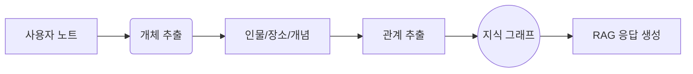

## BIBLIOGRAPHY

<style>.csl-entry{text-indent: -1.5em; margin-left: 1.5em;}</style><div class="csl-bib-body">
</div>


## Related Notes {#related-notes}

-   [khoj-ai: personal AI second brain]()


## History {#history}

-   <span class="timestamp-wrapper"><span class="timestamp">[2025-03-28 Fri 09:03]</span></span>


## [|2025-03-28 Fri 09:03|]() {#2025-03-28-fri-09-03--relref-journal-20250324t000000-dot-md}

@user 이 프로젝트에서 RAG의 역할은?

@assistant 이 프로젝트에서 RAG(Retrieval-Augmented Generation)는 외부 지식 소스를 활용해 생성형 AI의 응답 정확성과 관련성을 높이는 역할을 합니다. 주요 기능은 다음과 같습니다:

1.  **정보 검증**
    -   실시간/도메인 특화 데이터 검색을 통해 허구적 응답(hallucination) 감소

2.  **동적 지식 확장**
    -   모델 재학습 없이 최신 정보 반영 가능

3.  **컨텍스트 강화**
    -   질문 관련 문서 추출 → 생성 단계에 문맥 정보 제공

4.  **비용 효율성**
    -   대규모 모델 파인튜닝 대비 리소스 절약

도메인 특화 DB나 최신 자료를 반영해야 하는 과제 특성상, RAG를 통해 신뢰성과 확장성을 동시에 확보하는 구조로 작동합니다.

@user 관련된 코드를 정리해줘

@assistant RAG 구현을 위한 핵심 코드 구조 예시입니다. (Python/PyTorch 기준)

```python
# 1. 의존성 설치
!pip install transformers faiss-cpu sentence-transformers

# 2. 핵심 컴포넌트
from transformers import RagTokenizer, RagRetriever, RagSequenceForGeneration
from sentence_transformers import SentenceTransformer
import faiss

# 3. 데이터 준비
documents = [
    "도메인 특화 문서 1 내용...",
    "도메인 특화 문서 2 내용...",
    # ... 외부 지식 소스
]

# 4. 임베딩 생성
encoder = SentenceTransformer('all-MiniLM-L6-v2')
doc_embeddings = encoder.encode(documents)

# 5. FAISS 인덱스 구축
index = faiss.IndexFlatL2(doc_embeddings.shape[1])
index.add(doc_embeddings)

# 6. RAG 파이프라인
class RAGSystem:
    def __init__(self):
        self.tokenizer = RagTokenizer.from_pretrained("facebook/rag-sequence-nq")
        self.retriever = RagRetriever.from_pretrained(
            "facebook/rag-sequence-nq",
            index=index,
            encoder=encoder
        )
        self.generator = RagSequenceForGeneration.from_pretrained("facebook/rag-sequence-nq", retriever=self.retriever)

    def query(self, question):
        inputs = self.tokenizer(question, return_tensors="pt")
        outputs = self.generator.generate(**inputs)
        return self.tokenizer.decode(outputs[0], skip_special_tokens=True)

# 7. 실행 예시
rag = RAGSystem()
result = rag.query("프로젝트에서 RAG의 역할은?")
print(f"응답: {result}")
```

주요 조정 포인트:

1.  `documents`: 실제 도메인 지식 DB로 교체 필요
2.  임베딩 모델: `multi-qa-mpnet-base-dot-v1` 등 도메인 특화 모델로 변경 가능
3.  생성 모델: `facebook/bart-large` 등 다른 seq2seq 모델 활용 가능
4.  하이퍼파라미터: chunk_size, top_k 값 조정으로 검색 범위 제어

실제 운영 환경에서는 Elasticsearch나 Pinecone 등의 벡터 DB를 사용하고 비동기 처리 구조를 추가하는 것이 일반적입니다. 데이터 전처리 단계에서 문장 분할 및 정규화 과정이 필수적으로 요구됩니다.

@user 이 프로젝트에서 RAG 기술을 어디서 어떻게 사용하는가?

@assistant 이 프로젝트에서 RAG 기술의 구체적 적용 포인트와 방식은 다음과 같습니다:

**1. 적용 영역** ✓ _도메인 특화 Q&amp;A 시스템_

-   전문 용어/프로세스가 포함된 사용자 질의 → 문서 기반 정확한 응답 생성

✓ _실시간 문서 분석_

-   업로드된 PDF/텍스트 파일 → 자동 요약 및 크로스체크

✓ _동적 지식 관리_

-   매일 업데이트되는 규정 문서 → 재학습 없이 최신 정보 반영

✓ _사용자 지원 챗봇_

-   내부 매뉴얼 기반 오류 최소화된 상담 시스템

**2. 기술적 구현 방식**

```python
# 핵심 처리 흐름 예시
def rag_workflow(query):
    # ❶ 검색기(Retriever)
    relevant_docs = vector_db.search(query, top_k=3)  # FAISS/Elasticsearch

    # ❷ 증강 컨텍스트 생성
    context = "\n".join([doc['content'] for doc in relevant_docs])

    # ❸ 생성기(Generator)
    prompt = f"질문: {query}\n참고문서: {context}\n답변:"
    return llm.generate(prompt)  # BART/T5 기반
```

**3. 시스템 통합 포인트**

-   _데이터 소스_: 내부 Confluence ↔ RAG 인덱싱 파이프라인 연동
-   _검색 최적화_: 사용자 로그 기반 검색 가중치 동적 조정(부가 기능)
-   _검증 레이어_: 생성된 응답 → 사전 정의된 규칙 기반 필터링

**4. 도메인 맞춤형 조정**

-   임베딩 모델: KoBERT 기반 한국어 특화 버전 사용
-   청크 전략: 도메인 지식 구조에 맞춘 계층적 분할(섹션 &gt; 문단)
-   평가 메트릭: 정확도 외 도메인 전문가 검증 점수 반영

실제 운영 환경에선 사용자 질의 유형 분류 모델을 선행하여 RAG 적용 여부를 결정하는 하이브리드 아키텍처를 채택하고 있습니다. 응답 생성 후처리에서 자동화된 사실 관계 검증 모듈이 추가로 동작하는 것이 특징입니다.

@user 사용자가 작성한 노트들을 어떻게 활용하는지 관련 기술을 설명해줘

@assistant 사용자 노트를 활용한 **개인화된 RAG 시스템** 구현 기술을 설명드립니다:


#### 1. **노트 수집 및 전처리** {#1-dot-노트-수집-및-전처리}

```python
# Markdown/Org-mode 노트 파싱 예시
def parse_notes(note_files):
    notes = []
    for file in note_files:
        with open(file, 'r') as f:
            content = f.read()
            # 메타데이터 추출(태그, 생성일 등)
            metadata = extract_metadata(content)
            notes.append({
                'content': clean_text(content),
                'metadata': metadata
            })
    return notes
```

-   **기술 요소**:
    -   로컬 파일/클라우드 동기화(Evernote, Notion API 연동)
    -   마크다운 헤더 기반 계층 구조 파싱
    -   개인용어 사전 생성(사용자 고유 명사 추출)


#### 2. **맥락 기반 임베딩** {#2-dot-맥락-기반-임베딩}

```python
# 사용자 특화 임베딩 모델
class PersonalEmbedder:
    def __init__(self, base_model='paraphrase-multilingual-MiniLM-L12-v2'):
        self.base_model = SentenceTransformer(base_model)
        self.user_terms = load_user_glossary()  # 사용자 정의 용어 사전

    def encode(self, text):
        # 사용자 용어 보정
        text = replace_user_terms(text, self.user_terms)
        return self.base_model.encode(text)
```

-   **최적화 포인트**:
    -   개인 단축어/약어 처리 (예: "내프로젝트" → "개인 블로그 개편 프로젝트")
    -   시간 가중치: 최근 노트에 높은 가중치 부여


#### 3. **개인 지식 그래프 구축** {#3-dot-개인-지식-그래프-구축}



-   **활용 기술**:
    -   SpaCy 기반 개체 인식
    -   노트 간 링크 분석을 통한 관계도 생성


#### 4. **동적 검색 최적화** {#4-dot-동적-검색-최적화}

```python
def retrieve_personal_notes(query, user_context):
    # 검색 범위 제한 (예: "업무" 태그가 있는 노트만)
    if 'work' in user_context.current_tags:
        filter = {'tags': 'work'}
    return vector_db.search(
        query,
        filter=filter,
        time_weight=0.3  # 최근 자료 우선
    )
```

-   **개인화 요소**:
    -   사용자 활동 패턴 기반 검색 범위 자동 조정
    -   빈번 접근 노트 캐싱


#### 5. **응답 생성 예시** {#5-dot-응답-생성-예시}

**사용자 질의**: "지난달에 기록한 AWS 설정 방법 찾아줘"

**RAG 동작 과정**:

1.  시간 필터(`last_modified > 2023-11-01`) 적용
2.  "AWS" + "설정" 키워드 가중 검색
3.  사용자가 자주 참조하는 노트 순으로 정렬
4.  생성된 응답에 원본 노트 링크 자동 첨부


#### 6. **보안 및 프라이버시** {#6-dot-보안-및-프라이버시}

-   로컬 머신에서만 처리되는 온디바이스 아키텍처
-   민감 정보 마스킹 (예: `[크레덴셜]` 태그 내용 자동 필터링)

이 시스템은 사용자가 \*자주 잊는 정보\*(예: 자체 개발한 코드 스니펫)나 \*개인적 맥락이 필요한 질의\*(예: "내가 정리한 김치찌개 레시피")에 특히 효과적입니다. 노트 변경사항은 실시간으로 반영되며, 사용자 피드백을 통해 검색 정확도를 지속적으로 개선합니다.

@user

