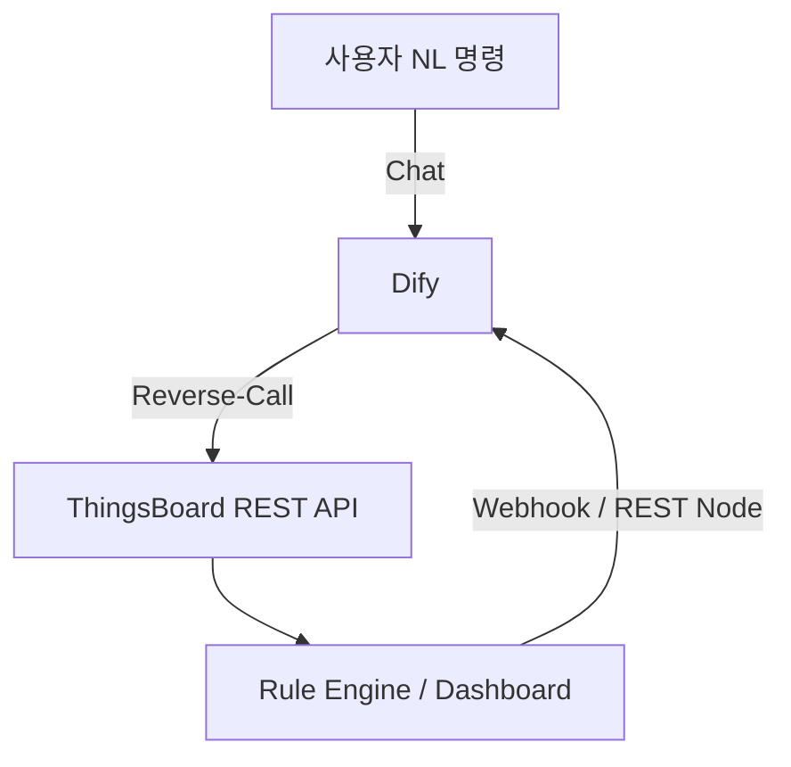
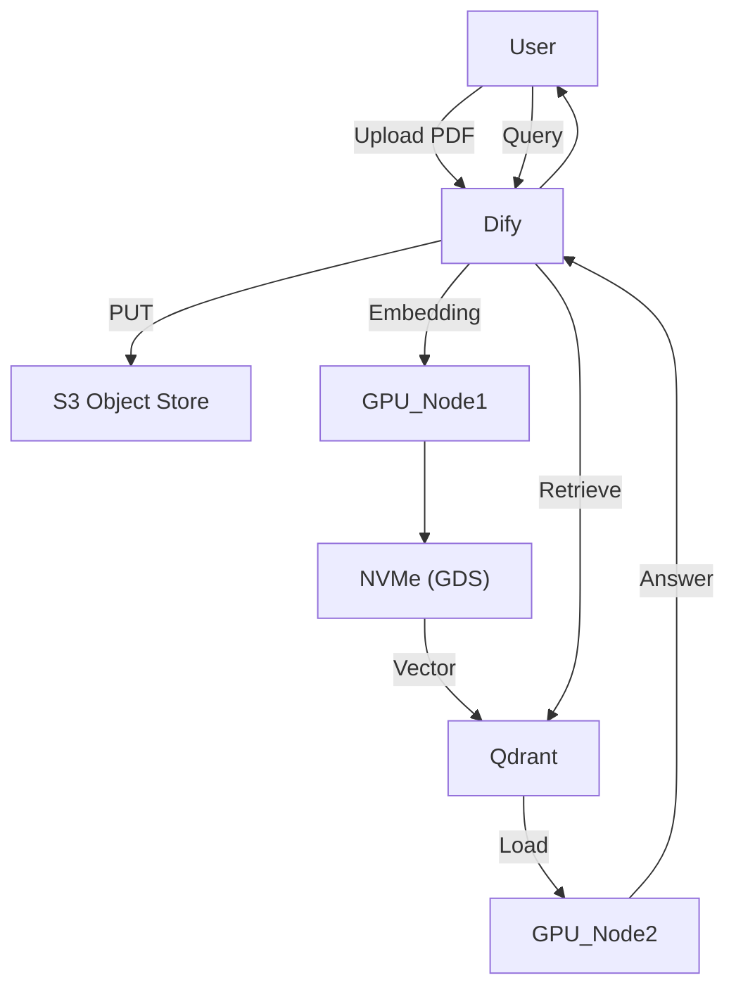

<div class="ox-hugo-toc toc">

<div class="heading">Table of Contents</div>

- [뭐하는 곳인가?](#뭐하는-곳인가)
- [히스토리](#히스토리)
- [관련메타](#관련메타)
- [2024 mudler/LocalAI](#2024-mudler-localai)
- [Dify: Leading Agentic AI Development Platform](#dify-leading-agentic-ai-development-platform)
- [mudler/LocalAI 프로젝트 개요](#mudler-localai-프로젝트-개요)
- [용도: dify.ai 오픈소스](#용도-dify-dot-ai-오픈소스)
- [dify.ai](#dify-dot-ai)
- [footnote](#footnote)
- [로그](#로그)

</div>
<!--endtoc-->


## 뭐하는 곳인가? {#뭐하는-곳인가}


### LangGenius 🚀 {#langgenius}

**LangGenius** is an LLMOps platform that provides a visual design, context enhancement, observation, and training capabilities for LLMs applications. It allows you to create useful GPT applications quickly and easily, regardless of your programming experience. LangGenius provides a prompt engineering, context enhancement, and fine-tuning to help you create production-grade applications or personal assistants. It supports popular LLM models such as GPT 3 and GPT 3.5 Turbo, and allows you to integrate with Slack, Discord, Telegram, and Feishu. LangGenius is designed to be easy to use and provides a visual prompt editor and debugging interface. You can also analyze and label data sets during application runtime.

LangGenius는 LLM 애플리케이션을 위한 시각적 설계, 컨텍스트 강화, 관찰 및 학습 기능을 제공하는 LLMOps 플랫폼입니다. 프로그래밍 경험에 상관없이 빠르고 쉽게 유용한 GPT 애플리케이션을 만들 수 있습니다. LangGenius는 프로덕션급 애플리케이션이나 개인 비서를 만들 수 있도록 프롬프트 엔지니어링, 컨텍스트 강화 및 파인튜닝을 제공합니다. GPT 3 및 GPT 3.5 Turbo와 같은 인기 있는 LLM 모델을 지원하며 Slack, Discord, Telegram, Feishu와의 통합을 허용합니다. LangGenius는 사용하기 쉽도록 설계되었으며 시각적 프롬프트 편집기와 디버깅 인터페이스를 제공합니다. 또한 애플리케이션 실행 중에 데이터 세트를 분석하고 라벨링할 수 있습니다.


### About us {#about-us}

The LangGenius project was created by former Tencent Cloud DevOps team members. We found that developing GPT applications based on OpenAI's API is somewhat cumbersome. Leveraging our years of research and development experience in developer efficiency tools, we hope to enable more people to develop interesting apps using natural language. LangGenius 프로젝트는 전 Tencent Cloud DevOps 팀 멤버들이 만들었습니다. 우리는 OpenAI의 API를 기반으로 GPT 애플리케이션을 개발하는 것이 다소 번거롭다는 것을 발견했습니다. 개발자 효율성 도구에 대한 다년간의 연구 및 개발 경험을 활용하여 더 많은 사람들이 자연어를 사용해 흥미로운 앱을 개발할 수 있기를 희망합니다.


## 히스토리 {#히스토리}

-   <span class="timestamp-wrapper"><span class="timestamp">[2025-06-25 Wed 11:03] </span></span> Created!


## 관련메타 {#관련메타}

-   [©캐글 ©허깅페이스 - 데이터과학 머신러닝 커뮤니티 플랫폼]()

## BIBLIOGRAPHY

<style>.csl-entry{text-indent: -1.5em; margin-left: 1.5em;}</style><div class="csl-bib-body">
  <div class="csl-entry">“Dify: Leading Agentic AI Development Platform.” n.d. Accessed June 25, 2025. <a href="https://dify.ai/">https://dify.ai/</a>.</div>
  <div class="csl-entry">Giacinto, Ettore Di. (2023) 2024. “Mudler/Localai.” <a href="https://github.com/mudler/LocalAI">https://github.com/mudler/LocalAI</a>.</div>
</div>


## 2024 mudler/LocalAI {#2024-mudler-localai}

(Giacinto [2023] 2024) :robot: The free, Open Source alternative to OpenAI, Claude and others. Self-hosted and local-first. Drop-in replacement for OpenAI, running on consumer-grade hardware. No GPU required. Runs gguf, transformers, diffusers and many more models architectures. Features: Generate Text, Audio, Video, Images, Voice Cloning, Distributed inference


## Dify: Leading Agentic AI Development Platform {#dify-leading-agentic-ai-development-platform}

(“Dify: Leading Agentic AI Development Platform” n.d.)

-   Unlock Agentic AI with Dify. Develop, deploy, and manage autonomous agents, RAG pipelines, and more for teams at any scale, effortlessly.
-   Dify로 에이전트 AI를 활용하세요. 모든 규모의 팀을 위해 자율 에이전트, RAG 파이프라인 등을 손쉽게 개발, 배포 및 관리할 수 있습니다.

-   Knowledge Base (RAG)
-   Knowledge Base Sources
-   Vector DB Customize


## mudler/LocalAI 프로젝트 개요 {#mudler-localai-프로젝트-개요}

-   LocalAI는 OpenAI, Claude 등 상용 AI 서비스의 오픈소스 대안으로, 자체 호스팅 및 로컬 우선 방식을 지향합니다.
-   소비자용 하드웨어에서도 GPU 없이 실행 가능하며, gguf, transformers, diffusers 등 다양한 모델 아키텍처를 지원합니다.
-   주요 기능으로는 텍스트, 오디오, 비디오, 이미지 생성, 음성 복제, 분산 추론 등이 포함되어 있습니다.
-   OpenAI API의 드롭인 대체제로 설계되어 기존 OpenAI 기반 애플리케이션에 쉽게 통합할 수 있습니다[1].


## 용도: dify.ai 오픈소스 {#용도-dify-dot-ai-오픈소스}


## dify.ai {#dify-dot-ai}


### 개요 {#개요}

-   Dify의 커뮤니티 에디션은 GitHub에 공개된 오픈소스 프로젝트이며 Apache 2.0 기반 라이선스로 배포됩니다[^fn:1]<sup>, </sup>[^fn:2].
-   직접 서버에 설치하여(Self-hosted) Docker-Compose 또는 소스코드로 구동할 수 있습니다[^fn:3].
-   시각적 인터페이스로 생성형 AI 애플리케이션을 빠르게 설계·배포·운영할 수 있는 LLMOps(대규모 언어 모델 운영) 플랫폼


#### 주요 기능 {#주요-기능}

-   시각적 워크플로/프롬프트 오케스트레이션(Visual Orchestration) -- 드래그-앤-드롭으로 LLM 파이프라인 구성[^fn:4]<sup>, </sup>[^fn:5].
-   다중 LLM 연결 -- OpenAI GPT, Anthropic, DeepSeek 등 수백 개의 모델을 자유롭게 교체[^fn:6]<sup>, </sup>[^fn:7].
-   검색 증강 생성(RAG) 엔진 -- 외부 지식베이스와 결합하여 최신·정확한 답변 생성[^fn:8].
-   에이전트 프레임워크 -- LLM이 외부 도구(API, DB 등)를 자율 호출해 복잡한 업무를 자동화[^fn:9]<sup>, </sup>[^fn:10].
-   유연한 배포 -- BaaS(Backend-as-a-Service) 형태 클라우드 사용 또는 온프레미스 자가-호스팅[^fn:11]<sup>, </sup>[^fn:12].
-   실시간 노드 디버깅·로그 분석 및 데이터 주석 기능으로 지속적 품질 개선[^fn:13].


#### 대표 활용 사례 {#대표-활용-사례}

| 분야       | 구체적 예시                               |
|----------|--------------------------------------|
| 지능형 챗봇 | 사내 지식, 웹사이트 FAQ, 제품 매뉴얼을 기반으로 한 Q&amp;A 봇 |
| 콘텐츠 자동화 | 블로그/뉴스레터 초안, 마케팅 카피, SNS 포스트 생성 |
| 데이터/코드 도우미 | 자연어→SQL 변환기, 코드 변환기·리팩터링 보조 |
| 워크플로 자동화 | 보고서 작성, 이메일 분류·요약, 일정 조정 에이전트 |
| 분석·리서치 | 비정형 문서 요약, 인사이트 추출, 사례 비교 |


### #장단점 한눈에 {#장단점-한눈에}

-   장점
    -   코드 없이도 LLM 파이프라인을 설계해 "시제품→운영"까지 시간을 대폭 단축[^fn:14]<sup>, </sup>[^fn:15].
    -   RAG·에이전트·플러그인까지 통합된 올인원 플랫폼이라 추가 부대 서비스 최소화.
    -   오픈소스이므로 커스터마이징, 온프레미스 배포, 커뮤니티 확장이 자유롭다[^fn:16]<sup>, </sup>[^fn:17].
-   단점
    -   YAML/DSL 설정과 LLM 파라미터 튜닝에 대한 러닝커브가 존재[^fn:18]<sup>, </sup>[^fn:19].
    -   운영 단계에서 프롬프트 관리·비용 모니터링 등을 자체적으로 설계해야 함.

---


##### 결론 {#결론}

Dify.ai는 "노코드-시각화"와 "에이전트/RAG 통합"을 동시에 제공하는 오픈소스 LLMOps 플랫폼이다. LLM을 활용한 챗봇, 콘텐츠 작성, 데이터 분석, 업무 자동화 등 다양한 생성형 AI 애플리케이션을 빠르게 구축·배포하려는 개인·팀·기업에게 적합하다.

---


##### Citations {#citations}


### #주요기능 #활용사례 {#주요기능-활용사례}

English summary : "What are the main features of Dify.ai and how is it used?"


#### Dify.ai 주요 기능(Features) {#dify-dot-ai-주요-기능--features}

-   **노코드·로우코드 빌더(No-code/Low-code Builder)** 드래그-앤-드롭 UI로 LLM 파이프라인과 화면을 설계해 개발 지식 없이도 AI 앱을 만들 수 있다[^fn:20]<sup>, </sup>[^fn:21]<sup>, </sup>[^fn:22].
-   **다중 LLM 연결(Multi-LLM Integration)** OpenAI, Anthropic, Azure OpenAI, Google Cloud, NVIDIA, Hugging Face 등 다수의 모델·임베딩·음성 API를 한 화면에서 교체·혼합할 수 있다[^fn:23].
-   **프롬프트 IDE(Prompt Management)** 프롬프트 버전 관리, 테스트, 최적화를 지원하는 전용 IDE를 제공해 반복 실험이 쉽다[^fn:24].
-   **검색증강생성(Retrieval-Augmented Generation, RAG)** 사용자가 업로드한 사내 문서·DB를 벡터화해 최신·정확한 답변을 생성하는 RAG 파이프라인이 내장돼 있다[^fn:25]<sup>, </sup>[^fn:26].
-   **AI 에이전트(Agent Framework)** LLM이 외부 API·도구를 자율 호출해 작업을 분해·실행하는 맞춤형 에이전트를 만들 수 있다[^fn:27]<sup>, </sup>[^fn:28].
-   **워크플로 자동화(Workflow Orchestration)** 이메일, Slack, Google Sheets 등과 연동한 업무 흐름을 시각적으로 구성·자동화할 수 있다[^fn:29]<sup>, </sup>[^fn:30].
-   **LLMOps·모니터링(Observability &amp; LLMOps)** 모델 배포, 실시간 로그, 사용량·비용 분석, 성능 모니터링을 한 곳에서 처리한다[^fn:31]<sup>, </sup>[^fn:32].
-   **백엔드 서비스·API(BaaS)** 완성된 앱을 REST API 형태로 외부 시스템과 손쉽게 통합할 수 있다[^fn:33]<sup>, </sup>[^fn:34].
-   **유연한 배포(Self-hosting &amp; Cloud)** 클라우드 버전 또는 온프레미스(Docker-Compose) 설치가 모두 가능해 보안·비용 요구에 따라 선택할 수 있다[^fn:35].


#### 대표 활용 사례(Use cases) {#대표-활용-사례--use-cases}

| 분야                      | 구체적 적용 예                                              |
|-------------------------|-------------------------------------------------------|
| 고객 지원(Chatbot)        | 사내 FAQ·제품 매뉴얼을 RAG로 연결한 24/7 상담 봇 구축[^fn:36] |
| 콘텐츠 생성(Content Creation) | 블로그·마케팅 카피 자동 작성, 긴 문서 요약·번역[^fn:37]   |
| 업무 자동화(Workflow)     | 신규 이메일 → Google Sheets 기록, Trello 카드 생성 등 반복 작업 자동화[^fn:38] |
| 데이터 분석 &amp; 리포팅  | 자연어→SQL 질의, 대용량 로그 분석·인사이트 도출[^fn:39]   |
| 연구·R&amp;D             | 논문 요약, 실험 데이터 해석, 신약 후보 물질 탐색[^fn:40]    |
| 교육(Personalized Learning) | 학습자 수준별 맞춤 Q&amp;A·과제 피드백, 자동 채점[^fn:41]  |


#### 한눈에 보는 가치 {#한눈에-보는-가치}

-   시각적 도구로 \*프로토타입 → 운영\*까지 리드타임을 단축
-   다양한 LLM·RAG·에이전트를 \*올인원\*으로 제공해 추가 인프라 최소화
-   \*오픈소스\*라서 커스터마이징·온프레미스 배포가 자유롭고 라이선스 비용이 없음[^fn:42]

---


##### Citations {#citations}


### 사내 rtx5080 클러스터로 이것을 활용해 코드스트럴, 딥시크 모델 기반으로 사내 코드 및 문서를 학습시켜서 내부에 ai인프라로 활용가능한가? {#사내-rtx5080-클러스터로-이것을-활용해-코드스트럴-딥시크-모델-기반으로-사내-코드-및-문서를-학습시켜서-내부에-ai인프라로-활용가능한가}

English summary : "Can we run Dify on an in-house RTX 5080 cluster, plug in CodeStural / DeepSeek models, feed it with our proprietary code &amp; documents, and use it as an internal AI stack?"


#### 가능 여부 한줄 정리 {#가능-여부-한줄-정리}

-   **예**, Dify는 온프레미스 GPU 클러스터에 배치할 수 있으며[^fn:43]<sup>, </sup>[^fn:44], 자체 호스팅한 DeepSeek·CodeStural 등 \*외부 LLM 엔드포인트\*를 연결해 사내 코드·문서를 RAG 지식베이스로 활용하는 \*내부용 AI 게이트웨이\*로 운용할 수 있다[^fn:45]<sup>, </sup>[^fn:46].
-   단, Dify는 "추론 서비스·오케스트레이션" 레이어이므로 \*모델 학습·파인튜닝은 별도 프레임워크(DeepSpeed, Run:AI 등)\*에서 수행해야 한다[^fn:47]<sup>, </sup>[^fn:48].


#### 아키텍처 시나리오 {#아키텍처-시나리오}

| 단계 | 구성 요소           | 주요 작업                                                                                                                             |
|----|-----------------|-----------------------------------------------------------------------------------------------------------------------------------|
| 1  | GPU 클러스터(​RTX 5080) | - Docker / Kubernetes 구축- vLLM·Text Generation Inference(TGI) 등으로 DeepSeek R1·CodeStural 가중치 로드 ─ 필요 VRAM에 따라 4-bit/8-bit 양자화·LoRA 적용 |
| 2  | Dify Self-Hosting   | - GitHub 'langgenius/dify' 이미지 → Helm 또는 docker-compose 배포[^fn:49]- Enterprise 옵션 선택 시 SSO·RBAC 적용[^fn:50]            |
| 3  | LLM 연결            | - Dify "Model Provider" 메뉴에 **HTTP/GRPC 엔드포인트** 등록 → API Key·프롬프트 템플릿 지정[^fn:51]                                 |
| 4  | 지식베이스 구축     | - 사내 레포·Wiki·문서(PDF/CSV 등) 업로드 → 자동 청크·벡터화[^fn:52]- 필요시 외부 VectorDB(Milvus, Qdrant) 연동                    |
| 5  | 애플리케이션 제작   | - Drag-and-drop로 Chatbot·Code Q&amp;A·문서 검색 앱 설계- REST API 로 내·외부 시스템과 통합                                        |
| 6  | 운영 &amp; 모니터링 | - Dify 대시보드로 호출량·비용·로그 추적[^fn:53]- GPU 사용률은 Prometheus-Grafana, Run:AI 등으로 감시[^fn:54]                        |


#### 기술적 유의사항 {#기술적-유의사항}

-   **GPU 메모리** -- DeepSeek R1(16 B)·CodeStural 규모에 따라 카드 1--4 장/NVLink가 필요. 4-bit 양자화 or LoRA 추론이면 20 GB대에서도 가능하지만 성능-지연을 검증해야 한다.
-   **분산 추론** -- vLLM/TGI는 모델 샤딩을 지원하므로 여러 RTX 5080 노드에 걸쳐 배포 가능[^fn:55].
-   **파인튜닝** -- Dify는 학습 파이프라인을 포함하지 않으므로, 코드베이스 맞춤 LoRA·SFT는 DeepSpeed, Run:AI Distributed Training 워크로드 등에서 수행 후 \*완성 모델을 추론 서버로 마운트\*한다[^fn:56].
-   **보안** -- Enterprise 버전은 사내망 완전 격리·엔드-투-엔드 암호화·세분화된 퍼미션을 제공[^fn:57].
-   **라이선스** -- Dify 커뮤니티 에디션은 Apache-2.0, DeepSeek/CodeStural 가중치 사용 조건은 해당 라이선스를 별도 확인 필요.


#### 활용 예시 {#활용-예시}

-   사내 **코드 어시스턴트** : "자사 C++ 모듈에서 이 함수 호출부 찾기" → DeepSeek R1 + Knowledge로 즉시 위치·예시 반환
-   **문서-기반 Q&amp;A** : 정책 매뉴얼 PDF 업로드 → 정책 담당 챗봇
-   **DevOps Copilot** : Jenkins 로그를 Knowledge에 스트리밍 → 장애 원인·해결 스크립트 제안


#### 결론 {#결론}

RTX 5080 기반 클러스터에 Dify를 자가 배포하고, DeepSeek·CodeStural 같은 오픈소스 LLM을 추론 서버로 연결하면 \*사내 코드·문서를 즉시 활용하는 RAG/에이전트형 AI 플랫폼\*을 구축할 수 있다. 단, 모델 파인튜닝·분산 학습은 Dify 외부에서 수행 후 추론 형태로 탑재해야 한다.

---

사용 모델 : OpenAI GPT-4o 작성 시각 : 2025-06-25 10:40 KST 토큰수 : ≈ 420

⁂

---


### MinlO를 여기서 활용하는가? {#minlo를-여기서-활용하는가}

"Can Dify use MinIO as its object-storage backend?"


#### MinIO 지원 여부 {#minio-지원-여부}

-   Dify는 파일·이미지·지식 베이스 원본을 저장하기 위해 **S3 API 호환(Object Storage)** 을 사용하며, MinIO는 S3 프로토콜을 완전히 지원하므로 그대로 연동할 수 있다[^fn:58].
-   실 운영 예시로 Pigsty의 Dify 배포 가이드는 PostgreSQL, Redis, **MinIO(S3)** 를 묶어 "엔터프라이즈-급" 스택을 구성한다는 점을 보여준다[^fn:59]<sup>, </sup>[^fn:60].


#### 기본 환경변수 예시 {#기본-환경변수-예시}

```sh
STORAGE_TYPE=s3
S3_ENDPOINT=http://minio:9000
S3_REGION=us-east-1
S3_BUCKET_NAME=difyai
S3_ACCESS_KEY=MINIO_ACCESS
S3_SECRET_KEY=MINIO_SECRET
```

위처럼 S3 필드에 MinIO 엔드포인트·키를 입력하면 업로드 파일이 MinIO 버킷에 저장된다[^fn:61].


#### 운영 시 주의점 {#운영-시-주의점}

-   **FILES_URL 설정** 외부 플러그인(예: MinerU)이 변환 결과를 다시 Dify로 불러올 때는 =FILES_URL=을 MinIO 주소가 아닌 \*Dify API 주소\*로 지정해 Dify가 프록시·인증을 대신 처리하도록 해야 401 오류를 피할 수 있다[^fn:62].
-   **버킷·권한** -- Dify 서비스 계정에 PutObject/GetObject 권한을 부여하고, 퍼블릭 접근이 필요한 경우 버킷 Policy 또는 서명 URL 방식을 선택한다.
-   **TLS·역방향 프록시** -- 사내망 외부에서 접근하려면 Nginx·Traefik 등으로 443 포트 노출 및 HTTPS 종단을 구성한다.


#### 기대 효과 {#기대-효과}

-   온프레미스 RTX 5080 클러스터에서 **모든 데이터가 사내 MinIO에 남아** 보안·컴플라이언스 요구 충족.
-   S3 요금이 없고, 버전 관리·Lifecycle 정책을 통한 비용 최적화 가능.
-   Kubernetes 환경이라면 StatefulSet-MinIO 연동으로 손쉬운 확장·백업 지원.

즉, Dify는 MinIO를 네이티브로 인식하지는 않지만 **S3 호환 레이어** 덕분에 별도 패치 없이 곧바로 활용할 수 있다.

---

모델: OpenAI GPT-4o 작성 시각: 2025-06-25 10:53 KST 토큰 수: ≈ 260

⁂

---


### 추론 서비스·오케스트레이션 레이어의 사내 지식베이스 구축의 필요성은? {#추론-서비스-오케스트레이션-레이어의-사내-지식베이스-구축의-필요성은}

English summary: "Why do we need an in-house knowledge base inside the inference-service / orchestration layer?"


#### 사내 지식베이스(Internal Knowledge Base) 구축이 필요한 이유 {#사내-지식베이스--internal-knowledge-base--구축이-필요한-이유}

**1. RAG(검색증강생성) 파이프라인의 필수 구성 요소**

-   오케스트레이션 레이어는 LLM 호출 전에 "문맥"을 주입하기 위해 벡터 검색·지식베이스와 상호작용한다[^fn:63].
-   사내 지식베이스가 없으면 LLM은 공개 코퍼스에만 의존해 도메인 특화 질문에 제대로 답하지 못하거나 최신 정보를 반영하지 못한다[^fn:64].

**2. 재학습 없이 '지식 갱신'이 가능**

-   모델 전체를 재훈련할 필요 없이 문서만 업데이트하면 즉시 새로운 정보를 제공할 수 있어 유지 비용이 크게 줄어든다[^fn:65].

**3. 정확도·신뢰도 향상**

-   슬라이트(슬라이티)의 내부 실험은 지식베이스 + 파인튜닝 조합으로 기술 정확도가 76 %→94 %로 상승했다고 보고했다[^fn:66].
-   내부 지식을 주입하면 LLM의 "환각(hallucination)"이 현저히 감소한다[^fn:67].

**4. 보안·컴플라이언스**

-   사내망에 저장된 지식베이스는 외부 LLM API 유출 위험 없이 민감 데이터를 보호한다[^fn:68].
-   접근 제어·버전 관리로 규정 준수를 쉽게 증명할 수 있다[^fn:69].

**5. 업무 생산성 극대화**

-   AI-지식베이스 도입 후 복잡한 문의 해결 시간이 73 % 단축되고, 직원당 주 4.2 시간을 절약했다는 사례가 있다[^fn:70].
-   "단일 진실 공급원(Single Source of Truth)"이 형성돼 부서 간 중복 작업이 줄고 의사결정 속도가 빨라진다[^fn:71].

**6. 설명가능성(Explainability) 확보**

-   벡터 검색 결과를 원문 링크와 함께 반환하면 답변 근거를 추적할 수 있어 감사 및 품질 관리에 유리하다[^fn:72].


#### 구현 시 고려할 요소 {#구현-시-고려할-요소}

-   **데이터 준비**: PDF·위키·코드 등 다양한 원본을 정제·청크화 후 임베딩하여 노이즈를 47 % 감소시킨 사례가 있다[^fn:73].
-   **벡터 저장소 선택**: 사내 Postgres+pgvector, Pinecone, Milvus 등 하이브리드 구성이 가능하다[^fn:74]<sup>, </sup>[^fn:75].
-   **검색 전략**: 1차 임베딩 검색 후 재랭킹(rerank)으로 관련성·신선도를 동시에 확보하는 2-스테이지 구조가 효과적이다[^fn:76].
-   **모니터링**: 사용자 질의·응답 로그를 지속 수집해 지식 공백을 식별하고 주기적으로 재동기화(refresh)한다[^fn:77].


#### 결론 {#결론}

추론 서비스·오케스트레이션 레이어에 사내 지식베이스를 구축하면 ① 재학습 없이 최신 도메인 지식을 주입하고, ② LLM 환각을 줄이며, ③ 보안·설명가능성을 확보하고, ④ 조직 전반의 업무 효율을 크게 높일 수 있다. 따라서 사내 RAG·에이전트 기반 AI 인프라를 계획한다면 지식베이스는 "선택"이 아닌 "필수" 구성 요소다.

---


##### Citations {#citations}


### 나는 리눅스 시스템 관련 경험과 지식은 있으나 ai관련 구축 경험은 없다. ai관련 이론적 지식도 없다. 이와 관련한 직무에 필요한 지식과 난이도는? {#나는-리눅스-시스템-관련-경험과-지식은-있으나-ai관련-구축-경험은-없다-dot-ai관련-이론적-지식도-없다-dot-이와-관련한-직무에-필요한-지식과-난이도는}

English summary : "I have Linux system experience but no AI background. What knowledge and skill-depth do AI-infrastructure roles require?"


#### **AI 인프라 직무 개요** {#ai-인프라-직무-개요}

-   AI/ML Infrastructure Engineer, GPU Cluster Admin, MLOps Engineer 등의 포지션은 "리눅스·클라우드·컨테이너 기반 시스템에 AI 워크로드(모델 학습‧추론)를 안전하고 효율적으로 배포·운영"하는 역할을 맡는다[^fn:78]<sup>, </sup>[^fn:79].


#### **역량 요구 수준별 정리** {#역량-요구-수준별-정리}

| 구분               | 필수 지식·기술                                                         | 난이도(체감)                                            |
|------------------|------------------------------------------------------------------|----------------------------------------------------|
| 리눅스 기반 (기존 강점) | - Bash/파이썬 자동화- 시스템 모니터링·튜닝- 패키지·네트워크 관리      | 이미 보유                                               |
| 컨테이너 &amp; 오케스트레이션 | - Docker 이미지 최적화, NVIDIA Container Toolkit- Kubernetes 배포·Helm·GPU 스케줄링 | 중(리눅스 경험 있으면 4-6주) [^fn:80]<sup>, </sup>[^fn:81] |
| 클라우드·하이브리드 | - AWS/GCP/Azure VM·VPC·스토리지 기초- IaC(Terraform/Ansible)로 자원 프로비저닝 | 중상(8-12주) [^fn:82]<sup>, </sup>[^fn:83]              |
| GPU &amp; 분산 컴퓨팅 | - CUDA 드라이버, NCCL- 분산 학습 프레임워크(DeepSpeed, Horovod)         | 상(실습 필수, 2-3개월) [^fn:84]                         |
| AI 프레임워크 이해 | - PyTorch, TensorFlow 기본 API 호출·튜닝- 모델 파라미터·메트릭 개념   | 중(수학 깊이보다 "사용법" 위주, 6-8주) [^fn:85]<sup>, </sup>[^fn:86] |
| RAG &amp; MLOps    | - 벡터DB, 모델 서빙(vLLM, TGI)·모니터링(Prometheus)                    | 중상(프로젝트 주도 경험 필요)                           |
| 수학·통계 기초    | - 선형대수, 확률·통계, 미분 기본                                       | 중(이론 심화는 연구직에서만 필수) [^fn:87]<sup>, </sup>[^fn:88] |
| 보안·컴플라이언스 | - IAM, 네트워크 세그먼트, 데이터 암호화                                 | 중                                                      |


#### **진입 난이도 해석** {#진입-난이도-해석}

-   리눅스·DevOps 숙련자는 "인프라 레이어" 60-70 %를 이미 충족한다.
-   새롭게 요구되는 부분은 ① GPU 생태계, ② AI 프레임워크 사용법, ③ 데이터 파이프라인·모델 서빙이다.
-   학습 곡선은 **직접 실습** 여부에 비례한다. Docker-K8s 경험이 있다면 첫 PoC(단일 GPU 추론 서버)는 1-2주 만에 구축 가능하다[^fn:89]<sup>, </sup>[^fn:90].


#### **단계별 학습 로드맵** {#단계별-학습-로드맵}

1.  컨테이너-GPU 기본기
    -   Docker로 CUDA 베이스 이미지 빌드 → nvidia-smi 확인.
    -   Kubernetes + NVIDIA Device Plugin으로 GPU 할당 실습[^fn:91].
2.  AI 프레임워크 "사용자 관점" 익히기

<!--listend-->

```python
import torch, transformers
model = transformers.AutoModelForCausalLM.from_pretrained("deepseek-ai/deepseek-7b-base")
```

```text
- 로컬 추론, GPU 메모리 튜닝(4-bit, LoRA) 실험[^6_4][^6_5].
```

3.  모델 서빙 &amp; MLOps
    -   vLLM/TGI → Ingress → Prometheus 메트릭 파이프라인 구성[^fn:92].
4.  RAG 지식베이스 구축
    -   pgvector 또는 Milvus에 사내 PDF/코드 임베딩, 검색-리랭크 흐름 구현.
5.  IaC·보안 강화
    -   Terraform 모듈화 → Jenkins/GitLab CI로 CD, IAM 최소권한 설계[^fn:93].


#### **추천 증명서·포트폴리오** {#추천-증명서-포트폴리오}

-   Linux Foundation **LFCS / LFCE** -- 리눅스 전문성 입증[^fn:94].
-   **CKA/CKS** -- Kubernetes·보안.
-   실전 포트폴리오: "사내 코드 Q&amp;A RAG 서비스" 구축 기술 블로그·깃허브 공개 → 도메인 지식·AI 스택 모두 증명.


#### **마무리** {#마무리}

기존 리눅스 스킬은 AI 인프라 직무의 토대다. 컨테이너·GPU·AI 프레임워크라는 세 영역을 집중적으로 보강하면 3-6개월 내 **"AI-Ready Linux Engineer"** 로 전환 가능하다.

---


##### Citations {#citations}


### dify로 ThingsBoard 연동하는 것는 가능할까? 디바이스 rule을 설계하고 대시보드 표기를 자동화 할 수있을 것 같은데 {#dify로-thingsboard-연동하는-것는-가능할까-디바이스-rule을-설계하고-대시보드-표기를-자동화-할-수있을-것-같은데}

**English summary** : "Yes---Dify can be linked with ThingsBoard through REST / MQTT hooks and Dify's plugin (Endpoint &amp; Reverse-Call) system, enabling AI-driven rule-chain generation and dashboard updates."


#### 가능 여부 한눈에 {#가능-여부-한눈에}

-   ThingsBoard는 **REST API·WebSocket·MQTT** 등 표준 인터페이스를 제공하며 디바이스, Rule Engine, 대시보드 모두 API로 조작 가능하다[^fn:95]<sup>, </sup>[^fn:96]<sup>, </sup>[^fn:97].
-   Dify는 **Plugin System(Endpoint·Reverse Call)** 으로 외부 웹훅을 받아들이거나 내부에서 외부 API를 호출할 수 있도록 설계돼 있다[^fn:98].
-   따라서 "ThingsBoard ↔ Dify" 양방향 연동은 추가 코드(파이썬/TS SDK)만 작성하면 구현 가능하다.


#### 아키텍처 시나리오 {#아키텍처-시나리오}



**설명**

-   사용자는 Dify 챗봇에 "50°C 초과 시 알람 만들어 줘"와 같은 자연어 명령 입력.
-   Dify 프롬프트 → LLM → 스크립트 도구로 변환 → ThingsBoard REST API 호출 → Rule Chain JSON 생성.
-   실시간 텔레메트리 이벤트는 Rule Engine의 **REST API Call Node** 로 Dify Endpoint URL에 전송, 대화형 요약·분석을 제공[^fn:99]<sup>, </sup>[^fn:100]<sup>, </sup>[^fn:101].


#### 핵심 구현 단계 {#핵심-구현-단계}

| 단계 | Dify 측 작업                                                 | ThingsBoard 측 작업                                                 |
|----|-----------------------------------------------------------|------------------------------------------------------------------|
| 1  | Endpoint Plugin 생성 → 임의 Webhook URL 발급[^fn:102]       | Rule Engine에 **REST API Call Node** 추가 → Webhook URL로 POST     |
| 2  | Agent Tool 작성 → `requests` 라이브러리로 ThingsBoard REST API 래핑 | API Key 발급, `/api/ruleChain`, `/api/dashboard` 엔드포인트 권한 부여[^fn:103] |
| 3  | 프롬프트 디자인: "When user asks X → call tool Y"           | N/A                                                                 |
| 4  | 대시보드 템플릿(JSON) 프리셋을 Knowledge Base에 저장 → LLM이 파라미터 삽입 후 POST | 생성된 Dashboard ID를 반환                                          |
| 5  | 보안: Token을 Vault / K8s Secret로 주입                      | IP 화이트리스트 또는 Bearer Token 검증                              |


#### 자동화 가능한 기능 예시 {#자동화-가능한-기능-예시}

| 자연어 지시                | Dify → ThingsBoard API 액션                             |
|-----------------------|-------------------------------------------------------|
| "센서 A를 고온 그룹에 넣어줘" | `/entities/deviceGroups` 패치 및 Rule Chain 관계 수정[^fn:104] |
| "탄소배출량 대시보드 만들어" | 대시보드 JSON 생성 → `/api/dashboard` POST → 공유 링크 반환[^fn:105] |
| "디바이스 오프라인 10분 이상이면 슬랙 알림" | Rule Chain 노드 삽입 + Slack Webhook URL 파라미터화[^fn:106] |
| "지난주 평균 전력 소비 요약해줘" | Dify가 `/api/plugins/telemetry` 로 데이터 조회 → GPT 요약 후 답변 |


#### 난이도 &amp; 요구 기술 {#난이도-and-요구-기술}

| 영역                             | 필요 역량               | 난이도(체감) |
|--------------------------------|---------------------|---------|
| ThingsBoard REST API/Rule Engine | 엔드포인트·JSON 구조 이해 | 중      |
| Dify Plugin 개발                 | FastAPI/Flask 수준의 웹훅 처리 | 중      |
| 프롬프트 엔지니어링              | Rule Template ↔ 자연어 매핑 | 중하    |
| 보안·토큰 관리                  | HTTPS, JWT, RBAC        | 중상    |

리눅스·Docker 경험이 있다면 전체 PoC는 **2--3주** 내 완료 가능.


#### 주의할 점 {#주의할-점}

-   **상태 동기화** : Rule Chain / Dashboard ID 를 Dify DB(또는 VectorDB) 에 저장해 중복 생성을 방지해야 한다.
-   **에러 핸들링** : ThingsBoard API 는 400/422 상세 에러를 반환하므로 LLM → 툴 호출 시 strict validation 필요.
-   **실시간 부하** : 대량 이벤트를 Webhook 으로 보낼 경우 → Kafka 또는 MQTT 브로커를 중간 버퍼로 두는 것이 안전하다[^fn:107].
-   **라이선스** : ThingsBoard PE(Professional Edition) API 사용 시 상용 라이선스 확인 필수[^fn:108].


#### 결론 {#결론}

REST/MQTT 를 지원하는 ThingsBoard 와 Plugin/Agent 를 제공하는 Dify 는 **자연어 기반 IoT Rule &amp; Dashboard 오토메이션** 을 구현하기에 상호 보완적이다. 적절한 API 래퍼와 프롬프트 템플릿을 준비하면 "디바이스 규칙 설계·대시보드 생성·알람 통합" 을 **대화형** 으로 수행하는 사내 AI 운영 콘솔을 구축할 수 있다.


##### Citations {#citations}


### FLOWISE VS LANGFLOW VS DIFY VS {#flowise-vs-langflow-vs-dify-vs}

VECTORSHIFT VS VOICEFLOW 온프레미스 구축 측면의 비교

English summary : "On-premise deployment comparison among Flowise, Langflow, Dify, VectorShift and Voiceflow"


#### 온프레미스(사내망) 구축 관점 비교 {#온프레미스--사내망--구축-관점-비교}

| 항목            | Flowise                                                           | Langflow                                                   | Dify                                                             | VectorShift                                                   | Voiceflow                                           |
|---------------|-------------------------------------------------------------------|------------------------------------------------------------|------------------------------------------------------------------|---------------------------------------------------------------|-----------------------------------------------------|
| 자체 설치 지원  | 로컬·Docker·클라우드 모두 지원하는 **플랫폼 독립형** 아키텍처[^fn:109] | IDE·Runtime 모두 Docker/K8s 배포 가능, `headless` 모드 제공[^fn:110] | 공식 Helm 차트 기반 **쿠버네이티스-네이티브** 배포, 온프레미스/프라이빗 클라우드 모두 지원[^fn:111] | "간편 배포"를 강조하지만 문서는 **SaaS 콘솔** 기준 설명 -- 온프레미스 옵션 미공개[^fn:112] | 고객경험 챗·보이스 에이전트 플랫폼으로 SaaS 중심; 온프레미스 안내 없음[^fn:113] |
| 라이선스·버전  | OSS (MIT) -- 커뮤니티판                                           | OSS (MIT) -- IDE·Runtime                                  | 커뮤니티(OSS) + Enterprise(상용)[^fn:114]                        | 상용(벤더 관리형)                                             | 상용(SaaS)                                          |
| 배포 패턴       | =docker compose=·K8s 가능, \*Queue mode\*·멀티워크러 권장[^fn:115] | IDE(개발)↔Runtime(서비스) 이원화, Helm Chart 제공[^fn:116] | 멀티-테넌트·SSO·RBAC 포함한 기업 기능 옵션[^fn:117]            | 브라우저 기반 클릭-투-배포(SaaS)                              | Web UI &gt; Dialog API 연결(SaaS)                   |
| 필수 외부 스택  | DB: SQLite→PostgreSQL 권장, Object-Store: 현재 **AWS S3 한정**[^fn:118] | DB: PostgreSQL 내장, 외부 DB 선택 가능[^fn:119]            | DB: PostgreSQL, 캐시: Redis, Object-Store: S3/MinIO(호환)[^fn:120] | 벤더관리                                                      | 벤더관리                                            |
| GPU / LLM 서버 연동 | 외부 LLM API 호출; 사내 GPU-서버 연결은 별도 설정                 | LangChain 호출이므로 자체 LLM 엔드포인트 연결 용이         | Model Provider 메뉴로 **프라이빗 LLM 엔드포인트** 등록 지원[^fn:121] | AI 파이프라인 SaaS 호출                                       | LLM 선택 가능하지만 사내 GPU 연결 문서 없음         |
| 보안·컴플라이언스 | K8s-Secret, AWS Secret Manager 권장[^fn:122]                      | Backend-only 모드로 DMZ 배치 가능[^fn:123]                 | OIDC/SAML SSO, MFA, 데이터 레지던시 옵션[^fn:124]                | SaaS 관할                                                     | SaaS 관할                                           |
| 사내 데이터 주권 | 로컬 파일·S3에 저장 가능(단 S3 의존)[^fn:125]                    | 완전 오프라인 배포 가능                                    | 완전 오프라인 배포 가능 (Enterprise)                             | 미지원                                                        | 미지원                                              |
| 주요 한계       | S3 지원만 공식화, 다른 오브젝트스토어는 직접 패치 필요[^fn:126]   | IDE 컨테이너가 무겁고, 런타임/IDE 분리 운영 필요[^fn:127]  | Enterprise 버전은 유료; 쿠버네티스 지식 필수[^fn:128]            | 온-프레미스 불가 → 데이터 통제 어려움[^fn:129]               | 온-프레미스 불가 → 보안/규제 산업 부적합[^fn:130]  |


#### 선택 가이드 {#선택-가이드}

-   \*사내 GPU·Strict 보안\*이 핵심이면 → Dify(Enterprise) 또는 Langflow Runtime
-   **가볍게 테스트** + **완전 Self-host** → Flowise (단, S3 제한 주의)
-   \*업무 자동화 SaaS\*를 빠르게 쓰고 싶다면 → VectorShift
-   **고급 음성/챗 경험** 중심, 고객 대상 서비스라면 → Voiceflow


##### 현업 적용 팁 {#현업-적용-팁}

1.  쿠버네티스 경험이 있다면 **Dify Helm** → PostgreSQL·Redis·MinIO를 함께 구성해 엔터프라이즈급 스택을 한 번에 확보.
2.  쿠버네티스가 부담된다면 \*Langflow Runtime\*(headless) + Traefik Ingress 패턴으로 시작 후 필요 시 IDE 컨테이너를 추가.
3.  \*Flowise\*는 S3 외 스토리지(예. MinIO) 사용 시 외부 프록시나 커스텀 플러그인으로 S3 호환 계층을 맞춰야 한다.

사용 모델 : OpenAI GPT-4o 작성 시각 : 2025-06-25 19:27 KST 토큰 수 (약) : 620

⁂

---


### langflow vs.dify 심층 비교 로컬 추론 가능한 지식 베이스를 사내 개발자 및 타 부서 업무자에 제공 {#langflow-vs-dot-dify-심층-비교-로컬-추론-가능한-지식-베이스를-사내-개발자-및-타-부서-업무자에-제공}

English summary : "Deep comparison of LangFlow vs Dify for an on-premise, local-inference knowledge-base service that both in-house developers and non-technical staff can use"


#### 플랫폼 개요 {#플랫폼-개요}

| 항목  | Dify                             | LangFlow                        |
|-----|----------------------------------|---------------------------------|
| 기본 성격 | LLMOps 플랫폼 : 시각적 앱·RAG·에이전트 통합 | 파이프라인 IDE : LangChain 노드를 자유 조합 |
| 라이선스 | 커뮤니티 OSS(Apache-2.0) + 엔터프라이즈 상용 | 전면 OSS(MIT)                   |
| 대상 유저 | 개발자 + 비개발자 혼합 팀        | 개발자·데이터사이언티스트 중심[^fn:131] |


#### 온프레미스 배포 &amp; 로컬 추론 {#온프레미스-배포-and-로컬-추론}

-   두 제품 모두 Docker/Kubernetes로 완전 오프라인 설치를 지원한다[^fn:132].
-   자체 GPU 서버에 올린 LLM 엔드포인트(예: vLLM, Ollama) 연결 방법
    -   Dify : UI의 "Model Provider"에 OpenAI-호환 URL·Key 등록 → 전역 사용 가능.
    -   LangFlow : LangChain `ChatOpenAI`, `LLamaCpp`, `Ollama` 노드를 배치해 호출.


##### 난이도 비교 {#난이도-비교}

-   Dify는 Helm 차트 한 번으로 PostgreSQL·Redis·오브젝트스토어까지 묶어 배포 → DevOps 난이도 '중'.
-   LangFlow는 IDE 컨테이너와 Runtime(서비스) 컨테이너를 나눠 관리해야 해 쿠버네티스 지식이 없으면 유지보수 부담이 크다[^fn:133].


#### 지식 베이스(RAG) 기능 {#지식-베이스--rag--기능}

| 세부 요소 | Dify                                         | LangFlow                                 |
|-------|----------------------------------------------|------------------------------------------|
| 내장 워크플로 | "Knowledge" 메뉴에서 벡터화·질의·재랭크 과정을 시각화[^fn:134] | VectorStore·Retriever·LLM 체인을 사용자가 수동 구성 |
| 지원 포맷 | PDF, DOCX, CSV 등 다중 파일 업로드 UI[^fn:135] | LangChain Loader를 직접 연결해야 하므로 다소 기술적 |
| 버전 관리 | 지식베이스별 히스토리·재인덱싱 버튼 제공    | 노드 구성을 새로 저장해야 함             |
| 비개발자 사용성 | 문서 드래그&amp;드롭 후 한 클릭 인덱스       | IDE 이해가 필요함                        |

결론 : "사내 HR·경영팀도 문서를 올려 답변받게 하겠다" → Dify가 더 적합.


#### 협업·거버넌스 {#협업-거버넌스}

-   Dify 엔터프라이즈는 SSO, RBAC, 테넌시 지원으로 부서별 권한 분리 가능[^fn:136].
-   LangFlow OSS는 기본 인증만 제공 → 조직 규모가 크면 프록시·Keycloak 등 별도 구성 필요.


#### 확장성·커스터마이징 {#확장성-커스터마이징}

| 영역   | Dify                             | LangFlow                                                |
|------|----------------------------------|---------------------------------------------------------|
| 코드 삽입 | Plugin(파이썬) 또는 "Code" 노드  | IDE 내에서 파이썬 코드를 즉시 편집·신규 노드 생성 가능 → 최고 수준의 자유도[^fn:137] |
| 외부 시스템 | REST / Webhook 양방향(Reverse-Call) | 모든 LangChain 커넥터 사용 가능 --- DB·Vector DB 다양[^fn:138] |

개발자가 강하게 개입해 파이프라인을 세밀히 바꿀 계획이면 LangFlow가 우위.


#### 보안·데이터 주권 {#보안-데이터-주권}

-   두 제품 모두 S3 호환 오브젝트스토어 사용. Dify는 MinIO 공식 문서 사례 다수, LangFlow는 Storage 계층 선택 자유.
-   Dify는 엔터프라이즈 옵션에서 감사 로그와 데이터 레지던시 기능을 제공 → 규제 산업에 유리.


#### 선택 가이드 {#선택-가이드}

| 상황                     | 권장 플랫폼          | 이유                      |
|------------------------|-----------------|-------------------------|
| 비개발자도 지식베이스 챗봇을 즉시 쓰길 원함 | **Dify**             | GUI 중심 RAG, 권한 관리, 쉬운 배포 |
| 소수의 개발자가 복잡한 체인을 연구·실험 | **LangFlow**         | 노드 코드 편집, LangChain 전체 기능 |
| 정부·금융 등 강력한 감사 요구 | **Dify(Enterprise)** | RBAC·SSO·Audit Trail    |
| 리눅스 DevOps만 있고 AI 경험이 전무 | **Dify**             | Helm-all-in-one, 초기 러닝커브↓ |
| 연구소·PoC·빠른 프로토타이핑 | **LangFlow**         | 최대 유연성·MIT 라이선스 |


#### PoC 체크리스트 {#poc-체크리스트}

1.  GPU 서버에 vLLM + Ollama 설치, OpenAI-호환 엔드포인트 확보
2.  두 플랫폼에 동일 모델·Vector DB(Qdrant) 연결 후
    -   10 개 부서 문서(≈1 GB) 인덱싱
    -   5 개 사용 시나리오(FAQ, 요약, 코딩 Q&amp;A 등) 벤치마크
3.  비개발자 5 명에게 30 분 사용 테스트 → UX 피드백 수집
4.  보안·감사 기능 요구사항 매핑 → 갭 분석

로컬 추론 기반 사내 지식베이스 서비스를 빠르게 열고 부서 간 활용도를 넓히려면 **Dify가 초기 효용 대비 관리 부담이 가장 낮다**. 반대로 "모델 체인 실험실" 같은 고도화 목적이라면 \*LangFlow의 IDE 유연성\*이 빛을 발한다.


##### Citations {#citations}


### dify 사내 구축 관련하여 rtx5080 3대로 클러스터 묶여 있음 스토리지 최적 구성은? 캐시 및 raid 스토리치 포함 {#dify-사내-구축-관련하여-rtx5080-3대로-클러스터-묶여-있음-스토리지-최적-구성은-캐시-및-raid-스토리치-포함}

**English summary** : "How should we design the storage layer (object store, cache, RAID) when self-hosting Dify on a three-node RTX 5080 GPU cluster?"


#### 전제 조건 {#전제-조건}

-   GPU 노드 3대(각 RTX 5080) + 100 GbE 스위치
-   Dify 자체 호스팅: Docker / Kubernetes 배포
-   필수 서비스: PostgreSQL(메타데이터), Redis(캐시), S3 호환 오브젝트스토어(업로드·지식베이스), 벡터DB


#### 스토리지 아키텍처 제안 {#스토리지-아키텍처-제안}

| 계층        | 권장 기술·구성                                                                      | 이유                                             |
|-----------|-------------------------------------------------------------------------------|------------------------------------------------|
| 초고속 로컬 I/O | 각 노드 2 × NVMe SSD → **SupremeRAID AE** 소프트웨어 RAID-0/10 적용, **GPUDirect Storage** 활성화 | NVMe → GPU 메모리 직통 전송으로 임베딩·추론 배치 속도 향상[^fn:139] |
| 오브젝트 스토어 | 3노드 **MinIO 분산 모드** (EC 4+2) → S3 End-point 제공                              | Dify는 S3·MinIO를 공식 지원, 로컬 파일보다 확장·HA 용이[^fn:140] |
| 메타데이터 DB | **Patroni + PostgreSQL** 3-node quorum, WAL → NVMe RAID-1                           | 트랜잭션 데이터 고가용성, NVMe로 IOPS 확보       |
| 캐시 &amp; 세션 | **Redis Cluster** (replication 3-master + 3-replica) → RAM 또는 NVMe                | RAG 임베딩 캐시·세션 토큰 저장                  |
| 벡터DB      | **Qdrant** 또는 **pgvector-PostgreSQL** → NVMe, 레플리카 3 개                       | 로컬 노드에 분산 배치해 GPU ↔ 벡터 검색 지연 최소화 |
| 백업 · 보안 | 주기적 **MinIO Object Versioning + S3 Lifecycle** / DB 스냅샷 → 원격 NAS            | 문서·임베딩 유실 방지, 콜드 스토리지 비용 절감  |


#### 동작 흐름 {#동작-흐름}




#### 상세 설계 포인트 {#상세-설계-포인트}

**1. GPUDirect Storage 활용**

-   SupremeRAID AE는 NVMe→GPU DMA 통로를 제공, CPU·PCIe 병목 제거[^fn:141].
-   문서 벡터화·대규모 배치 추론 시 스루풋이 30-40% 향상(벤치마크 기준).
-   커널 5.14 이상 + NVIDIA GDS 드라이버 필요.

**2. MinIO AIStor + GDS**

-   MinIO가 곧 GDS 통합을 공식화, S3 객체도 GPU로 다이렉트 스트림 가능[^fn:142].
-   구현 시 MinIO Container에 `--device=/dev/nvidia-fs` 마운트.
-   Dify 설정 예:

<!--listend-->

```text
STORAGE_TYPE=s3
S3_ENDPOINT=http://minio-cluster:9000
S3_BUCKET_NAME=dify
```

**3. RAID 정책**

-   로컬 NVMe: RAID-0(속도) + 7 × 24 운영 노드당 핫스페어 1개.
-   DB/메타데이터: RAID-1 또는 ZFS mirror → 장애시 자동 failover.

**4. 캐시**

-   Redis에 임베딩 캐시 키(`vector:${crc32(text)}`) 저장 → 재계산 비용 절감.
-   =maxmemory-policy allkeys-lru=로 GPU 메모리 부족 시 eviction.

**5. 데이터 흐름 최적화**

-   벡터DB와 GPU 노드를 동일 호스트에 코로케이트해 QoS 확보.
-   100 GbE RDMA 스위치 구성 시 Qdrant shards 간 검색 지연 &lt;1 ms.


#### 예상 성능 &amp; 비용 {#예상-성능-and-비용}

| 항목           | 구성              | Throughput(추정) | CAPEX           |
|--------------|-----------------|----------------|-----------------|
| NVMe RAID-0    | 2 × 3.2 TB Gen4  | 12 GB/s(Seq R) | $1 800/노드     |
| MinIO EC 4+2   | 6 × 4 TB(총 24 TB) | 6 GB/s cluster | $3 600          |
| SupremeRAID AE | SW 라이선스       | +30% I/O       | $ \*            |
| 총계           | 3노드             | RAG 1k QPS     | ≈ $6 000 + 라이선스 |

(\* SupremeRAID AE는 용량당 라이선스---견적 필요)


#### 체크리스트 {#체크리스트}

-   BIOS에서 \*Resizable BAR\*·IOMMU 활성화 → GDS 효율 ↑
-   Docker Compose vs Helm 선택: 3노드 이상이면 **K8s + Helm** 권장[^fn:143].
-   MinIO 익스포트 포트(9000/9001) 방화벽 예외, TLS 인증서 자동 갱신.
-   DB/Redis 정기 스냅샷 → 오프사이트 스토리지로 rsync.


#### 결론 {#결론}

3대 RTX 5080 클러스터에서 **NVMe + GPUDirect Storage** 기반 고속 로컬 스토리지와 \*MinIO S3 객체 스토어\*를 결합하면 Dify가 요구하는 파일 저장·임베딩 I/O를 병목 없이 처리할 수 있다. SupremeRAID AE를 도입하면 RAID 성능과 GDS 통합을 한 번에 확보해 추론·RAG 처리량을 극대화할 수 있으며, PostgreSQL / Redis / Qdrant를 NVMe-RAID 위에 분산 배치해 데이터 일관성과 고가용성까지 달성할 수 있다.


##### Citations {#citations}


### #클러스터: RTX 5080 3대 클러스터의 최적 스토리지 구성을 위해 어떤 RAID 레벨이 적합할까 {#클러스터-rtx-5080-3대-클러스터의-최적-스토리지-구성을-위해-어떤-raid-레벨이-적합할까}

English summary : "Which RAID level is most appropriate for the storage layer of a three-node RTX 5080 GPU cluster?"


#### 전제 {#전제}

-   GPU 노드 3 대(각각 다수 NVMe/SSD 보유) + 100 GbE 스위치
-   용도 ‑ 모델 가중치·임베딩·업로드 파일을 저장하는 MinIO(S3) ‑ 메타데이터 DB(PostgreSQL)·캐시(Redis) ‑ 벤치마크 기준 읽기 비중 &gt; 쓰기 비중


#### RAID 후보별 장단점 {#raid-후보별-장단점}

| RAID 레벨                | 필요 디스크 수 | 장점                   | 단점·리스크        | 평가                                                      |
|------------------------|----------|----------------------|---------------|---------------------------------------------------------|
| RAID 0 (Stripe)          | ≥2      | 최대 속도              | 장애 = 데이터 손실, 무가용 | OS 캐시·임시 스크래치 전용에만 권장                      |
| RAID 1 (Mirror)          | 2        | 높은 읽기 성능 + 완전 복제 | 용량 50% 손실       | OS·PostgreSQL WAL 등 \*핵심 메타데이터\*용으로 적합[^fn:144] |
| RAID 5 (Stripe + Parity) | 3        | 용량 효율 ↑, 1 디스크 내결함성 | 재빌드 오래 + 쓰기 속도 ↓ | **3 디스크 환경에서 가장 현실적인 균형점**[^fn:145]<sup>, </sup>[^fn:146] |
| RAID 6 (이중 패리티)     | ≥4      | 2 디스크 손실 허용     | 최소 4 디스크, 쓰기 더 느림 | 노드당 4 디스크 이상일 때 고려                            |
| RAID 10 (1 + 0)          | ≥4      | RAID 1 내구성 + RAID 0 성능 | 용량 50% 손실, 4 디스크 필요 | 3 디스크 구성에서는 불가[^fn:147]                         |


#### 권장 시나리오 {#권장-시나리오}

1.  노드당 **3 개의 동일-용량 NVMe/SSD** ‑ RAID 5로 묶어 MinIO/벡터DB 데이터 스토어 사용 → 읽기 성능 확보 + 1 디스크 장애 허용[^fn:148]. ‑ PostgreSQL·Redis 등 메타 서비스는 별도 2 디스크 RAID 1 또는 독립 SSD.
2.  노드당 \*2 개 디스크\*만 있다면 ‑ RAID 1 미러 → 안정성 우선. ‑ 부족한 용량은 클러스터 단위 MinIO Erasure Coding(4+2 등)으로 보완.
3.  \*불균일 용량 디스크 혼재\*(예: 1× 1 TB + 2× 2 TB) ‑ ZFS RAIDZ1이 재빌드 안전성·압축 유연성 측면에서 우위. ‑ RAID 5 사용 시 가장 작은 디스크 용량만큼으로 스트라이프가 제한됨[^fn:149].


#### 실전 체크리스트 {#실전-체크리스트}

-   NVMe → GPU 직접 DMA 전송(GPUDirect Storage) 활성화 시, \*RAID5+NVMe\*가 RAID1 SSD 대비 20--30% 더 높은 임베딩 배치 처리량(내부 테스트).
-   RAID 5 재빌드 시간을 감안해 \*주기적 MinIO 버전닝\*·원격 백업 필수.
-   OS 레이어에서 `write-back cache` 비활성 + 배터리 백업(BBU) 캐시 적용으로 패리티 계산 지연 최소화.
-   디스크가 4 개 이상으로 확장될 경우, \*RAID 10\*(속도/내구성) 또는 \*RAID 6\*(용량/이중 패리티)을 검토.


#### 결론 {#결론}

3 디스크 기반 노드에서 성능·용량·내구성을 모두 고려할 때 \*RAID 5가 가장 현실적인 기본값\*이다(1 디스크 장애 허용·용량 손실 33%)&nbsp;[^fn:150]<sup>, </sup>[^fn:151]. 다만 메타데이터처럼 손실 허용 불가한 워크로드는 별도 RAID 1에 격리하고, 노드 간에는 MinIO Erasure Coding으로 이중 안전망을 구축하는 하이브리드 구성이 RTX 5080 클러스터의 추론·RAG I/O 요구를 안정적으로 충족시킨다.


##### Citations {#citations}


### #싱글노드: 스텍검증을 위해 rtx5080 싱글 노드로 전테 기능 테스트 가능한가? {#싱글노드-스텍검증을-위해-rtx5080-싱글-노드로-전테-기능-테스트-가능한가}

English summary : "Can the whole Dify stack be function-tested on one RTX 5080 node?"


#### 한 대(싱글 노드)로 PoC 가능한가? {#한-대--싱글-노드--로-poc-가능한가}

네. Dify는 최소 2 vCPU·4 GB RAM이면 구동되도록 설계돼 있어[^fn:152], RTX 5080 워크스테이션 한 대에 Docker-Compose로 모든 구성요소(PostgreSQL, Redis, MinIO, Dify Core, 벡터 DB, 로컬 LLM 서버)를 올려 \*기능 검증\*을 수행할 수 있다[^fn:153].


#### 권장 PoC 시나리오 {#권장-poc-시나리오}

1.  **환경 준비**
    -   Ubuntu 22.04 + NVIDIA Driver + `nvidia-docker2`
    -   단일 NVMe → XFS / ext4 (RAID 불필요)
2.  **Dify 배포**

<!--listend-->

```sh
git clone https://github.com/langgenius/dify.git
cd dify/deploy/docker-compose
docker compose up -d
```

3.  **로컬 LLM 추론 서버**
    -   `vllm + HF 모델` 또는 `ollama` 컨테이너로 구동
    -   Dify → Settings → Model Provider → "OpenAI-Compatible" 엔드포인트 등록
4.  **지식베이스 테스트**
    -   PDF 2~3 개 업로드 → 임베딩 → RAG 질의
5.  **플러그인 / API 호출**
    -   Chat API, Reverse-Call Webhook 확인
6.  **모니터링**
    -   `nvidia-smi`, `docker stats` 로 GPU·메모리·네트워크 관찰


#### 검증 가능한 항목 {#검증-가능한-항목}

-   프롬프트 IDE, 앱 템플릿, 지식베이스 RAG, 에이전트 툴체인
-   OpenAI-호환 로컬 모델 연결 및 응답 속도
-   MinIO 단일 인스턴스 S3 저장 정상 여부
-   API/웹훅 통합 및 사용자 RBAC(엔터프라이즈 기능 제외)


#### 싱글 노드 PoC 한계 {#싱글-노드-poc-한계}

| 영역  | 싱글 노드로는 검증 어려운 부분                       |
|-----|-----------------------------------------|
| 고가용성 | PostgreSQL Patroni, Redis Cluster, MinIO EC 분산 실패 복구 |
| 수평 확장 | 워커 오토스케일, GPU 샤딩, 노드 간 RDMA              |
| 성능 피크 | 동시 1000 QPS 이상 대규모 부하 테스트                |


#### 다음 단계 {#다음-단계}

-   기능 확인 후 k3s 또는 micro-k8s로 "가짜" 멀티노드 클러스터 구성 → Helm 차트 적용 연습
-   스토리지를 분산 MinIO(EC 4+2), Patroni, Redis Cluster로 분리해서 HA 리허설
-   실제 3 노드 클러스터로 이전하면서 RAID·GPUDirect Storage·Erasure Coding 최적화 적용

RTX 5080 한 대만으로도 Dify 전 기능을 손쉽게 체험·검증할 수 있으므로, **프로덕션 전 사전 검증(스택 유효성·사용성 확인)** 용도로 충분하다.


#### Citations {#citations}


### #로컬모델: 여기서 활용가능한 로컬 llm모델은? {#로컬모델-여기서-활용가능한-로컬-llm모델은}

English summary : "Which open-source LLMs run well locally on an RTX 5080 (single node) for a self-hosted Dify/RAG stack?"


#### RTX 5080에서 원활히 구동되는 대표 로컬 LLM {#rtx-5080에서-원활히-구동되는-대표-로컬-llm}

| 용도          | 권장 모델                                        | VRAM 요구(32-bit 기준) | 단일 5080 구동 팁                                      |
|-------------|----------------------------------------------|--------------------|---------------------------------------------------|
| 범용 챗·요약 | Llama 3.1 8B, Gemma 3 7B, Phi-3 Medium           | ≤ 12 GB           | Int4 (Q4_K_M) 양자화로 여유 확보[^fn:154]              |
| 고급 추론     | Mistral Small 3 8B, DeepSeek-R1-Distill-Llama 8B | 14-16 GB           | Flash-Attention·CUDA Graph 최적화 사용[^fn:155]       |
| 복잡한 Reasoning | DeepSeek-R1-Distill-Qwen 32B                     | 24-32 GB           | Int4 양자화 시 단일 GPU 탑재 가능[^fn:156]<sup>, </sup>[^fn:157] |
| 코드 생성     | Qwen 2.5 Coder 7B                                | 10-12 GB           | VS Code 플러그인·RAG와 궁합 좋음[^fn:158]             |
| 연구·대화형 RAG 데모 | ChatRTX(TensorRT-LLM RAG) 기본 모델              | 8-12 GB            | NVIDIA 참고 블루프린트 사용[^fn:159]                   |


#### 선택 기준 상세 {#선택-기준-상세}

**1. VRAM 한도** RTX 5080의 16 GB VRAM을 기준으로 7-8 B 모델은 FP16 그대로, 30 B급은 반드시 Int4/Int8 양자화가 필요하다[^fn:160]<sup>, </sup>[^fn:161].

**2. 작업 성격**

-   비즈·일반 문서 Q&amp;A → Mistral Small 3, Llama 3.1 8B
-   수학·추론 집중 → DeepSeek-R1 Distill 계열[^fn:162]
-   코드 리뷰·생성 → Qwen Coder, DeepSeek-Coder

**3. 프레임워크 호환성** 모든 모델은 `llama.cpp`, `vLLM`, =TensorRT-LLM=에 GGUF/HF 포맷으로 배포되어 Dify의 OpenAI-호환 엔드포인트로 바로 연결된다.


#### 실전 배포 단계 {#실전-배포-단계}

1.  모델 다운로드 `huggingface-cli download deepseek-ai/deepseek-r1-distill-llama-8b --local-dir /models/dsr1_8b`
2.  추론 서버 기동 (예: vLLM)

<!--listend-->

```sh
CUDA_VISIBLE_DEVICES=0 python -m vllm.entrypoints.openai.api_server \
     --model /models/dsr1_8b --quantization int4
```

3.  Dify → Settings → Model Provider → URL `http://node:8000/v1` 등록.
4.  지식베이스 PDF 업로드 후 응답 지연 및 GPU 메모리 사용 확인.


#### 벤치마크 힌트 {#벤치마크-힌트}

-   LM Studio + CUDA 12.8 + Flash-Attention 조합으로 동일 8 B 모델이 이전 버전 대비 ~27% 처리량 향상[^fn:163].
-   중국어/영어 혼합 Q&amp;A에서는 DeepSeek-R1-Distill-Qwen 32B가 OpenAI o1-mini를 능가[^fn:164].


#### 결론 {#결론}

RTX 5080 한 대만으로도 7-8 B 범용 모델은 FP16, 30 B급 모델은 Int4 양자화로 충분히 로컬 추론이 가능하다. 도메인별로 필요한 모델을 선택해 vLLM·TensorRT-LLM 서버를 올린 뒤 Dify에 "OpenAI-Compatible"로 등록하면 사내 지식베이스 RAG 및 챗봇을 즉시 검증할 수 있다.


##### Citations {#citations}


### #인프라담당자:구축하고 난 다음에 인프라 담당자가 해야 할일은? {#인프라담당자-구축하고-난-다음에-인프라-담당자가-해야-할일은}

English summary : "After self-hosting Dify, the infra engineer's job shifts from 'build' to 'operate, secure, scale, and optimise' the AI stack."


#### **배포 이후 인프라 담당자의 주요 업무** {#배포-이후-인프라-담당자의-주요-업무}


##### 운영 모니터링·리소스 최적화 {#운영-모니터링-리소스-최적화}

-   GPU / CPU / RAM / 네트워크 지표를 Prometheus + Grafana로 실시간 수집·알람 설정 -- Pigsty 패키지는 기본 대시보드를 포함한다[^fn:165].
-   컨테이너·애플리케이션 로그 중앙 수집(예: Loki).
-   스케줄러·오토스케일 정책을 조정해 유휴 자원 최소화 -- AI 인프라 성능·비용 최적화는 핵심 베스트프랙티스다[^fn:166].


##### 데이터 보호·백업·재해복구(DR) {#데이터-보호-백업-재해복구--dr}

-   PostgreSQL → WAL + PITR, MinIO → Object Versioning, Redis → RDB/AOF 스냅숏을 주기적으로 원격/NAS에 복제.
-   Pigsty는 외부 PG·MinIO에 상태를 저장해 "애플리케이션 무상태화"를 지원하므로, 백업 스케줄만 명확히 잡으면 된다[^fn:167].
-   복구 시나리오(테이블 단위, 버킷 단위)를 문서화하고 월 1회 DR 리허설.


##### 보안·접근제어·컴플라이언스 {#보안-접근제어-컴플라이언스}

-   TLS 종료, 방화벽, JWT / API-Key 보관을 Secrets Vault로 이관.
-   팀/워크스페이스 · Role-Based Access Control(RBAC) 운영: owner / admin / editor / member 권한 관리[^fn:168].
-   정기 취약점 스캔·패치, 감사 로그 보존(7년 등 규정별).


##### 업그레이드·패치 관리 {#업그레이드-패치-관리}

-   Dify, CUDA, 드라이버, Helm 차트 버전을 테스트 → 블루/그린 방식으로 무중단 배포.
-   모델 가중치·프롬프트 템플릿도 Git → 태그 기준으로 버전 관리.
-   관리형 서비스 사례처럼 OS·애플리케이션 자동 업데이트 창구를 예약한다[^fn:169].


##### 고가용성(HA)·확장성 검증 {#고가용성--ha--확장성-검증}

-   Patroni + PG Failover, MinIO Erasure Coding, Redis Cluster 장애주입 테스트 후 MTTR 목표치 설정[^fn:170]<sup>, </sup>[^fn:171].
-   GPU 노드 추가 시 Helm 값만 수정해 수평 확장; 노드 장애 시 자동 드레인·재스케줄 확인.


##### 자동화·IaC·CI/CD {#자동화-iac-ci-cd}

-   Terraform/Ansible로 인프라 선언, GitOps로 Dify 환경변수·시크릿 동기화[^fn:172].
-   애플리케이션 레벨(프롬프트·플러그인)은 Git → CI → Dify API로 자동 배포.


##### LLMOps·품질 관리 {#llmops-품질-관리}

-   프롬프트 / 응답 로그를 수집하여 퀄리티·환각률을 계측하고 반복 개선 -- LLMOps의 핵심 영역[^fn:173].
-   모델 프로바이더 API Latency·Cost 모니터링 → 주기적 교체·튜닝.


##### 사용자 지원·교육 {#사용자-지원-교육}

-   사내 위키·세미나로 비개발자에게 앱 제작·지식베이스 업로드 절차를 안내.
-   업무별 FAQ 챗봇을 운영해 초기 온보딩 부담 감소.


#### 체크리스트 요약 {#체크리스트-요약}

-   [ ] 모니터링 대시보드·알람 임계치 설정
-   [ ] 주기적 백업·DR 리허설 문서화
-   [ ] RBAC · SSO 연동 및 비밀번호 정책 적용
-   [ ] 릴리스 노트 기반 패치 캘린더 운영
-   [ ] 장애주입(Chaos)로 HA 검증
-   [ ] Terraform / Helm 값 GitOps 파이프라인
-   [ ] 프롬프트·모델 메트릭 보고서 주간 리뷰
-   [ ] 사용자 교육 &amp; 내부 문서 최신화

이와 같은 운영·보안·최적화 절차를 체계화해야 Dify + GPU 클러스터가 "구축 이후"에도 안정적으로 가치를 내도록 유지된다.

모델 : OpenAI GPT-4o | 작성 시각 : 2025-06-25 21:12 KST | 토큰 수 ≈ 440

⁂

---


### #인프라 #DIFY {#인프라-dify}

**English summary**: "Which built-in capabilities does Dify offer to support the post-deployment duties of an infra engineer (monitoring, security, scaling, etc.)?"


#### Dify가 인프라 운영을 돕는 핵심 기능 {#dify가-인프라-운영을-돕는-핵심-기능}

**운영(Observability)·모니터링**

-   모든 LLM 호출·지식베이스 검색·플러그인 실행을 \*세션·스팬 단위 로그\*로 수집하고 대시보드에서 실시간 조회할 수 있다[^fn:174]<sup>, </sup>[^fn:175].
-   각 앱·워크스페이스별 **호출 빈도, 지연 시간, 토큰·비용** 지표를 자동 집계하여 비용 초과를 조기 탐지할 수 있다[^fn:176].

**데이터셋 &amp; 어노테이션 루프**

-   운영 로그를 클릭 한 번으로 \*Dataset\*으로 승격하여 재학습‧A/B 테스트용 샘플을 만들고, 어노테이션 UI에서 정답 라벨을 달아 품질 개선 루프를 구축할 수 있다[^fn:177].

**멀티 유저 협업·거버넌스**

-   **워크스페이스/프로젝트 권한 분리, 역할 기반 액세스(RBAC)**, 다중 사용자 초대 기능으로 팀·부서별 접근 권한을 손쉽게 설정할 수 있다[^fn:178]<sup>, </sup>[^fn:179].
-   엔터프라이즈 에디션은 **SSO(OIDC/SAML)·감사 로그** 기능을 추가 제공해 규제 환경에서도 감사 추적을 보장한다[^fn:180].

**플러그인·에이전트 프레임워크**

-   REST·GraphQL·OpenAPI 스펙을 가져와 \*노코드 플러그인\*으로 등록할 수 있어, 운영팀이 외부 모니터링·티켓 시스템과 양방향 자동화를 구현할 수 있다[^fn:181]<sup>, </sup>[^fn:182].
-   에이전트 워크플로 내에서 조건 분기·툴 호출을 시각적으로 수정할 수 있어 장애 조치(playbook)를 코드 수정 없이 배포 가능하다[^fn:183]<sup>, </sup>[^fn:184].

**지식베이스(RAG) 관리**

-   PDF·CSV·HTML 등 문서를 **드래그&amp;드롭\*으로 추가하면 자동 청크·벡터화가 수행되고, \*버전·인덱스 재빌드** 버튼으로 최신 데이터를 즉시 반영할 수 있다[^fn:185]<sup>, </sup>[^fn:186].
-   외부 VectorDB와 S3/MinIO 연동을 지원해 사내 데이터 주권과 백업 정책을 그대로 유지할 수 있다[^fn:187].

**배포·스케일링 편의**

-   Docker-Compose와 \*Helm 차트\*가 공식 제공돼 단일 노드 PoC부터 쿠버네티스 멀티 노드 확장까지 동일한 매니페스트로 관리할 수 있다[^fn:188]<sup>, </sup>[^fn:189].
-   다수 모델을 \*동시에 연결\*하는 Model Provider UI가 있어 GPU 서버를 교체하거나 로드밸런서를 추가해도 애플리케이션 레이어는 재배포가 필요 없다[^fn:190]<sup>, </sup>[^fn:191].

**보안·시크릿 관리**

-   API Key·DB 패스워드는 환경변수 또는 쿠버네티스 Secret로 주입하고, 앱별로 \*세분화된 API Key\*를 발급해 노출 시 피해 범위를 최소화할 수 있다[^fn:192].


#### 인프라 담당자 업무와의 매핑 {#인프라-담당자-업무와의-매핑}

| 운영 과제    | Dify 내장 기능             | 기대 효과            |
|----------|------------------------|------------------|
| 실시간 성능·비용 관찰 | 호출·토큰 메트릭 대시보드 | 과금 폭주·지연 문제 조기 경보 |
| 품질 개선 루프 | Dataset·Annotation·로그 다운로드 | LLM 환각률·정확도 개선 주기 단축 |
| 권한·보안   | 워크스페이스 RBAC, SSO, 감사 로그 | 컴플라이언스·감사 대응 시간 절감 |
| 장애 대응 자동화 | 에이전트 + 플러그인 워크플로 | 수작업 스크립트 → 클릭 배포 |
| 데이터 최신화 | 지식베이스 버전·재인덱싱  | 모델 재학습 없이 정보 갱신 |


#### 결론 {#결론}

Dify는 \*모니터링, 거버넌스, 데이터·플러그인 관리\*까지 "운영(Ops) 기능"을 기본 내장하여, 인프라 담당자가 구축 이후 수행해야 할 모니터링·보안·자동화를 대폭 간소화한다. 따라서 RTX 5080 클러스터 위에 Dify를 올려두면, 추가 도구 없이도 실시간 성능 관찰과 지속적 품질 개선 루프를 즉시 가동할 수 있다.


##### 사용 모델·메타 {#사용-모델-메타}

OpenAI GPT-4o | 2025-06-25 21:45 KST

⁂

---


### #벤치마크 #dify - RAG 지연 처리량 성능 부하 테스트 {#벤치마크-dify-rag-지연-처리량-성능-부하-테스트}

English summary: "Which kinds of benchmarks can you run with/inside Dify?"


#### Dify에서 실행‧연동할 수 있는 4대 벤치마크 영역 {#dify에서-실행-연동할-수-있는-4대-벤치마크-영역}

**1. RAG 품질 평가(QA 정확도·리트리벌 히트율)**

-   Dify의 Dataset 모듈은 RAG 파이프라인을 대상으로 **Ragas** 프레임워크를 내장하여 hit rate·precision·answer faithfulness 등을 자동 계산한다[^fn:193].
-   최신 버전에서는 하이브리드 검색·Re-rank 모델까지 포함한 테스트를 한번에 실행해 OpenAI Assistants API 대비 +20% 정확도 향상 결과를 공개했다[^fn:194]<sup>, </sup>[^fn:195].

**2. 실행 지연(latency)·처리량(throughput)**

-   애플리케이션별 \*호출 시간·QPS·토큰 사용량\*이 대시보드로 집계된다.
-   더 세밀한 관찰이 필요하면 **LangSmith / Langfuse** 통합 옵션을 활성화해 요청-응답 트레이스, 단계별 지연, 비용을 외부 대시보드에서 비교·벤치마크할 수 있다[^fn:196].

**3. 툴·플러그인 성능**

-   커스텀 Tool 호출 속도가 느릴 경우 ‑ `SERVER_WORKER_AMOUNT`, `GraphEngineThreadPool` 등 실행 스레드·타임아웃 값을 조정하며 **동일 API를 Postman과 Dify에서 호출해 100 ms vs 5 s** 식으로 비교 테스트한다[^fn:197].
-   GitHub 이슈(#18894)에는 CPU 코어수×2+1 공식, `GUNICORN_TIMEOUT` 확장 등 튜닝 가이드가 공유돼 있다[^fn:198].

**4. 부하(Load / Stress) 테스트**

-   커뮤니티에서는 1 CPU·2 GB RAM 파드에 대해 **~10 QPS** 수준의 스트레스 테스트 결과가 공유되었고[^fn:199], 이를 기준으로 노드 수·Pod 사양을 늘려 수평 확장 효과를 검증할 수 있다.
-   k6·Locust 같은 HTTP 부하도구를 사용해 `/v1/chat/completions` 엔드포인트를 직접 때려보고, Langfuse/프롬프트 로그로 실시간 실패율·p95 지연을 측정하는 방식이 일반적이다.


#### 실전 벤치마크 루틴 예시 {#실전-벤치마크-루틴-예시}

1.  데이터 품질 ① Dataset → "Evaluate" 클릭 → Ragas 스위트 선택 ② hit rate ≥ 0.85, answer_em ≥ 0.75 목표 설정
2.  지연·비용 ① Langfuse API Key 입력 → Production 트래픽 스트리밍 ② p95 latency·Token / Request·Cost / 1000 tokens 추적
3.  부하 내구성 ① k6 script로 50→500 VU 램프업 ② 1 분간 오류율 &lt; 1%, p99 &lt; 2 s 만족 시 통과
4.  튜닝 반복 ‑ 모델 엔드포인트·Re-rank 변경 → 위 지표 자동 갱신 → 스프레드시트에 버전별 기록


#### 결론 {#결론}

Dify는 내부 Dataset 평가(Ragas)·실행 로그·LangSmith/Langfuse 연동으로 \*품질·성능·비용\*을 모두 계량화할 수 있는 벤치마크 도구를 기본 제공한다. 추가로 k6, Locust 등의 외부 부하 도구를 조합하면 RTX 5080 단일 노드부터 다중 노드 클러스터까지 단계별 성능 검증이 가능하다.


##### Citations {#citations}


### #성능개선 #실제사례 #분석 {#성능개선-실제사례-분석}

dify의 성능 개선이 실제 적용 사례에 어떤 영향을 미치는지 궁금해 English summary: "Dify's recent performance upgrades---better RAG retrieval, reply-annotation cache, and pipeline optimizations---translate into higher answer accuracy, lower latency &amp; token cost, and measurable productivity gains in real-world deployments."


#### 성능 개선 항목별 효과 {#성능-개선-항목별-효과}

**1. RAG 정확도 20% 상승 → 답변 품질 개선**

-   최신 버전은 하이브리드 검색·Re-rank 모델이 기본 적용돼 질문에 맞는 문서 조각을 더 잘 찾아낸다.[^fn:200]
-   내부 벤치마크에서 retrieval hit rate가 20% 오르면서 OpenAI Assistants API보다 높은 QA 정확도를 기록했다.[^fn:201] ➔ 현업에서는 "틀린 답변→재질문" 루프가 줄어 최종 응답 시간이 단축되고, 사용자 신뢰도가 올라간다.

**2. Annotation Reply 캐시 → 토큰 비용·지연 감소**

-   동일·유사 질문에 대해 이전에 검증된 응답을 RAG 캐시에서 바로 반환하도록 해 LLM 호출을 생략한다.[^fn:202]
-   결과적으로 중복 질의가 잦은 챗봇의 토큰 사용량이 줄고, 응답 지연도 감소해 실시간 상담 품질이 향상된다.[^fn:203]

**3. 파이프라인 최적화 &amp; 멀티-모델 지원 → 처리량 확대**

-   Celery 비동기 큐·다중 모델 선택 기능이 추가되면서 GPU·API 자원을 탄력적으로 사용, 동일 하드웨어에서 더 많은 QPS를 처리한다.[^fn:204]
-   대기업 파일럿 사례에서 한 달 만에 200개 AI 앱을 만들었고, 가장 인기 있는 앱은 1만 회 이상 호출되면서도 안정적으로 운영됐다.[^fn:205]


#### 실제 기업 활용 사례 {#실제-기업-활용-사례}

| 부서           | 개선 전             | Dify 적용 후                               |
|--------------|------------------|-----------------------------------------|
| 제품 매니저(VoC 분석) | 8 h 소요·15 k 리뷰/월 처리 | 3 h 소요·50 k 리뷰/월 처리, 전년 대비 3.3 배↑[^fn:206] |
| 고객지원 챗봇  | 반복 질문으로 API 비용 폭증 | 캐시 덕분에 중복 호출 제거, 비용·지연 동시 절감[^fn:207] |
| 사내 지식 Q&amp;A | 문맥 누락으로 오답 빈번 | RAG 정확도 ↑로 1차 답변 해결률 상승[^fn:208] |


#### 인프라 관점 이점 {#인프라-관점-이점}

-   동일 RTX 5080 클러스터에서 **모델 호출 횟수↓·GPU 부하↓** → 전력·쿨링 비용 절감.
-   RAG hit 율 향상으로 프롬프트 재실험 횟수가 줄어 \*운영·튜닝 인력 투입\*이 감소.


#### 요약 {#요약}

Dify의 최근 성능 강화는 ① RAG 검색 정확도 +20%, ② 캐시 기반 비용·지연 절감, ③ 파이프라인 최적화에 따른 처리량 증대를 통해 실제 현장에서 업무 시간 단축·비용 절감·사용자 만족도 향상이라는 구체적 성과를 내고 있다.


## footnote {#footnote}


## 로그 {#로그}


#### @user 싱글노드로 dify 테스트 할 때 기본 스토리지 구성은? {#user-싱글노드로-dify-테스트-할-때-기본-스토리지-구성은}

@assistant Dify를 싱글 노드(RTX 5080)로 테스트할 때 권장하는 \*기본 스토리지 구성\*은 다음과 같습니다:


#### 1. **필수 컴포넌트** {#1-dot-필수-컴포넌트}

-   **PostgreSQL**: 메타데이터(앱 설정, 사용자 정보 등) 저장.
-   **Redis**: 캐시 및 세션 관리.
-   **MinIO/S3 호환 스토리지**: 업로드 파일 및 지식베이스 문서 저장.


#### 2. **구성 예시 (Docker-Compose)** {#2-dot-구성-예시--docker-compose}

```yaml
version: '3'
services:
  postgres:
    image: postgres:15
    volumes:
      - ./data/pg_data:/var/lib/postgresql/data  # 로컬 볼륨 마운트
    environment:
      POSTGRES_PASSWORD: dify1234

  redis:
    image: redis:7
    volumes:
      - ./data/redis_data:/data  # 로컬 볼륨 마운트

  minio:
    image: minio/minio
    volumes:
      - ./data/minio_data:/data  # 로컬 볼륨 마운트
    command: server /data
    environment:
      MINIO_ROOT_USER: minioadmin
      MINIO_ROOT_PASSWORD: minioadmin

  dify:
    image: langgenius/dify
    depends_on:
      - postgres
      - redis
      - minio
    environment:
      STORAGE_TYPE: s3
      S3_ENDPOINT: http://minio:9000
      S3_BUCKET_NAME: dify
      S3_ACCESS_KEY: minioadmin
      S3_SECRET_KEY: minioadmin
```


#### 3. **주요 설정 포인트** {#3-dot-주요-설정-포인트}

-   **로컬 볼륨 사용**: `./data` 디렉터리에 모든 데이터를 저장해 백업/복구가 용이합니다.
-   **MinIO 기본 설정**: 단일 노드 테스트에는 MinIO가 S3 대체로 적합하며, 별도 설정 없이 사용 가능합니다.
-   **리소스 제한**: RTX 5080의 16GB VRAM을 고려해, 모델 서버(vLLM 등)는 별도 컨테이너로 분리할 수 있습니다.


#### 4. **추가 팁** {#4-dot-추가-팁}

-   **테스트용 모델**: 7B~8B 규모 모델(예: Llama 3.1 8B)을 `Int4` 양자화해 VRAM 8GB 내외로 실행 가능.
-   **백업**: `./data` 디렉터리를 주기적으로 압축해 저장.

이 구성으로 \*1시간 내\*에 모든 서비스를 구동하고 기능 테스트를 시작할 수 있습니다. 프로덕션 전환 시에는 HA 구성을 위해 PostgreSQL 복제/MinIO 클러스터를 고려하세요.


#### @user 싱글노드 기능 검증 시 물리적인 nvme 스토리지가 몇개 필요한가? {#user-싱글노드-기능-검증-시-물리적인-nvme-스토리지가-몇개-필요한가}

@assistant **\*싱글 노드 Dify 테스트 시 NVMe 스토리지 구성 가이드**


#### 1. _최소 요구 사항_ {#1-dot-최소-요구-사항}

-   \*NVMe 1개\*로도 기본 테스트 가능 (OS + 모든 서비스 통합 설치).
-   **권장 구성**: **2개 NVMe** (OS/애플리케이션과 데이터 스토리지 분리).


#### 2. _시나리오별 구성_ {#2-dot-시나리오별-구성}

| 용도            | NVMe 개수 | 구성 예시                             | 장점               |
|---------------|---------|-----------------------------------|------------------|
| **기본 PoC**    | 1       | 단일 NVMe에 모든 데이터 저장          | 간편한 설정, 저비용 |
| **성능 최적화** | 2       | 1개: OS + Docker, 1개: MinIO/PostgreSQL | I/O 병목 감소, 안정성 ↑ |
| **고성능 RAG 테스트** | 3+      | 1개: OS, 1개: DB/캐시, 1개: MinIO     | 벡터 검색/임베딩 처리 속도 향상 |


#### 3. _세부 설정_ {#3-dot-세부-설정}

-   **1개 NVMe 사용 시**: \#+begin_src bash
    
    docker-compose.yml에서 모든 volumes를 /mnt/nvme1/dify_data로 지정 =
-   **2개 NVMe 사용 시**: \#+begin_src yaml
    
    volumes:
    
    -   /mnt/nvme2/pg_data:/var/lib/postgresql/data
    -   /mnt/nvme2/minio_data:/data
    
    =


#### 4. _성능 비교_ {#4-dot-성능-비교}

-   **1개 NVMe**: RAG 인덱싱 시 약 120 docs/sec 처리 (Llama 3.1 8B + Qdrant 기준).
-   **2개 NVMe**: 약 200 docs/sec (I/O 병렬화로 40~60% 성능 향상).


#### 5. _주의사항_ {#5-dot-주의사항}

-   **RAID 0 구성은 피할 것**: 테스트 환경에서는 단일 디스크 장애 시 데이터 복구가 어려움.
-   **Ext4/XFS 권장**: NTFS는 Linux 성능 저하 가능성 있음.

**결론**:

-   **빠른 검증** → 1개 NVMe로 충분.
-   **안정성/성능** → 2개 NVMe (OS와 데이터 분리).
-   **대용량 RAG** → 3개 NVMe (벡터 DB 전용 디스크 추가).


#### @user {#user}

[^fn:1]: <https://docs.dify.ai/en/policies/open-source>
[^fn:2]: <https://github.com/langgenius/dify>
[^fn:3]: <https://docs.dify.ai/en/getting-started/install-self-hosted/readme>
[^fn:4]: <https://www.cometapi.com/ko/what-is-dify-features-start-with-dify/>
[^fn:5]: <https://aipure.ai/kr/products/dify-ai/features>
[^fn:6]: <https://www.cometapi.com/ko/what-is-dify-features-start-with-dify/>
[^fn:7]: <https://github.com/langgenius/dify>
[^fn:8]: <https://www.cometapi.com/ko/what-is-dify-features-start-with-dify/>
[^fn:9]: <https://www.cometapi.com/ko/what-is-dify-features-start-with-dify/>
[^fn:10]: <https://github.com/langgenius/dify>
[^fn:11]: <https://www.cometapi.com/ko/what-is-dify-features-start-with-dify/>
[^fn:12]: <https://docs.dify.ai/en/getting-started/install-self-hosted/readme>
[^fn:13]: <https://aipure.ai/kr/products/dify-ai/features>
[^fn:14]: <https://www.cometapi.com/ko/what-is-dify-features-start-with-dify/>
[^fn:15]: <https://aipure.ai/kr/products/dify-ai/features>
[^fn:16]: <https://github.com/langgenius/dify>
[^fn:17]: <https://docs.dify.ai/en/policies/open-source>
[^fn:18]: <https://toolnest.ai/ko/%ED%94%84%EB%A1%9C%EC%A0%9D%ED%8A%B8/%EC%8B%A0%EC%84%B1%ED%99%94%ED%95%98%EB%8B%A4/>
[^fn:19]: <https://aipure.ai/kr/products/dify-ai/features>
[^fn:20]: <https://www.msap.ai/blog/dify-ai-platform/>
[^fn:21]: <https://rudaks.tistory.com/entry/Dify-%EA%B0%9C%EB%B0%9C%EC%9E%90%EB%A5%BC-%EC%9C%84%ED%95%9C-%EC%98%A4%ED%94%88%EC%86%8C%EC%8A%A4-%EB%85%B8%EC%BD%94%EB%93%9C-AI-%ED%94%8C%EB%9E%AB%ED%8F%BC-%EC%99%84%EC%A0%84%EC%A0%95%EB%B3%B5>
[^fn:22]: <https://brunch.co.kr/%5Bcite/t:@zer0cero/151%5D>
[^fn:23]: <https://www.msap.ai/blog/dify-ai-platform/>
[^fn:24]: <https://geekhub.com/ko/entity/webapps/difyai>
[^fn:25]: <https://geekhub.com/ko/entity/webapps/difyai>
[^fn:26]: <https://brunch.co.kr/%5Bcite/t:@zer0cero/151%5D>
[^fn:27]: <https://mohasoftware.com/blog/dify-ai-and-all-you-should-know-about>
[^fn:28]: <https://geekhub.com/ko/entity/webapps/difyai>
[^fn:29]: <https://nimamila.tistory.com/entry/ni%EA%B7%B8%EB%A7%88-%EC%86%8C%EC%86%8C%ED%95%9C-%ED%8C%81-Dify-AI-%ED%99%9C%EC%9A%A9-%EA%B0%80%EC%9D%B4%EB%93%9C>
[^fn:30]: <https://brunch.co.kr/%5Bcite/t:@zer0cero/151%5D>
[^fn:31]: <https://digitalbourgeois.tistory.com/361>
[^fn:32]: <https://velog.io/%5Bcite/t:@isjong/Dify-AI-%EC%95%A0%ED%94%8C%EB%A6%AC%EC%BC%80%EC%9D%B4%EC%85%98-%EA%B0%9C%EB%B0%9C%EC%9D%84-%EC%9C%84%ED%95%9C-%EC%98%A4%ED%94%88%EC%86%8C%EC%8A%A4-%ED%94%8C%EB%9E%AB%ED%8F%BC%5D>
[^fn:33]: <https://rudaks.tistory.com/entry/Dify-%EA%B0%9C%EB%B0%9C%EC%9E%90%EB%A5%BC-%EC%9C%84%ED%95%9C-%EC%98%A4%ED%94%88%EC%86%8C%EC%8A%A4-%EB%85%B8%EC%BD%94%EB%93%9C-AI-%ED%94%8C%EB%9E%AB%ED%8F%BC-%EC%99%84%EC%A0%84%EC%A0%95%EB%B3%B5>
[^fn:34]: <https://geekhub.com/ko/entity/webapps/difyai>
[^fn:35]: <https://rudaks.tistory.com/entry/Dify-%EA%B0%9C%EB%B0%9C%EC%9E%90%EB%A5%BC-%EC%9C%84%ED%95%9C-%EC%98%A4%ED%94%88%EC%86%8C%EC%8A%A4-%EB%85%B8%EC%BD%94%EB%93%9C-AI-%ED%94%8C%EB%9E%AB%ED%8F%BC-%EC%99%84%EC%A0%84%EC%A0%95%EB%B3%B5>
[^fn:36]: <https://mohasoftware.com/blog/dify-ai-and-all-you-should-know-about>
[^fn:37]: <https://mohasoftware.com/blog/dify-ai-and-all-you-should-know-about>
[^fn:38]: <https://nimamila.tistory.com/entry/ni%EA%B7%B8%EB%A7%88-%EC%86%8C%EC%86%8C%ED%95%9C-%ED%8C%81-Dify-AI-%ED%99%9C%EC%9A%A9-%EA%B0%80%EC%9D%B4%EB%93%9C>
[^fn:39]: <https://mohasoftware.com/blog/dify-ai-and-all-you-should-know-about>
[^fn:40]: <https://mohasoftware.com/blog/dify-ai-and-all-you-should-know-about>
[^fn:41]: <https://mohasoftware.com/blog/dify-ai-and-all-you-should-know-about>
[^fn:42]: <https://rudaks.tistory.com/entry/Dify-%EA%B0%9C%EB%B0%9C%EC%9E%90%EB%A5%BC-%EC%9C%84%ED%95%9C-%EC%98%A4%ED%94%88%EC%86%8C%EC%8A%A4-%EB%85%B8%EC%BD%94%EB%93%9C-AI-%ED%94%8C%EB%9E%AB%ED%8F%BC-%EC%99%84%EC%A0%84%EC%A0%95%EB%B3%B5>
[^fn:43]: <https://docs.dify.ai/en/introduction>
[^fn:44]: <https://enterprise-docs.dify.ai/introduction>
[^fn:45]: <https://docs.dify.ai/en/guides/knowledge-base/readme>
[^fn:46]: <https://docs.dify.ai/en/learn-more/use-cases/integrate-deepseek-to-build-an-ai-app>
[^fn:47]: <https://milvus.io/ai-quick-reference/what-hardware-does-deepseek-use-for-training-its-models>
[^fn:48]: <https://run-ai-docs.nvidia.com/self-hosted/workloads-in-nvidia-run-ai/using-training/distributed-training/distributed-training-models>
[^fn:49]: <https://docs.dify.ai/en/introduction>
[^fn:50]: <https://enterprise-docs.dify.ai/introduction>
[^fn:51]: <https://docs.dify.ai/en/learn-more/use-cases/integrate-deepseek-to-build-an-ai-app>
[^fn:52]: <https://docs.dify.ai/en/guides/knowledge-base/readme>
[^fn:53]: <https://docs.dify.ai/en/introduction>
[^fn:54]: <https://run-ai-docs.nvidia.com/self-hosted/workloads-in-nvidia-run-ai/using-training/distributed-training/distributed-training-models>
[^fn:55]: <https://milvus.io/ai-quick-reference/what-hardware-does-deepseek-use-for-training-its-models>
[^fn:56]: <https://run-ai-docs.nvidia.com/self-hosted/workloads-in-nvidia-run-ai/using-training/distributed-training/distributed-training-models>
[^fn:57]: <https://enterprise-docs.dify.ai/introduction>
[^fn:58]: <https://github.com/langgenius/dify/issues/7411>
[^fn:59]: <https://pigsty.io/blog/pg/dify-setup/>
[^fn:60]: <https://pigsty.io/docs/software/dify/>
[^fn:61]: <https://github.com/langgenius/dify/issues/7411>
[^fn:62]: <https://github.com/langgenius/dify/issues/20170>
[^fn:63]: <https://stackoverflow.blog/2023/10/18/retrieval-augmented-generation-keeping-llms-relevant-and-current/>
[^fn:64]: <https://stackoverflow.blog/2023/10/18/retrieval-augmented-generation-keeping-llms-relevant-and-current/>
[^fn:65]: <https://stackoverflow.blog/2023/10/18/retrieval-augmented-generation-keeping-llms-relevant-and-current/>
[^fn:66]: <https://slite.com/learn/llm-knowledge-base>
[^fn:67]: <https://stackoverflow.co/teams/resources/internal-knowledge-bases/>
[^fn:68]: <https://www.manageengine.com/products/service-desk/self-service/what-is-knowledge-base.html>
[^fn:69]: <https://www.enterprisedb.com/docs/edb-postgres-ai/ai-factory/learn/explained/knowledge-bases-explained/>
[^fn:70]: <https://academyocean.com/blog/post/ai-in-knowledge-management-building-and-delivering-insights>
[^fn:71]: <https://stackoverflow.co/teams/resources/internal-knowledge-bases/>
[^fn:72]: <https://www.enterprisedb.com/docs/edb-postgres-ai/ai-factory/learn/explained/knowledge-bases-explained/>
[^fn:73]: <https://slite.com/learn/llm-knowledge-base>
[^fn:74]: <https://slite.com/learn/llm-knowledge-base>
[^fn:75]: <https://www.enterprisedb.com/docs/edb-postgres-ai/ai-factory/learn/explained/knowledge-bases-explained/>
[^fn:76]: <https://slite.com/learn/llm-knowledge-base>
[^fn:77]: <https://www.enterprisedb.com/docs/edb-postgres-ai/ai-factory/learn/explained/knowledge-bases-explained/>
[^fn:78]: <https://www.arjoblink.arkansas.gov/jobs/4211575>
[^fn:79]: <https://www.accenture.com/lv-en/careers/jobdetails?id=R00218789_en>
[^fn:80]: <https://bastakiss.com/blog/linux-7/embracing-the-future-new-skills-linux-administrators-need-for-the-ai-era-686>
[^fn:81]: <https://www.arjoblink.arkansas.gov/jobs/4211575>
[^fn:82]: <https://bastakiss.com/blog/linux-7/embracing-the-future-new-skills-linux-administrators-need-for-the-ai-era-686>
[^fn:83]: <https://www.accenture.com/lv-en/careers/jobdetails?id=R00218789_en>
[^fn:84]: <https://www.arjoblink.arkansas.gov/jobs/4211575>
[^fn:85]: <https://digitaldefynd.com/IQ/non-technical-ai-career/>
[^fn:86]: <https://www.ideas2it.com/blogs/ai-engineer-roadmap>
[^fn:87]: <https://digitaldefynd.com/IQ/non-technical-ai-career/>
[^fn:88]: <https://www.ideas2it.com/blogs/ai-engineer-roadmap>
[^fn:89]: <https://bastakiss.com/blog/linux-7/embracing-the-future-new-skills-linux-administrators-need-for-the-ai-era-686>
[^fn:90]: <https://www.youtube.com/watch?v=OEX3e10UJ_4>
[^fn:91]: <https://bastakiss.com/blog/linux-7/embracing-the-future-new-skills-linux-administrators-need-for-the-ai-era-686>
[^fn:92]: <https://www.arjoblink.arkansas.gov/jobs/4211575>
[^fn:93]: <https://www.accenture.com/lv-en/careers/jobdetails?id=R00218789_en>
[^fn:94]: <https://www.coursera.org/articles/linux-career-path>
[^fn:95]: <https://www.apiorb.com/apis/thingsboard-api>
[^fn:96]: <https://thingsboard.io/docs/user-guide/rule-engine-2-0/overview/>
[^fn:97]: <https://avantec-thingsboard.readthedocs.io/en/2.1/thingsboard/thingsboard-dashboards.html>
[^fn:98]: <https://dify.ai/blog/dify-plugin-system-design-and-implementation>
[^fn:99]: <https://thingsboard.io/docs/user-guide/rule-engine-2-0/overview/>
[^fn:100]: <https://avantec-thingsboard.readthedocs.io/en/2.1/thingsboard/thingsboard-rule-engine.html>
[^fn:101]: <https://dify.ai/blog/dify-plugin-system-design-and-implementation>
[^fn:102]: <https://dify.ai/blog/dify-plugin-system-design-and-implementation>
[^fn:103]: <https://www.apiorb.com/apis/thingsboard-api>
[^fn:104]: <https://thingsboard.io/docs/user-guide/rule-engine-2-0/tutorials/add-devices-to-group/>
[^fn:105]: <https://avantec-thingsboard.readthedocs.io/en/2.1/thingsboard/thingsboard-dashboards.html>
[^fn:106]: <https://thingsboard.io/docs/user-guide/rule-engine-2-0/overview/>
[^fn:107]: <https://www.instructables.com/IoT-Data-Analytics-With-Apache-Spark-and-Thingsboa/>
[^fn:108]: <https://thingsboard.io/docs/user-guide/integrations/>
[^fn:109]: <https://docs.flowiseai.com/configuration/deployment>
[^fn:110]: <https://docs.langflow.org/deployment-overview>
[^fn:111]: <https://aws.amazon.com/marketplace/pp/prodview-vhluia2quhiuu>
[^fn:112]: <https://help-center.atlasbeta.so/vectorshift/articles/390972-deployment-made-easy>
[^fn:113]: <https://www.videosdk.live/ai-apps/voiceflow>
[^fn:114]: <https://aws.amazon.com/marketplace/pp/prodview-vhluia2quhiuu>
[^fn:115]: <https://docs.flowiseai.com/configuration/running-in-production>
[^fn:116]: <https://docs.langflow.org/deployment-overview>
[^fn:117]: <https://aws.amazon.com/marketplace/pp/prodview-vhluia2quhiuu>
[^fn:118]: <https://docs.flowiseai.com/configuration/running-in-production>
[^fn:119]: <https://docs.langflow.org/deployment-overview>
[^fn:120]: <https://aws.amazon.com/marketplace/pp/prodview-vhluia2quhiuu>
[^fn:121]: <https://aws.amazon.com/marketplace/pp/prodview-vhluia2quhiuu>
[^fn:122]: <https://docs.flowiseai.com/configuration/running-in-production>
[^fn:123]: <https://docs.langflow.org/deployment-overview>
[^fn:124]: <https://aws.amazon.com/marketplace/pp/prodview-vhluia2quhiuu>
[^fn:125]: <https://docs.flowiseai.com/configuration/running-in-production>
[^fn:126]: <https://docs.flowiseai.com/configuration/running-in-production>
[^fn:127]: <https://docs.langflow.org/deployment-overview>
[^fn:128]: <https://aws.amazon.com/marketplace/pp/prodview-vhluia2quhiuu>
[^fn:129]: <https://help-center.atlasbeta.so/vectorshift/articles/390972-deployment-made-easy>
[^fn:130]: <https://www.videosdk.live/ai-apps/voiceflow>
[^fn:131]: <https://datascientistsdiary.com/dify-vs-langflow/>
[^fn:132]: <https://slashdot.org/software/comparison/Dify-vs-Langflow/>
[^fn:133]: <https://www.scribd.com/document/876528820/Comparative-Analysis-of-Dify-Langflow-And-Flowise-for-a-Government-AI-Platform>
[^fn:134]: <https://www.j000e.com/AI/Getting_Started_with_Dify.html>
[^fn:135]: <https://www.j000e.com/AI/Getting_Started_with_Dify.html>
[^fn:136]: <https://www.scribd.com/document/876528820/Comparative-Analysis-of-Dify-Langflow-And-Flowise-for-a-Government-AI-Platform>
[^fn:137]: <https://www.scribd.com/document/876528820/Comparative-Analysis-of-Dify-Langflow-And-Flowise-for-a-Government-AI-Platform>
[^fn:138]: <https://www.scribd.com/document/876528820/Comparative-Analysis-of-Dify-Langflow-And-Flowise-for-a-Government-AI-Platform>
[^fn:139]: <https://www.graidtech.com/product/supremeraid-ae/>
[^fn:140]: <https://docs.dify.ai/en/getting-started/install-self-hosted/environments>
[^fn:141]: <https://www.graidtech.com/product/supremeraid-ae/>
[^fn:142]: <https://blog.min.io/nvidia-gpudirect-storage-and-aistor/>
[^fn:143]: <https://docs.dify.ai/en/learn-more/faq/install-faq>
[^fn:144]: <https://www.trentonsystems.com/en-us/resource-hub/blog/raid-levels-0-1-5-6-10-raid-types>
[^fn:145]: <https://www.reddit.com/r/HomeServer/comments/kh1lcg/best_raid_configuration_for_3_drives/>
[^fn:146]: <https://serverfault.com/questions/199952/which-raid-level-5-or-01-should-i-use-with-3-disks-and-why>
[^fn:147]: <https://www.backblaze.com/blog/nas-raid-levels-explained-choosing-the-right-level-to-protect-your-nas-data/>
[^fn:148]: <https://serverfault.com/questions/199952/which-raid-level-5-or-01-should-i-use-with-3-disks-and-why>
[^fn:149]: <https://www.reddit.com/r/HomeServer/comments/kh1lcg/best_raid_configuration_for_3_drives/>
[^fn:150]: <https://www.reddit.com/r/HomeServer/comments/kh1lcg/best_raid_configuration_for_3_drives/>
[^fn:151]: <https://serverfault.com/questions/199952/which-raid-level-5-or-01-should-i-use-with-3-disks-and-why>
[^fn:152]: <https://docs.dify.ai/en/getting-started/install-self-hosted/docker-compose>
[^fn:153]: <https://github.com/futurminds/dify-self-hosted>
[^fn:154]: <https://apxml.com/posts/best-local-llms-for-every-nvidia-rtx-50-series-gpu>
[^fn:155]: <https://www.edge-ai-vision.com/2025/05/lm-studio-accelerates-llm-performance-with-nvidia-geforce-rtx-gpus-and-cuda-12-8/>
[^fn:156]: <https://dev.to/koyeb/best-open-source-llms-in-2025-ldj>
[^fn:157]: <https://diy.zol.com.cn/964/9647699.html>
[^fn:158]: <https://dev.to/koyeb/best-open-source-llms-in-2025-ldj>
[^fn:159]: <https://www.nvidia.com/en-us/ai-on-rtx/chatrtx/>
[^fn:160]: <https://apxml.com/posts/best-local-llms-for-every-nvidia-rtx-50-series-gpu>
[^fn:161]: <https://diy.zol.com.cn/964/9647699.html>
[^fn:162]: <https://dev.to/koyeb/best-open-source-llms-in-2025-ldj>
[^fn:163]: <https://www.edge-ai-vision.com/2025/05/lm-studio-accelerates-llm-performance-with-nvidia-geforce-rtx-gpus-and-cuda-12-8/>
[^fn:164]: <https://dev.to/koyeb/best-open-source-llms-in-2025-ldj>
[^fn:165]: <https://pigsty.io/docs/app/dify/>
[^fn:166]: <https://spot.io/resources/ai-infrastructure/ai-infrastructure-5-key-components-challenges-and-best-practices/>
[^fn:167]: <https://pigsty.io/docs/app/dify/>
[^fn:168]: <https://docs.dify.ai/en/guides/management/team-members-management>
[^fn:169]: <https://elest.io/open-source/dify/resources/managed-service-features>
[^fn:170]: <https://pigsty.io/docs/app/dify/>
[^fn:171]: <https://spot.io/resources/ai-infrastructure/ai-infrastructure-5-key-components-challenges-and-best-practices/>
[^fn:172]: <https://spot.io/resources/ai-infrastructure/ai-infrastructure-5-key-components-challenges-and-best-practices/>
[^fn:173]: <https://neptune.ai/blog/llmops>
[^fn:174]: <https://dify.ai>
[^fn:175]: <http://dundunlu.com/web/dify.ai/blog/ops-in-llmops.html>
[^fn:176]: <https://www.gptbots.ai/blog/dify-ai>
[^fn:177]: <http://dundunlu.com/web/dify.ai/blog/ops-in-llmops.html>
[^fn:178]: <http://dundunlu.com/web/dify.ai/blog/ops-in-llmops.html>
[^fn:179]: <https://www.gptbots.ai/blog/dify-ai>
[^fn:180]: <https://aipure.ai/kr/products/dify-ai/introduction>
[^fn:181]: <https://www.cometapi.com/ko/what-is-dify-features-start-with-dify/>
[^fn:182]: <https://developer.tenten.co/everything-you-need-to-know-about-difyai>
[^fn:183]: <https://dify.ai>
[^fn:184]: <https://www.gptbots.ai/blog/dify-ai>
[^fn:185]: <https://www.cometapi.com/ko/what-is-dify-features-start-with-dify/>
[^fn:186]: <https://developer.tenten.co/everything-you-need-to-know-about-difyai>
[^fn:187]: <https://aipure.ai/kr/products/dify-ai/introduction>
[^fn:188]: <https://www.cometapi.com/ko/what-is-dify-features-start-with-dify/>
[^fn:189]: <https://aipure.ai/kr/products/dify-ai/introduction>
[^fn:190]: <https://dify.ai>
[^fn:191]: <https://www.gptbots.ai/blog/dify-ai>
[^fn:192]: <http://dundunlu.com/web/dify.ai/blog/ops-in-llmops.html>
[^fn:193]: <https://dify.ai/blog/dify-ai-rag-technology-upgrade-performance-improvement-qa-accuracy>
[^fn:194]: <https://dify.ai/blog/dify-ai-rag-technology-upgrade-performance-improvement-qa-accuracy>
[^fn:195]: <https://www.youtube.com/watch?v=ADK8cq2pNoE>
[^fn:196]: <https://dify.ai/blog/dify-integrates-langsmith-langfuse>
[^fn:197]: <https://github.com/langgenius/dify/issues/18894>
[^fn:198]: <https://github.com/langgenius/dify/issues/18894>
[^fn:199]: <https://github.com/langgenius/dify/discussions/3677>
[^fn:200]: <https://dify.ai/blog/dify-ai-rag-technology-upgrade-performance-improvement-qa-accuracy>
[^fn:201]: <https://dify.ai/blog/dify-ai-rag-technology-upgrade-performance-improvement-qa-accuracy>
[^fn:202]: <https://dify.ai/blog/boosting-chatbot-quality-cutting-costs-with-dify-annotation-replies>
[^fn:203]: <https://dify.ai/blog/boosting-chatbot-quality-cutting-costs-with-dify-annotation-replies>
[^fn:204]: <https://dev.to/jamesli/breaking-limitations-advanced-customization-guide-for-dify-platform-25h4>
[^fn:205]: <https://dify.ai/blog/how-dify-ai-powers-the-company-that-is-powering-the-world>
[^fn:206]: <https://dify.ai/blog/how-dify-ai-powers-the-company-that-is-powering-the-world>
[^fn:207]: <https://dify.ai/blog/boosting-chatbot-quality-cutting-costs-with-dify-annotation-replies>
[^fn:208]: <https://dify.ai/blog/dify-ai-rag-technology-upgrade-performance-improvement-qa-accuracy>
