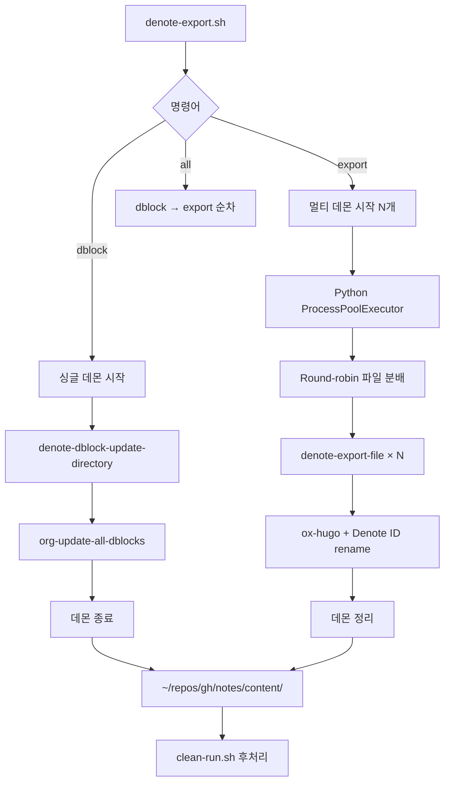

## 관련노트 {#관련노트}

-   [@힣: 간결 실용 심플 텍스트 도구 #닷파일: #이맥스 #스타터키트]()


## 메타노트 {#메타노트}

-   [†#내보내기#업데이트#개정]()


## Overview {#overview}

Denote 노트를 Hugo로 내보내는 통합 시스템. dblock 업데이트와 export를 하나의 워크플로우로 관리.


### 주요 기능 {#주요-기능}

-   **통합 관리**: dblock 갱신 + Hugo export를 단일 스크립트로
-   **Daemon 기반**: 패키지 로딩 1회, 18x 성능 향상
-   **Unicode 완벽 지원**: NBSP(U+00A0), 한글, 특수문자 안전 처리
-   **Bibliography 통합**: Citar/org-cite로 인용 링크 자동 생성
-   **메모리 관리**: 주기적 GC로 2000+ 파일 안정 처리


### 성능 {#성능}

| 작업                 | 파일 수 | 시간 | 속도          |
|--------------------|------|----|-------------|
| dblock (순차)        | 530   | ~11초 | 50 files/sec  |
| export (병렬 2 daemon) | 1,976 | ~33분 | 1.0 files/sec |
| export (병렬 4 daemon) | 1,976 | ~18분 | 1.8 files/sec |


### 배포 파이프라인 {#배포-파이프라인}

```text
┌─────────────────────────────────────────────────────────────┐
│                    Digital Garden Pipeline                   │
├─────────────────────────────────────────────────────────────┤
│  1. dblock 갱신     ~/org/meta → denote-links 업데이트      │
│         ↓                                                    │
│  2. Hugo export     ~/org/{meta,bib,notes} → markdown       │
│         ↓                                                    │
│  3. 후처리          clean-run.sh (secretlint, sed)          │
│         ↓                                                    │
│  4. 배포            Quartz build → GitHub Pages              │
└─────────────────────────────────────────────────────────────┘
```


## Architecture {#architecture}


### 파일 구조 (v2.0 - 통합) {#파일-구조--v2-dot-0-통합}

```text
doomemacs-config/
├── bin/
│   ├── denote-export.sh          # 통합 wrapper (dblock + export)
│   ├── denote-export-parallel.py # Python 병렬 처리
│   ├── denote-export.el          # 통합 Elisp (daemon/dblock/export)
│   │
│   ├── [DELETED] denote-export-batch.el      # obsolete
│   ├── [DELETED] denote-export-server.el     # → denote-export.el
│   ├── [DELETED] denote-dblock-batch.el      # → denote-export.el
│   └── [DELETED] denote-dblock-update.sh     # → denote-export.sh
│
├── lisp/
│   └── denote-export.el          # Interactive export 설정
│
└── docs/
    ├── 20251221T120044--denote-export-unified-system.org  # 이 문서
    ├── [LEGACY] 20251027T092900--denote-export-system.org
    └── [LEGACY] 20251110T190854--denote-dblock-update-system.org
```


### 통합 el 파일 구조 {#통합-el-파일-구조}

```elisp
;;; bin/denote-export.el --- Unified Denote Export System

;;;; 1. 초기화
;; - gc-cons-threshold (most-positive-fixnum → 16MB)
;; - UI 비활성화 (daemon용)
;; - package.el 비활성화 (ELPA 방지)

;;;; 2. Doom 패키지 로딩
;; - find-straight-build-dir (버전 무관)
;; - load-path + autoloads 설정

;;;; 3. 필수 패키지 require
;; Built-in: org, ox, cl-lib, seq, json, browse-url
;; Doom: dash, denote, ox-hugo, citar, parsebib
;; Org-cite: oc, oc-basic, oc-csl
;; Denote: denote-regexp → denote-org-extras → denote-explore

;;;; 4. 설정 로딩
;; - +user-info.el (config-bibfiles, user-hugo-blog-dir)
;; - lisp/denote-export.el
;; - Bibliography 초기화
;; - 매크로 확장 설정

;;;; 5. Helper 함수들
;; - extract-denote-id-from-filename
;; - get-org-hugo-section-from-path

;;;; 6. Dblock 함수들
;; - denote-dblock-update-file
;; - denote-dblock-update-directory

;;;; 7. Export 함수들
;; - denote-export-file
;; - denote-export-batch-files
;; - denote-export-directory

;;;; 8. 메모리 관리
;; - denote-export-file-counter
;; - denote-export-gc-interval (50 files)
;; - gc-cons-threshold 리셋 (16MB)

;;;; 9. Server 시작
;; - denote-export-server-ready = t
;; - (server-start)
```


### 처리 흐름 {#처리-흐름}




## Usage {#usage}


### 명령어 구조 {#명령어-구조}

```bash
denote-export.sh <command> [options]

Commands:
  dblock [dir]           # dblock 업데이트 (싱글 데몬)
  export <target> [n]    # Hugo export (멀티 데몬)
  all [n]                # dblock + export 전체

Targets (export):
  all                    # meta, bib, notes 순차
  meta                   # ~/org/meta
  bib                    # ~/org/bib
  notes                  # ~/org/notes
  test                   # ~/org/test (빠른 검증)
  run <dir>              # 커스텀 디렉토리

Options:
  n                      # 데몬 개수 (기본: 2)
```


### 기본 사용법 {#기본-사용법}

```bash
# 전체 배포 (권장)
./bin/denote-export.sh all

# dblock만 갱신 (meta)
./bin/denote-export.sh dblock
./bin/denote-export.sh dblock ~/org/meta

# export만 (특정 디렉토리)
./bin/denote-export.sh export meta 4
./bin/denote-export.sh export notes 2

# 커스텀 디렉토리
./bin/denote-export.sh export run ~/custom/path 4
```


### 후처리 {#후처리}

```bash
cd ~/repos/gh/notes/
./clean-run.sh

# 또는 개별 실행
./lint.sh              # secretlint 검증
./change-text.sh       # sed 치환
npx quartz build       # 정적 사이트 생성
```


## Technical Details {#technical-details}


### 패키지 로딩 (핵심) {#패키지-로딩--핵심}

Doom Emacs의 straight.el 패키지를 batch/daemon 모드에서 로딩하는 방법:

```elisp
;; 1. ELPA 완전 비활성화 (중요!)
(setq package-enable-at-startup nil)
(setq package-archives nil)
(fset 'package-initialize #'ignore)
(fset 'package-install (lambda (&rest _)
  (error "ELPA is disabled! Use Doom's straight packages only")))

;; 2. straight build 디렉토리 찾기 (버전 무관)
(defun find-straight-build-dir ()
  (let ((base (expand-file-name ".local/straight/" doom-emacs-dir)))
    (when (file-directory-p base)
      (car (sort (directory-files base t "^build-")
                 #'file-newer-than-file-p)))))

;; 3. 패키지 디렉토리 + autoloads 로딩
(let ((build-dir (find-straight-build-dir)))
  (dolist (pkg-dir (directory-files build-dir t "^[^.]" t))
    (add-to-list 'load-path pkg-dir)
    ;; autoloads 파일도 로딩 (중요!)
    (let ((autoload (expand-file-name
                     (concat (file-name-nondirectory pkg-dir)
                             "-autoloads.el")
                     pkg-dir)))
      (when (file-exists-p autoload)
        (load autoload nil t)))))
```


### 필수 패키지 목록 {#필수-패키지-목록}

| 카테고리 | 패키지               | 용도            |
|------|-------------------|---------------|
| Built-in | org, ox              | Org-mode export |
| Built-in | cl-lib, seq          | 리스트 처리     |
| Built-in | json, browse-url     | 유틸리티        |
| Doom     | dash                 | 함수형 유틸     |
| Doom     | denote               | Denote 코어     |
| Doom     | ox-hugo              | Hugo 변환       |
| Doom     | citar, parsebib      | 서지 관리       |
| Org-cite | oc, oc-basic, oc-csl | 인용 처리       |
| Denote   | denote-regexp        | 정규식 (의존성) |
| Denote   | denote-org-extras    | dblock 함수     |
| Denote   | denote-explore       | 매크로          |


### dblock vs Export 차이 {#dblock-vs-export-차이}

| 항목   | dblock        | export        |
|------|---------------|---------------|
| 파일 의존성 | 상호 참조 (스캔 필요) | 독립적        |
| 병목   | I/O (디렉토리 스캔) | CPU (마크다운 변환) |
| 병렬 효과 | 오히려 느려짐 | 4-8배 향상    |
| 권장 방식 | 순차 (싱글 데몬) | 병렬 (멀티 데몬) |
| 처리 속도 | 50 files/sec  | 1-2 files/sec |


### Unicode 안전 처리 {#unicode-안전-처리}

파일명에 NBSP(U+00A0) 등 특수문자가 있을 때 쉘 quoting 문제 발생:

```python
# ❌ 쉘 명령어로 파일 전달 시 깨짐
subprocess.run(['emacs', '--eval', f'(export "{filepath}")'])

# ✅ Python에서 파일 목록 생성, Elisp에서 직접 처리
org_files = sorted(directory.glob("*.org"))  # Python 유니코드 완벽 지원
for file in org_files:
    # emacsclient로 파일 경로 전달
    elisp_cmd = f'(denote-export-file "{file}")'
```


### 메모리 관리 {#메모리-관리}

2000+ 파일 처리 시 메모리 누수 방지:

```elisp
;; 1. 초기화 시 GC 비활성화 (빠른 로딩)
(setq gc-cons-threshold most-positive-fixnum)

;; 2. 초기화 완료 후 GC 리셋 (16MB)
(setq gc-cons-threshold (* 16 1024 1024))
(garbage-collect)

;; 3. 주기적 GC (50 파일마다)
(defvar denote-export-gc-interval 50)
(defvar denote-export-file-counter 0)

(defun denote-export-file (file)
  (setq denote-export-file-counter (1+ denote-export-file-counter))
  (when (zerop (mod denote-export-file-counter denote-export-gc-interval))
    (garbage-collect))

  ;; 4. 버퍼 정리 (unwind-protect)
  (let ((buf (find-file-noselect file)))
    (unwind-protect
        (with-current-buffer buf
          ;; export 로직
          )
      ;; 항상 버퍼 정리
      (when (buffer-live-p buf)
        (kill-buffer buf)))))
```


### 데몬 라이프사이클 {#데몬-라이프사이클}

```python
# 시작
subprocess.Popen(['emacs', '--quick',
                  f'--daemon={daemon_name}',
                  '--load', 'denote-export.el'])

# 준비 대기 (ready flag 체크)
while not ready:
    result = subprocess.run(
        ['emacsclient', '-s', daemon_name,
         '--eval', "(boundp 'denote-export-server-ready)"])
    if 't' in result.stdout:
        ready = True

# 종료
subprocess.run(['emacsclient', '-s', daemon_name,
                '--eval', '(kill-emacs)'])

# 강제 정리 (interrupt 시)
subprocess.run(['pkill', '-f', 'denote-export-daemon'])
```


## Configuration {#configuration}


### .dir-locals.el 설정 {#dot-dir-locals-dot-el-설정}

```elisp
;; ~/org/meta/.dir-locals.el
((org-mode . ((org-hugo-section . "meta")
              (org-hugo-base-dir . "~/repos/gh/notes/"))))

;; ~/org/notes/.dir-locals.el
((org-mode . ((org-hugo-section . "notes")
              (org-hugo-base-dir . "~/repos/gh/notes/"))))

;; ~/org/bib/.dir-locals.el
((org-mode . ((org-hugo-section . "bib")
              (org-hugo-base-dir . "~/repos/gh/notes/"))))
```


### +user-info.el 설정 {#plus-user-info-dot-el-설정}

```elisp
;; Bibliography 파일 경로
(defvar config-bibfiles
  '("~/org/bib/references.bib"
    "~/org/bib/books.bib"))

;; Hugo 블로그 디렉토리
(defvar user-hugo-blog-dir
  (expand-file-name "~/repos/gh/notes/"))

;; Org 디렉토리
(defvar user-org-directory
  (expand-file-name "~/org/"))
```


### 데몬 개수 권장값 {#데몬-개수-권장값}

| 시스템 메모리 | 권장 데몬 수 | 비고  |
|---------|---------|-----|
| 8GB     | 2       | 기본값 |
| 16GB    | 4       | 안정적 |
| 32GB+   | 8       | 최대 성능 |


## Troubleshooting {#troubleshooting}


### 데몬 좀비 프로세스 {#데몬-좀비-프로세스}

```bash
# 상태 확인
ps aux | grep denote-export-daemon

# 강제 종료
pkill -f "denote-export-daemon"

# 소켓 정리
rm -f /tmp/emacs$(id -u)/denote-export-daemon-*
```


### 패키지 로딩 실패 {#패키지-로딩-실패}

```bash
# 에러: "dash not found in Doom"
# 해결: Doom 패키지 재빌드
doom sync
doom build
```


### dblock 업데이트 에러 {#dblock-업데이트-에러}

```nil
에러: "Error during update of dynamic block"

원인:
- denote-org-extras 미로딩 (seq 누락 등)
- denote-directory 미설정

해결:
1. denote-export.el에서 (require 'seq) 확인
2. (setq denote-directory "~/org/") 확인
```


### Export 실패 (개별 파일) {#export-실패--개별-파일}

```elisp
;; 테스트
(find-file "~/org/notes/test.org")
(org-hugo-export-to-md)

;; 로그 확인
(switch-to-buffer "*Messages*")
```


### Ctrl+C 인터럽트 후 정리 {#ctrl-plus-c-인터럽트-후-정리}

```bash
# Python 스크립트는 signal handler로 자동 정리
# 만약 남아있다면:
pkill -f "denote-export-daemon"
```


## Migration from Legacy {#migration-from-legacy}


### 기존 파일 매핑 {#기존-파일-매핑}

| 기존 파일               | 새 파일          | 비고         |
|---------------------|---------------|------------|
| denote-export-server.el | denote-export.el | rename + 통합 |
| denote-dblock-batch.el  | denote-export.el | 함수 통합    |
| denote-export-batch.el  | (삭제)           | obsolete     |
| denote-dblock-update.sh | denote-export.sh | dblock 명령 통합 |


### 명령어 매핑 {#명령어-매핑}

| 기존 명령                              | 새 명령                            |
|------------------------------------|---------------------------------|
| `./denote-dblock-update.sh ~/org/meta` | `./denote-export.sh dblock`        |
| `./denote-export.sh meta 4`            | `./denote-export.sh export meta 4` |
| (수동 순차)                            | `./denote-export.sh all`           |


## Performance History {#performance-history}


### v1.0 → v2.0 개선 {#v1-dot-0-v2-dot-0-개선}

| 버전 | 방식         | 1962 파일 시간 | 속도           |
|----|------------|------------|--------------|
| v1.0 | Batch 순차   | ~10시간    | 0.05 files/sec |
| v1.3 | Daemon 순차  | ~2.5시간   | 0.22 files/sec |
| v1.4 | Daemon 병렬(4) | ~18분      | 1.8 files/sec  |
| v2.0 | 통합 + 최적화 | ~15분 (예상) | 2.0+ files/sec |


### 개선 포인트 (v2.0) {#개선-포인트--v2-dot-0}

-   패키지 로딩 통합 (dblock + export 동일 환경)
-   seq 패키지 누락 수정
-   데몬 라이프사이클 통합 관리
-   메모리 관리 일원화


## Changelog {#changelog}


### <span class="timestamp-wrapper"><span class="timestamp">[2025-12-21 Sun] </span></span> v2.0.0 - Unified System {#v2-dot-0-dot-0-unified-system}


#### 주요 변경 {#주요-변경}

-   denote-export.el 통합 (server + dblock)
-   denote-export.sh에 dblock 명령 추가
-   obsolete 파일 삭제 (batch.el, dblock-update.sh)
-   패키지 로딩 버그 수정 (seq 누락)


#### 파일 구조 개선 {#파일-구조-개선}

-   8개 → 4개 파일로 단순화
-   단일 el 파일로 관리 용이성 향상
-   문서 통합


### <span class="timestamp-wrapper"><span class="timestamp">[2025-12-17 Wed] </span></span> v1.5.x - Memory Management {#v1-dot-5-dot-x-memory-management}

-   gc-cons-threshold 리셋 (16MB)
-   주기적 GC (50 파일마다)
-   기본 데몬 4 → 2개로 감소 (안정성)


### <span class="timestamp-wrapper"><span class="timestamp">[2025-10-29 Wed] </span></span> v1.4.0 - Production Ready {#v1-dot-4-dot-0-production-ready}

-   server-start 누락 해결
-   Unicode 파일명 완벽 지원
-   1961 파일 100% 성공률


### <span class="timestamp-wrapper"><span class="timestamp">[2025-10-28 Tue] </span></span> v1.3.0 - Server Mode {#v1-dot-3-dot-0-server-mode}

-   Daemon 방식 도입 (18x 성능 향상)
-   파일명 기반 Denote ID 추출
-   디렉토리 기반 Section 자동 결정


## References {#references}

-   [Denote Manual](https://protesilaos.com/emacs/denote)
-   [ox-hugo Documentation](https://ox-hugo.scripter.co/)
-   [denote-explore](https://github.com/pprevos/denote-explore)
-   [org-dblock Manual](https://orgmode.org/manual/Dynamic-Blocks.html)


## Legacy Documents {#legacy-documents}

이 문서는 다음 문서들을 통합/대체합니다:

-   [Denote Export System (Legacy)]
-   [Denote dblock Update System (Legacy)]


## License {#license}

GPLv3

> 지식베이스 퍼블리싱의 새로운 패러다임:
> 
> -   **Denote**: 파일명 기반 PKM (DB 불필요)
> -   **ox-hugo**: Org → Hugo 변환
> -   **Daemon**: 빠른 배치 처리
> -   **Unicode**: 한글 제목, 특수문자 완벽 지원

